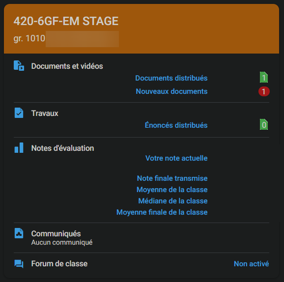

# Cours 1 - Atelier

## 🔌 Connexion aux postes informatiques

Chaque étudiant(e) doit pouvoir se connecter aux ordinateurs en classe.

* Compte réseau : [https://techno.cegepmontpetit.ca/compte-reseau/](https://techno.cegepmontpetit.ca/compte-reseau/)
* Double authentification : [https://techno.cegepmontpetit.ca/cybersecurite/2fae/](https://techno.cegepmontpetit.ca/cybersecurite/2fae/)

## 👥 Formation d'équipes de 4

* ⚖ L'enseignant(e) forme les équipes rapidement, au pif
* ✨ Dans la vie, il faut apprendre à faire semblant d'aimer collaborer avec nos collègues
* 🚔 Illégal d'être avec une personne qu'on connait déjà (le but est que tout le monde soit mal à l'aise !)
* 📝 Vous apprendrez à connaître vos partenaires de manière douteuse au travers les exercices qui suivent

## 🏫 Introduction à Omnivox et Léa

Léa est une plateforme accessible via Omnivox pour accéder aux notes de cours, aux travaux, aux Mios (messagerie) et aux remises de notes.

⚗ Démo :

* Mio (Il est important de lire ses Mios !)
* Léa : Notes de cours, travaux et remises de notes

🧪 Activité :

* Envoyez un Mio à l'enseignant(e) 
* Récupérer des notes de cours
* Récupérer, compléter, puis remettre un travail
* Vérifier une remise de note (fausse note)

## 👥 Introduction à Teams

Teams est une plateforme plus conviviale pour communiquer avec ses enseignants. (Comparé à Mio, qui ressemble plus à un système de courriels) En TIM, certains cours sont représentés par une **équipe Teams** où les notes de cours (et parfois les devoirs) seront disponibles.

⚗ Démo :

* Envoyer un message à un(e) enseignant(e) (À prioriser plutôt que les Mios !)
* Accéder aux notes de cours.
* Remises de travaux.

🧪 Activité :

* Récupérer des notes de cours
* Récupérer, compléter, puis remettre un travail

## 🧭 Introduction à Google Classrooms

Certains cours en TIM utilisent Google Classroom pour distribuer les notes de cours et devoirs.

⚗ Démo : 
* Accéder à des notes de cours.
* Accéder à un travail.

🧪 Activité :

* Se connecter son compte Google institutionnel. (Il existe déjà automatiquement !)
  * Identifiant : `matricule@gmail.com` (ex : `1676767@gmail.com`)
  * Mot de passe : Identique à celui d'Omnivox
* Joindre un cours à l'aide du code fourni par l'enseignant(e)
* Récupérer des notes de cours
* Récupérer, compléter, puis remettre un travail

## 📂 Introduction à GoogleDrive

:::warning

Mise en garde : les fichiers enregistrées sur un ordinateur au Cégep sont perdus lorsqu'on ferme sa session !

:::

⚗ Démo :

* Accès dans le navigateur
* Création de sous-dossiers

🧪 Activité :

* Créer un dossier pour la session A26
* Créer un dossier pour chacun de ses cours de la session

## 📝 Test auto-diagnostic des habiletés en informatique

🧪 Activité :

* Réaliser le formulaire : [https://forms.office.com/r/92xP7ewtYM](https://forms.office.com/r/92xP7ewtYM)
* ⚠ Une fois le formulaire soumis, appuyer sur le bouton pour vérifier ses réponses !
* Vérifier ses résultats avec son enseignant(e) au besoin.

## 🌐 Introduction à Moodle

Moodle est une plateforme utilisée par certain(s) enseignant(e)s pour administrer un cours. (À la place de Léa et / ou de Teams)

⚗ Démo avec le Moodle de la formation en informatique :

* S'assurer que tous arrivent à se connecter. (Au besoin : [https://techno.cegepmontpetit.ca/compte-moodle/](https://techno.cegepmontpetit.ca/compte-moodle/))
* Brève visite de la page de la formation en informatique. (Accès aux vidéos et aux exercices)

Joindre le Moodle : [https://edm.moodle.decclic.qc.ca/course/view.php?id=7029](https://edm.moodle.decclic.qc.ca/course/view.php?id=7029)
(Le code secret est `TIM`)

🧪 Activité :

* Télécharger l'épreuve du chapitre 1.
* Si vous avez des chapitres à compléter, les commencer, sinon, quitter.