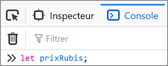
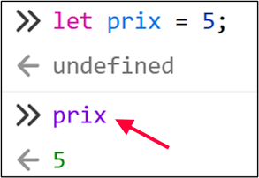
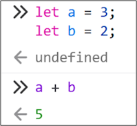
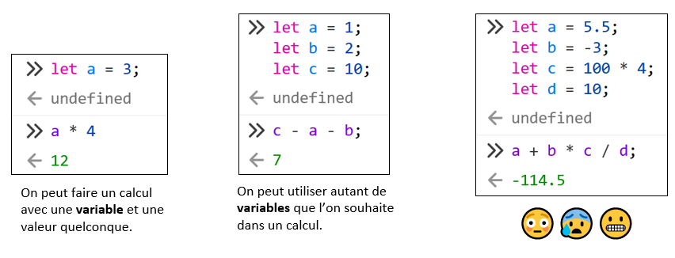

import Tabs from '@theme/Tabs';
import TabItem from '@theme/TabItem';

# Cours 2 - Variables et calculs

## 🤓 JavaScript

* C'est un langage de programmation né en 1996 👶
* Les fichiers de code JavaScript ont l'extension `.js`

<center></center>

* Très utilisé pour la **programmation Web** 🌐, mais pas que pour ça ! C'est donc le **langage parfait** pour apprendre à coder en TIM. (Car vous ferez beaucoup de Web)
* Exemples d'applications / projets qui utilisent JavaScript :

<center></center>

<br/>

Exemple de morceau de code en JavaScript (Pour le moment, vous n'êtes pas censés comprendre !) :

```js showLineNumbers
let pseudo = "SkibidiJeremy";
let score = 124;

if(score > 1000){
    superWin(pseudo);
}
else if(score > 500){
    win(pseudo);
}
else{
    defeat(pseudo);
}

for(let i = 0; i < items.length; i+= 1){
    items[i].remove();
}
```

:::warning

C'est normal qu'au début, la programmation vous semble très abstraite et bizarre. 🧩 Il y a une longue route et beaucoup de travail à réaliser avant de pouvoir **coder des choses concrètes et intéressantes** comme des **jeux** 🎲, des **sites Web** 🌐 et des **logiciels variés**. 🧰

Soyez donc **patient(e)** ⌛, car apprendre à programmer risque de ne pas être ultra stimulant au début ! La **bonne nouvelle**, c'est que déjà, dans quelques semaines, nous pourrons **coder des jeux simples** et **rendre des pages web interactives**.

:::

## 🌐 JavaScript dans un navigateur Web

Pour le moment, nous utiliserons la « console du navigateur Web » de **Google Chrome** ou **Mozilla Firefox** pour apprendre JavaScript.

Ouvrez un **navigateur Web** et appuyez sur `F12` (ou faites **clic-droit** -> **Inspecter**) puis accédez à la **console** :

<center></center>

<center></center>

## 🧮 Opérateurs arithmétiques

Les programmes et logiciels nécessitent souvent de faire des **calculs mathématiques**. Heureusement, on peut utiliser les opérateurs suivants en JavaScript :

* ` + ` : Addition

<center></center>

* ` - ` : Soustraction

<center></center>

* ` * ` : Multiplication (et non ` x` !)

<center></center>

* ` / ` : Division (et non ` ÷ ` !)

<center></center>

:::info

Remarquez qu'on peut utiliser des **nombres à virgules** en utilisant un point `.`. (Et non une virgule !)

Exemples : `1.53`, `69.420`, `-41.04`, etc.

Remarquez qu'on peut utiliser des **nombres négatifs** en utilisant un tiret `-` devant le nombre.

Exemples : `-3`, `-69.96`, `-420`, etc.

:::

## 📦 Variables

Une variable est un « espace dans la mémoire » qui permet de stocker une **donnée**.

Dans un programme (logiciel, jeu, application, etc.), on a souvent besoin de **stocker des informations** pour pouvoir les utiliser à nouveau plus tard.

Quelques exemples :
* Stocker les **points de vie** d'un personnage : `78` 💗
* Stocker la **taille du pinceau** utilisé dans Photoshop : `5.5` 🎨
* Stocker le **nom d'un item** dans un jeu : `"diamond"` 💎
* Stocker votre **niveau de concentration** en classe : `10` (%) 😴

### 📢 Déclarer une variable

Déclarer une variable veut dire **créer une variable**. Pour pouvoir utiliser une variable, il faut commencer par la **créer**.

Voici comment déclarer une variable :

```js
let nomVariable;
```

* Le mot-clé `let` sert à dire à JavaScript qu'on souhaite **créer une variable**.
* `nomVariable` est un exemple de **nom** qu'on donne à la variable. Vous pouvez choisir son nom !
* Le point-virgule `;` **ne fait pas partie du nom de la variable** et sert juste à dire à JavaScript « ma ligne de code est terminée ».

Exemple dans la console :

<center></center>

:::info

Parfois, la console nous répond `← undefined`... C'est normal !

<center></center>

Quand on fait un calcul, la console **doit nous retourner le résultat**, mais quand on crée une variable... la console n'a rien à nous dire ! Elle nous répond donc simplement `undefined` et c'est normal. (La variable a bien été créée)

:::

### 💾 Affecter une valeur à une variable

**Affecter** une valeur à une variable, cela signifie de **stocker une donnée** dans la variable.

On affecte une valeur à une variable à l'aide de l'opérateur `=` :

```js
prixRubis = 800;
```

Ce code signifie donc : « je souhaite stocker la valeur `800` dans la variable nommée `prixRubis` ».

:::danger

Avant d'affecter une valeur à une variable, assurez-vous **de l'avoir créée** d'abord !

D'abord :

```js
let prixRubis;
```

Puis :

```js
prixRubis = 800;
```

:::

La console nous permet, en tout temps, de **vérifier la valeur** d'une variable. Il suffit d'écrire le **nom de la variable**, et la console va nous répondre avec sa **valeur** :

<center></center>

:::tip

On peut **déclarer** et **affecter** une variable simultanément :

```js
let ageSylvain = 102;
```

On peut **déclarer** plusieurs variables simultanément en utilisant des `,` (virgules) pour séparer leur nom :

```js
let prixPain, prixNutella, prixCouteau;
```

On peut **déclarer** et **affecter** plusieurs variables simultanément :

```js
let triangle = 3, carre = 4, pentagone = 5;
```

:::

Notez qu'on peut utiliser l'opérateur `=` sur une variable qui **contient déjà une valeur** pour la **remplacer.

Par exemple, à la fin de ces lignes de code, la variable `prix` contiendra `50` plutôt que `40` :

```js
let prix = 40;
prix = 50;
```

Enfin, n'hésitez pas à utiliser des **calculs** pour **affecter** des valeurs à des variables.

Par exemple, `prixDeDeuxMinous` contiendra bien `400` et `prixDeTroisPitous` contiendra bien `450` :

```js
let prixDeDeuxMinous = 200 * 2;
let prixDeTroisPitous = 150 * 3;
```

### 📝 Bien nommer les variables

#### 🔨 Règles de nommage (obligatoires sinon ERREUR 🐞)

* Chaque variable doit avoir **un nom unique**.
* Doit commencer par une **lettre** ou un trait de soulignement `_`.
* Peut contenir des **lettres**, des **chiffres** et des traits de soulignement `_`.
* Ne peut pas contenir d'**espace** et de **caractères spéciaux** comme `?!#/%&*~\`.

#### 📐 Convention de nommage (fortement suggérées ✅)

* Doit être significatif. (Représente bien l'utilité de la variable)
  * ✅ `nomDragon`, `prix`, `age`
  * 🚫 `abc`, `lmao`, `jeSaisPas`, `skibidi`
* Si composé de **plusieurs mots**, le premier commence par une **minuscule** et les suivants par une **majuscule**.
  * ✅ `dateNaissance`, `nbEtudiants`, `pointsDeVie`
  * 🚫 `cestillisible`, `cafaitdur`, `bonnechance`

:::danger

Il ne faut jamais donner **le même nom** à deux variables ! Attention quand vous utilisez `let` : assurez-vous qu'aucune variable avec ce nom n'existe.

<center></center>

Si on souhaitait changer la valeur de la variable, il suffisait de faire ceci :

<center></center>

:::

### 🧰 Utiliser des variables

Une fois qu'une variable est **déclarée** et **affectée** (donc créée ET contient une valeur), on peut l'utiliser dans des calculs.

Par exemple, ci-dessous, on a **déclaré** et **affectée** les variables `a` et `b`. On peut donc les additionner ensuite :

<center></center>

Notez bien :

* Lorsqu'une variable est utilisée, elle « remplacée par la valeur qu'elle contient ». Ici, c'est comme si on avait fait `3 + 2` !
* Suite à cette addition, les valeurs de `a` et `b` n'ont pas changé ! `a` contient encore `3` et `b` contient encore `2`.

Quelques exemples supplémentaires :

<center></center>

## 📬 Opérateurs d'affectation

Il existe plusieurs **opérateurs** qui permettent de modifier la valeur d'une variable.

### Opérateur `=`

Nous l'avons déjà abordé : il permet d'**affecter une valeur** à une variable ou de **remplacer** l'ancienne valeur.

Dans cet exemple, `a` vaut `12`, puis ensuite `a` vaut `5`.

<center></center>

### Opérateurs `+=` et `-=` 

L'opérateur `+=` permet d'**incrémenter** (augmenter) la valeur de la variable.

<center></center>

L'opérateur `-=` permet de **décrémenter** (diminuer) la valeur de la variable.

<center></center>

:::info

Il est possible d'utiliser l'opérateur `=` à la place des opérateurs `+=` et `-=` !

Augmenter une variable de 3 :

<Tabs>
    <TabItem value="js1" label="Avec +=">
        ```js
        let x = 2;
        x += 3;
        ```
    </TabItem>
    <TabItem value="js2" label="Avec =" default>
        ```js
        let x = 2;
        x = x + 3;
        ```
    </TabItem>
</Tabs>

Diminuer une variable de 5 :

<Tabs>
    <TabItem value="js1" label="Avec -=">
        ```js
        let x = 10;
        x -= 5;
        ```
    </TabItem>
    <TabItem value="js2" label="Avec =" default>
        ```js
        let x = 10;
        x = x - 5;
        ```
    </TabItem>
</Tabs>

:::

:::tip

Vous n'êtes pas obligé(e) de les utiliser, mais il existe également les opérateurs `++` et `--`.

`++` est simplement équivalent de `+= 1`. Ici, la variable `x` sera **augmentée de 1** :

```js
let x = 7;
x++;
```

`--` est simplement équivalent de `-= 1`. Ici, la variable `y` sera **réduite de 1** :

```js
let y = 4;
y--;
```

:::

## 🥇🥈🥉 Priorité des opérateurs

L'ordre de priorité des opérateurs est la suivante :

1. Parenthèses `()`
2. Multiplication et division `*` `/`
3. Addition et soustraction `+` `-`
4. Affectation `=`

(En cas d'égalité, on résoud l'équation de **gauche à droite**)

Les parenthèses permettent donc de prioriser certaines opérations. Par exemple, ci-dessous, on obtient deux résultats différents grâce aux parenthèses :

<center></center>