# Cours 3 - DOM et fonctions

## 🌐 Ouvrir une page Web

Pour apprendre JavaScript, nous utiliserons nos propres pages Web. (Fichiers **.html**)

Pour les ouvrir dans le navigateur (🦊 Firefox est recommandé !), trouvez le fichier **.html** et faites :

`clic-droit -> Ouvrir avec -> Firefox`

<center>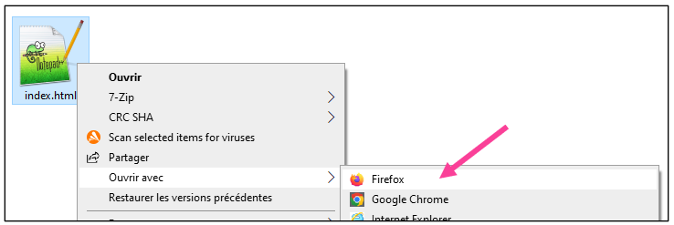</center>

Une fois la page ouverte dans le navigateur, ouvrez la **console** (F12), comme d'habitude.

## 📦 DOM (Document Object Model)

Le **DOM** est un *bidule* complexe qui **représente une page Web en entier**. (C'est-à-dire, tout son code HTML, tous ses éléments HTML)

Grâce au **DOM**, nous pourrons, à l'aide de **JavaScript**, modifier une page Web à volonté.

Exemples :
* Couleur du texte
* Contenu textuel
* Jeux
* Faire apparaître des images
* etc.

### ✨ Classes

En HTML, les éléments peuvent avoir des « **classes** ».

* Élément sans classe :

```html
<p>Petit tapis rouge.</p>
```

* Élément avec une classe (nommée `gris`) :

```html
<p class="gris">Petit tapis gris.</p>
```

C'est le développeur Web qui choisit le **nom de chaque classe**. (Ça peut être n'importe quoi d'autre, pas juste `gris` !)

<hr/>

Grâce à la **classe** d'un élément, nous allons pouvoir le modifier. 📝 (Changer son texte, changer sa couleur, etc.) Par exemple, prenons l'élément suivant :

```html
<div class="pikachu">Please pick a shoe.</div>
```

Pour modifier son texte, en **JavaScript**, nous pourrons utiliser le code suivant :

```js
document.querySelector(".pikachu").textContent = "Choisissez une chaussure s'il vous plait.";
```

💡 Remarquez que la classe `pikachu` a été utilisée dans le code ! Plus de détails plus loin.

:::tip

🔍 Pour trouver la **classe** d'un élément HTML, on peut utiliser l'outil « Inspecter » du navigateur !

Par exemple, ici, je me demande quelle est la **classe** du titre « Smudge » :

<center></center>

Voici comment trouver la classe :

1. Faites `clic-droit` **sur l'élément** (sur le texte) et faites `Inspecter`

<center>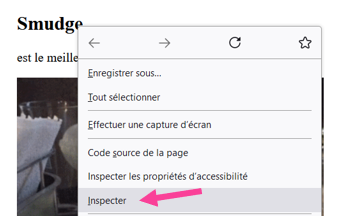</center>

2. Le code HTML de la page va s'afficher. Identifiez la **classe** pour **l'élément HTML surligné en bleu** !

<center>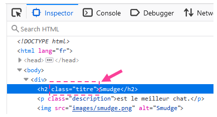</center>

💡 Ici, on peut voir que sa **classe** est `titre`.

:::

### 🔍 Obtenir le contenu textuel d'un élément

La ligne de code suivante permet d'**obtenir le contenu textuel** d'un élément :

```js
document.querySelector(".classe").textContent
```

Par exemple, ci-dessous, on veut obtenir le contenu textuel de l'élément avec la classe `"titre"` et la console nous répond `"Smudge"` :

<center>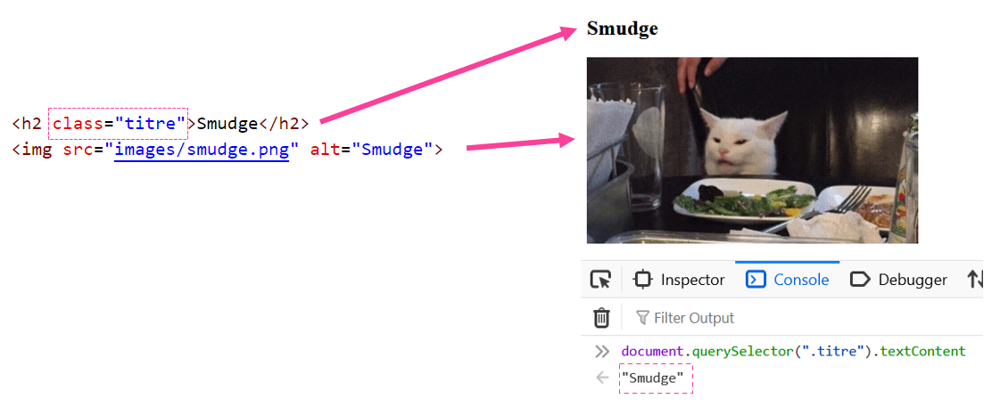</center>

En gros, c'est un peu comme si on demandait à la console : « dis-moi quel est le texte de l'élément avec cette classe ».

:::info

Décortiquons **un peu** la ligne de code suivante :

```js
document.querySelector(".titre").textContent
```

* `document` : Indique qu'on va utiliser le **DOM**.
* `.querySelector` : Indique qu'on va demander d'accéder à l'**élément HTML**.
* `(".titre")` : La **classe** de l'élément qui nous intéresse doit être ... :
  * Précédée d'un point `.`
  * Entourée de guillemets `"..."`
  * Entourée de parenthèses `(...)`
  * C'est un peu bizarre, mais pour le moment soyez ouvert d'esprit 😵
* `.textContent` : Indique qu'on veut connaître le **contenu textuel** de l'élément, notez bien le `t` minuscule et le `C` majuscule 🧐.

:::

### 📝 Modifier le contenu textuel d'un élément

#### Opérateur `=`

La ligne de code suivante permet de **modifier le contenu textuel** d'un élément :

```js
document.querySelector(".classe").textContent = "Nouveau texte";
```

Ci-dessous, nous allons **remplacer** le texte « Smudge » par « Chat consterné ». On doit utiliser la classe `.titre` pour y arriver.

<center>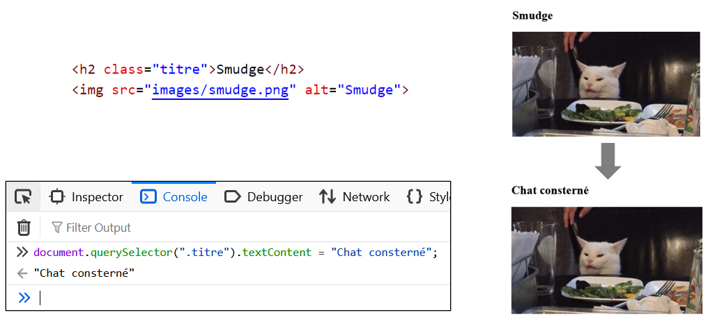</center>

#### Opérateur `+=`

La ligne de code suivante permet d'**ajouter ⛔ du contenu textuel** à la fin du texte existant :

```js
document.querySelector(".classe").textContent += "texte supplémentaire";
```

🔍 Remarquez bien qu'on a utilisé l'opérateur `+=` plutôt que `=` !

<center>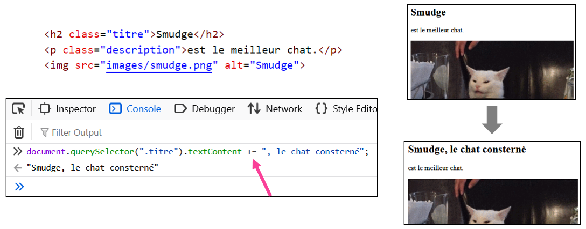</center>

#### Afficher la valeur d'une variable

Plutôt que d’affecter une **chaîne de caractères** au contenu textuel manuellement, on peut également utiliser n’importe quelle variable pour afficher sa valeur dans la page Web :

<center>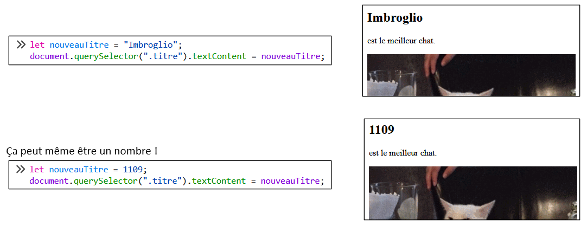</center>

#### 🧩 Exemple un peu plus complexe

Nous allons récupérer les textes « Smudge » et « est le meilleur chat » pour les **concaténer** et les afficher dans un élément.

<center>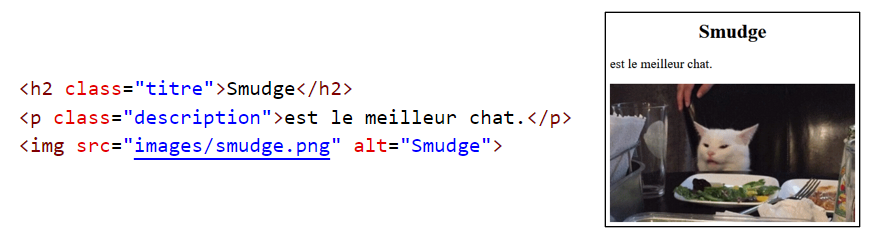</center>

1. D'abord, nous allons récupérer le texte `"Smudge"` pour le mettre dans une variable :

<center>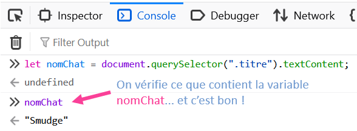</center>

2. Ensuite, nous allons également récupérer le texte `"est le meilleur chat."` pour le mettre dans une deuxième variable :

<center>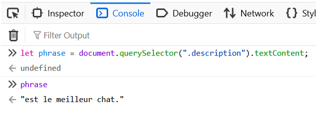</center>

3. Finalement, nous allons modifier le contenu textuel de l'élément avec la classe `description` en utilisant un **template string** :

<center>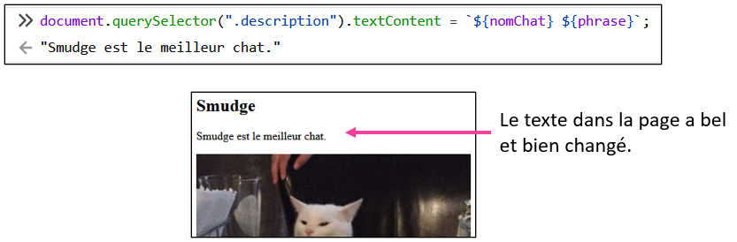</center>

<hr/>

<center>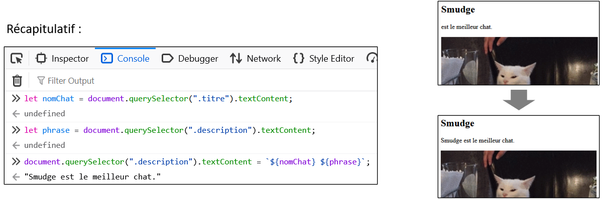</center>

### 🔄 Mise en garde

Pour le moment, nous utilisons la console du navigateur Web pour écrire notre code **JavaScript**, alors tous les changements que nous faisons sont **temporaires** !

**Réactualiser** 🔄 la page Web **supprime tous les changements** faits sur le DOM avec la console.

## 📝 Visual Studio Code

C'est un **éditeur de code** utilisable pour plein de langages, dont **HTML, CSS et JavaScript**. Nous l'utiliserons pour nos projets Web.

* 💰 Logiciel gratuit. [N'hésitez pas à l'installer à la maison](https://code.visualstudio.com/download).
* ✅ Déjà installé au Cégep. Prêt à être utilisé !
* 🔵 L'icône est bleue, et le bleu, c'est une couleur relaxante.

### 🌳 Structure d'un projet Web

Pour tous nos projets durant la session, nous utiliserons cette structure dans nos projets Web :

<center>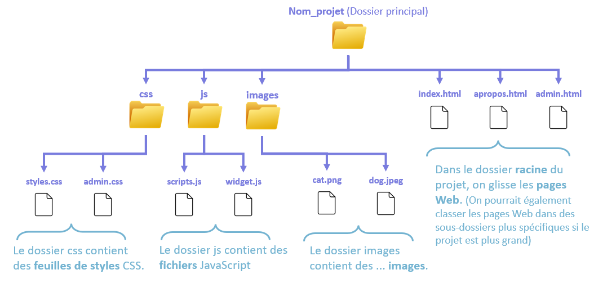</center>

### 📂 Ouvrir un projet avec VS Code

1. Fichier -> Ouvrir le dossier...

<center>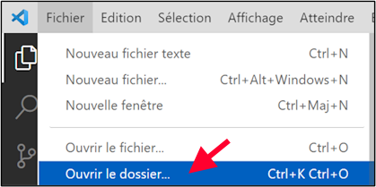</center>

2. Cliquer sur le dossier principal du projet, puis appuyer sur **Sélectionner un dossier**.

<center>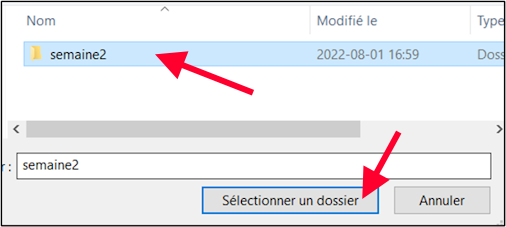</center>

Et voilà, le projet est **ouvert dans VS Code** et on a accès à tous ses **sous-dossiers** et **fichiers** dans l'interface :

<center>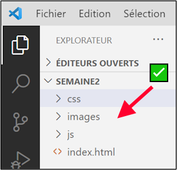</center>

### 🔄 Alternative

On peut aussi simplement trouver le dossier principal du projet Web puis faire `clic-droit -> Ouvrir avec Code` !

<center>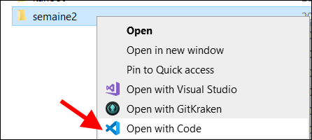</center>

## 🔩 Fonctions

### 🤔 Qu'est-ce qu'une fonction ?

Commençons par un exemple mystérieux : lorsqu'on écrit `changerTexte()` dans la console... le contenu textuel du titre de cette page change 😱

<center>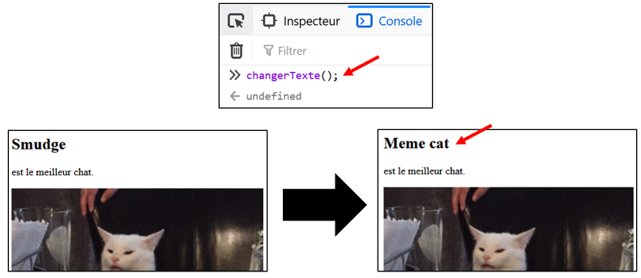</center>

> Wohlala, comment c'est possible ? On n'a même pas utilisé `document.querySelector(...).textContent = ...` !

#### 💡 Explication

En réalité, `changerTexte()` est ce qu'on appelle une **fonction**. Une **fonction**, ça contient un **morceau de code** de notre choix.

Voici la **déclaration** de la **fonction** `changerTexte()`, que nous avions rédigée avant de l'utiliser dans la console :

```js
function changerTexte(){
    
    document.querySelector(".titre").textContent = "Meme cat";

}
```

Décortiquons un peu tout ce code :

* `function` est un **mot-clé obligatoire** qui indique qu'on souhaite « déclarer une fonction ».
* `changerTexte` est le **nom de la fonction**. On le choisit nous-mêmes !
* `()` Les **parenthèses vides** après le nom de la fonction sont **obligatoires**. Elles semblent inutiles pour le moment, c'est normal.
* `{ ... }` Les **accolades** sont **obligatoires** et permettent d'indiquer **où le code de la fonction commence** et **où le code de la fonction se termine**.

Le fait d'avoir **déclaré la fonction** nous permet de **l'appeler** à volonté. (Entre autre dans la console !) En gros, une fonction, c'est **un morceau de code réutilisable** créé par nous.

<center>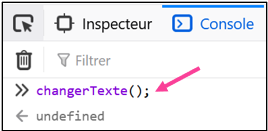</center>

### 🔍 Où déclarer une fonction ?

À quel endroit doit-on rédiger la **déclaration de la fonction** ? (Le machin ci-dessous)

```js
function changerTexte(){
    
    document.querySelector(".titre").textContent = "Meme cat";

}
```

:::danger

Pas dans la console en tout cas ! 

Si nous déclarons la fonction dans la console, **elle n'existera plus lorsqu'on réactualisera la page** !

<center>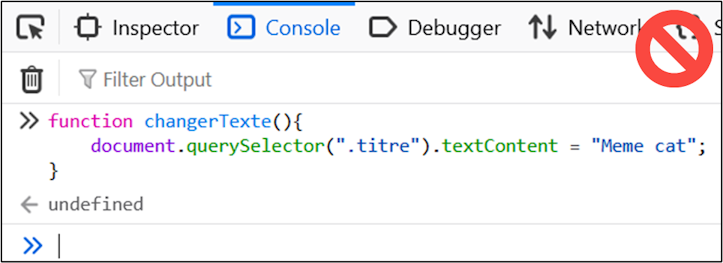</center>

:::

La fonction doit être **déclarée** dans un **fichier avec l'extension `.js`**, dans le dossier `js` de notre **projet Web**.


<center>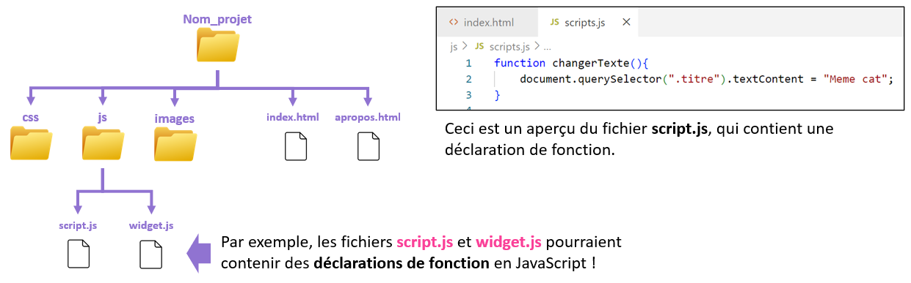</center>

:::note

Notez que pour pouvoir **appeler la fonction** dans la console d'une page Web spécifique, il faut avoir ajouté cette ligne dans le `<head>` de la page Web :

<center>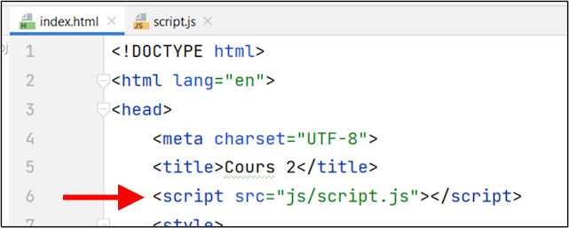</center>

« `script.js` » correspond au fichier qui **contient la ou les déclarations de fonction**.

**Bonne nouvelle** : dans ce cours, cette opération sera toujours réalisée pour vous au préalable, donc vous n'aurez pas à le faire.

:::

### 🐥 Fonctions préexistantes

Certaines fonctions **existent déjà** en JavaScript sans qu'on ait besoin de les déclarer nous-mêmes.

Quelques exemples :

* `document.querySelector()` (que nous connaissons déjà)
* `alert()`
* `console.log()`

#### Afficher du texte dans une alerte avec `alert()`

La fonction `alert()` permet de créer un « pop-up » (une *alerte*) dans la page avec le **message de notre choix**.

Il suffit d'inclure une **chaîne de caractères** à l'intérieur des parenthèses. (N'oubliez pas les guillemets ! `" ... "`)

<center>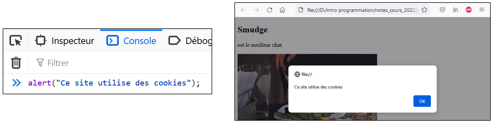</center>

#### Afficher du texte dans la console avec `console.log()`

La fonction `console.log()` permet simplement d’afficher du texte dans la console du navigateur. Attention, en programmation, on dit parfois « **imprimer** du texte dans la console » plutôt que « afficher » !

Il suffit d'inclure une **chaîne de caractères** à l'intérieur des parenthèses. (N'oubliez pas les guillemets ! `" ... "`)

<center>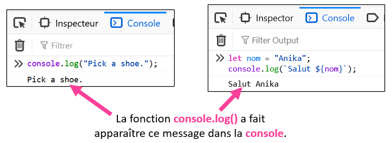</center>

### 💬 Commentaires

Les commentaires permettent de **rédiger des annotations dans le code.** Ils sont **ignorés** lorsque l'application est exécutée : c'est comme s'ils n'existaient pas ! Ça sert à laisser des **notes / descriptions** dans le code pour se retrouver. 🔍

Pour rédiger un **commentaire mono-ligne**, on utilise `//` au début du commentaire :

<center>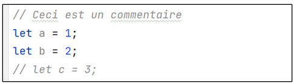</center>

Pour rédiger un **commentaire multi-ligne**, on utilise `/*` au **début** du commentaire et `*/` à la **fin** du commentaire :

<center>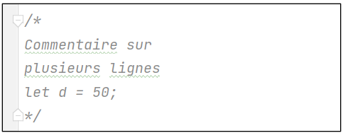</center>

:::note

Dans les exemples ci-dessus, il faut comprendre que c'est comme si les variables `c` et `d` n'existaient pas ! Il sera impossible de les utiliser.

:::

### 🥚 Créer une fonction

#### 🔍 Étape 1

Premièrement, il faut trouver (ou créer) le fichier `script.js` dans notre projet Web, puisque c'est à l'intérieur qu'on devra **déclarer notre fonction**.

<center>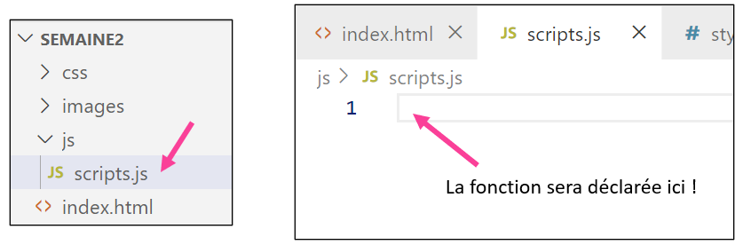</center>

#### 🦴 Étape 2

Deuxièmement, il faut **préparer la structure de la fonction** et la **nommer**.

Dans ce cas-ci, on a nommé la fonction `texteSalade` :

<center>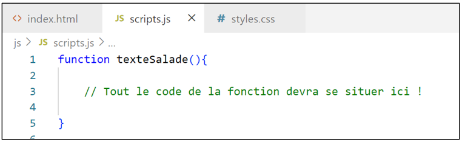</center>

:::danger

Une **erreur fréquente** lorsqu'on déclare une fonction est d'**oublier** une accolade ou **mal placer** les accolades :

<center>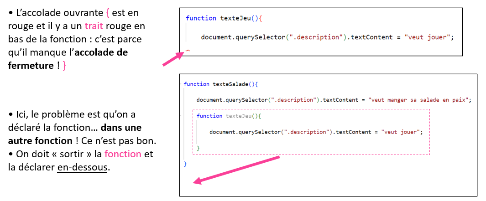</center>

:::

#### 📝 Étape 3

Troisièmement, on doit **rédiger le code de la fonction**

Bien entendu, c'est nous qui décidons ce que la fonction va faire. Par exemple, disons qu'on veut faire trois choses :

* Remplacer le texte `"est le meilleur chat"` par `"veut manger sa salade en paix."` dans la page.
* Afficher une **alerte** avec le message `"Texte changé !"`.
* Afficher le message `"Fonction terminée."` dans la **console**.

On va commencer par jeter un coup d'oeil au code HTML pour trouver la **classe** de l'élément dont on souhaite **changer le texte** :

```html
<p class="description">est le meilleur chat.</p>
```

Puis on va pouvoir écrire le code dans la fonction :

```js showLineNumbers
function texteSalade(){

    // Changer le texte dans la page
    document.querySelector(".description").textContent = "veut manger sa salade en paix.";

    // Afficher une alerte
    alert("Texte changé !");

    // Afficher un message dans la console
    console.log("Fonction terminée.");

}
```

#### 🔩 Étape 4

Quatrièmement : **tester** la fonction ! Il est possible qu'on ait fait des **erreurs** 🐞 ! Il faut s'assurer que ça fonctionne comme prévu.

Généralement, pour **tester une fonction**, on va **l'appeler dans la console** :

<center>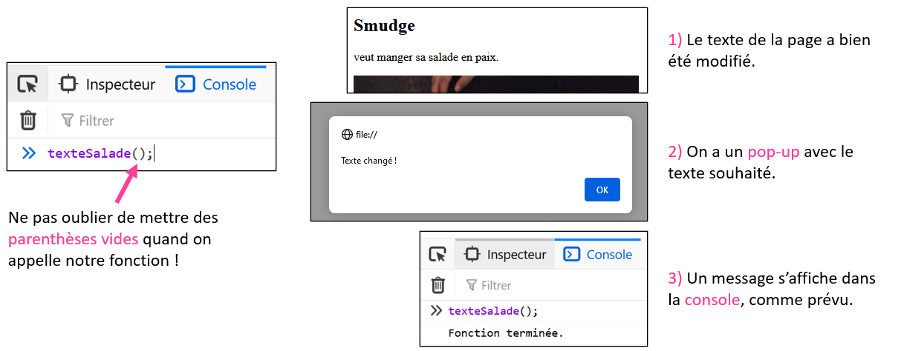</center>

:::warning

N'oubliez jamais les **parenthèses vides** lorsque vous appelez une fonction ! Si vous oubliez les parenthèses, plutôt que **d'appeler** la fonction pour la tester, cela va seulement **afficher la fonction sans l'appeler** !

<center>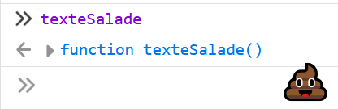</center>

:::