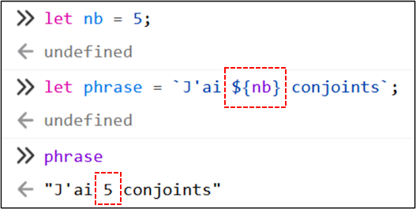
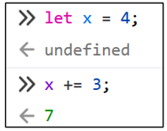
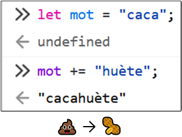
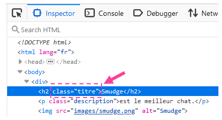
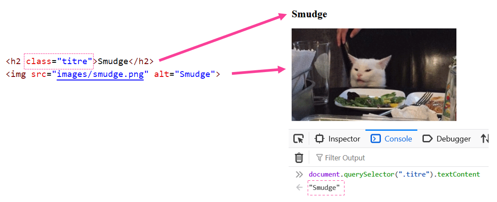
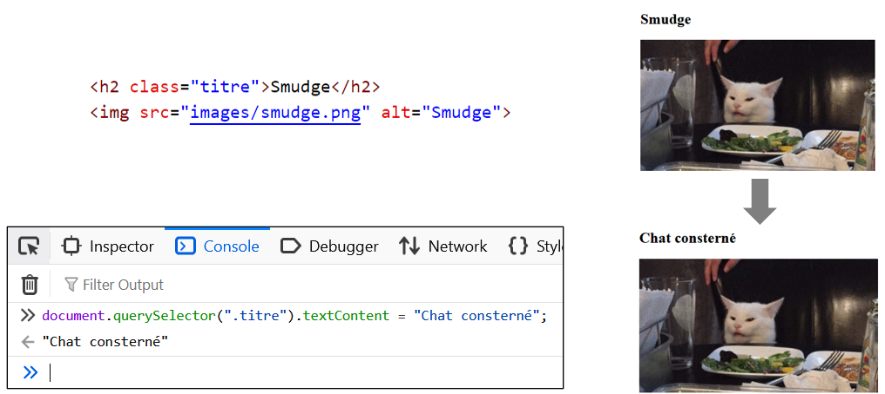
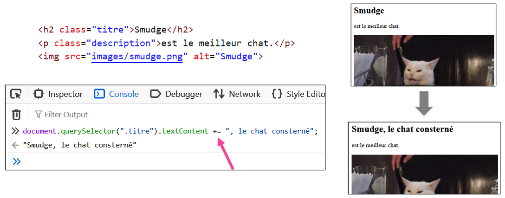
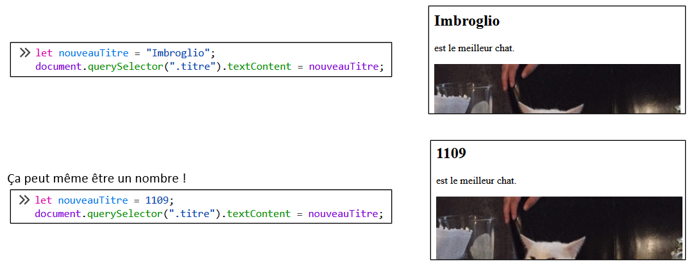
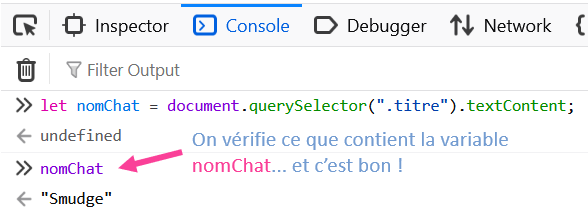
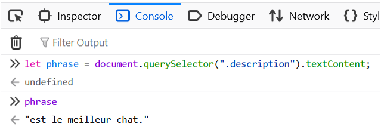

# Cours 3 - Chaînes de caractères

## 🔤 Chaînes de caractères

Jusqu'ici, nous avons vu deux types de données : les **nombres entiers** et les **nombres à virgule**.

```js
let age = 17;
let prixSalade = 4.99;
```

Il existe un autre type de données : les **chaînes de caractères** (lettres, mots, phrases, etc.)

```js
let chaine1 = "Le cours est plate.";
let chaine2 = "Sussy";
let chaine3 = "420 chiens chassent 69 chats.";
```

:::warning

Les **chaînes de caractères** doivent toujours être encadrées par des **guillemets doubles** `"..."` ou simples `'...'`.

Si on oublie les guillemets, ça ne fonctionne pas !

<center></center>

:::

:::note

Les deux variables ci-dessous contiennent des **valeurs complètement différentes** ! Même si `55` et `"55"` semblent identiques, `55` est un **nombre** et `"55"` est une **chaîne de caractères** composée du caractère `"5"` deux fois.

```js
let pasUnNombre = "55";
let unNombre = 55;
```

> Qu'est-ce que ça change ?

Si on tente de faire des opérations mathématiques avec la variable `pasUnNombre`, on risque d'avoir des surprises :

<center> </center>

:::

## 🧱 Concaténation

### 🧰 Opérateur `+`

L'opérateur `+` fonctionnement différemment dès qu'une donnée de type **chaîne de caractères** fait partie de l'équation :

<table>
<tr>
<td>
<center></center>
Si on additionne deux **nombres**, une opération mathématique est faite.
</td>
<td>
<center> </center>
Si on additionne un **nombre** avec une **chaîne de caractères**, les deux valeurs sont tout simplement **⛔ concaténées** l’une à la suite de l’autre pour former une nouvelle **chaîne de caractères**.
</td>
<td>
<center></center>
Bien entendu, si on additionne deux **chaînes de caractères**, elles sont **⛔ concaténées** également.
</td>
</tr>
</table>

### 🔩 Littéraux de gabarits (template strings)

Les **littéraux de gabarits** permettent entre autres de glisser la valeur d'une variable dans une **chaîne de caractères**.

<center></center>

Dans l'exemple ci-dessus, la variable `nb` a été **remplacée** par sa valeur, c'est-à-dire `5`. Remarquez que `nb` est encadrée par `${ ... }` : ça permet de dire à JavaScript « remplace la variable par la valeur qu'elle contient ».

#### 📝 Construire un template string

Pour utiliser les **littéraux de gabarits**, il y a deux étapes simples à suivre :

1. Remplacer les **guillemets** `"..."` autour de la chaîne de caractères par des **accents graves** `` `...` ``

<center></center>

2. Encadrer les noms de variable avec `${...}` :

<center></center>

<center></center>

:::tip

Un **template string** peut contenir plusieurs variables :

<center></center>

Un **template string** peut contenir des calculs :

<center></center>

:::

### 🧰 Opérateur `+=`

Pour rappel, l'opérateur `+=` permet d'**augmenter (incrémenter)** la valeur d'une variable.

<center>`x` valait `4`, maintenant ça vaut `7` :</center>

<center></center>
<br/>
<center>`y` valait `7`, maintenant ça vaut `13` :</center>

<center></center>
<br/>
Cela dit, avec des **chaînes de caractères**, cela **ajoute du texte à la fin de la chaîne**.

<center>`mot` contenait `"caca"`, maintenant ça contient `"cacahuète"`, car on a **ajouté** `"huète"` à la fin :</center>

<center></center>

Voici d'autres exemples :

<center></center>

## 🌐 Ouvrir une page Web

Pour apprendre JavaScript, nous utiliserons nos propres pages Web. (Fichiers **.html**)

Pour les ouvrir dans le navigateur (🦊 Firefox est recommandé !), trouvez le fichier **.html** et faites :

`clic-droit -> Ouvrir avec -> Firefox`

<center></center>

Une fois la page ouverte dans le navigateur, ouvrez la **console** (F12), comme d'habitude.

## 📦 DOM (Document Object Model)

Le **DOM** est un *bidule* complexe qui **représente une page Web en entier**. (C'est-à-dire, tout son code HTML, tous ses éléments HTML)

Grâce au **DOM**, nous pourrons, à l'aide de **JavaScript**, modifier une page Web à volonté.

Exemples :
* Couleur du texte
* Contenu textuel
* Jeux
* Faire apparaître des images
* etc.

### ✨ Classes

En HTML, les éléments peuvent avoir des « **classes** ».

* Élément sans classe :

```html
<p>Petit tapis rouge.</p>
```

* Élément avec une classe (nommée `gris`) :

```html
<p class="gris">Petit tapis gris.</p>
```

C'est le développeur Web qui choisit le **nom de chaque classe**. (Ça peut être n'importe quoi d'autre, pas juste `gris` !)

<hr/>

Grâce à la **classe** d'un élément, nous allons pouvoir le modifier. 📝 (Changer son texte, changer sa couleur, etc.) Par exemple, prenons l'élément suivant :

```html
<div class="pikachu">Please pick a shoe.</div>
```

Pour modifier son texte, en **JavaScript**, nous pourrons utiliser le code suivant :

```js
document.querySelector(".pikachu").textContent = "Choisissez une chaussure s'il vous plait.";
```

💡 Remarquez que la classe `pikachu` a été utilisée dans le code ! Plus de détails plus loin.

:::tip

🔍 Pour trouver la **classe** d'un élément HTML, on peut utiliser l'outil « Inspecter » du navigateur !

Par exemple, ici, je me demande quelle est la **classe** du titre « Smudge » :

<center></center>

Voici comment trouver la classe :

1. Faites `clic-droit` **sur l'élément** (sur le texte) et faites `Inspecter`

<center></center>

2. Le code HTML de la page va s'afficher. Identifiez la **classe** pour **l'élément HTML surligné en bleu** !

<center></center>

💡 Ici, on peut voir que sa **classe** est `titre`.

:::

### 🔍 Obtenir le contenu textuel d'un élément

La ligne de code suivante permet d'**obtenir le contenu textuel** d'un élément :

```js
document.querySelector(".classe").textContent
```

Par exemple, ci-dessous, on veut obtenir le contenu textuel de l'élément avec la classe `"titre"` et la console nous répond `"Smudge"` :

<center></center>

En gros, c'est un peu comme si on demandait à la console : « dis-moi quel est le texte de l'élément avec cette classe ».

:::info

Décortiquons **un peu** la ligne de code suivante :

```js
document.querySelector(".titre").textContent
```

* `document` : Indique qu'on va utiliser le **DOM**.
* `.querySelector` : Indique qu'on va demander d'accéder à **élément HTML**.
* `(".titre")` : La **classe** de l'élément qui nous intéresse doit être ... :
  * Précédée d'un point `.`
  * Entourée de guillemets `"..."`
  * Entourée de parenthèses `(...)`
  * C'est un peu bizarre, mais pour le moment soyez ouvert d'esprit 😵
* `.textContent` : Indique qu'on veut connaître le **contenu textuel** de l'élément

:::

### 📝 Modifier le contenu textuel d'un élément

#### Opérateur `=`

La ligne de code suivante permet de **modifier le contenu textuel** d'un élément :

```js
document.querySelector(".classe").textContent = "Nouveau texte";
```

Ci-dessous, nous allons **remplacer** le texte « Smudge » par « Chat consterné ». On doit utiliser la classe `.titre` pour y arriver.

<center></center>

#### Opérateur `+=`

La ligne de code suivante permet d'**ajouter ⛔ du contenu textuel** à la fin du texte existant :

```js
document.querySelector(".classe").textContent += "texte supplémentaire";
```

🔍 Remarquez bien qu'on a utilisé l'opérateur `+=` plutôt que `=` !

<center></center>

#### Afficher la valeur d'une variable

Plutôt que d’affecter une **chaîne de caractères** au contenu textuel manuellement, on peut également utiliser n’importe quelle variable pour afficher sa valeur dans la page Web :

<center></center>

#### 🧩 Exemple un peu plus complexe

Nous allons récupérer les textes « Smudge » et « est le meilleur chat » pour les **concaténer** et les afficher dans un élément.

<center></center>

1. D'abord, nous allons récupérer le texte `"Smudge"` pour le mettre dans une variable :

<center></center>

2. Ensuite, nous allons également récupérer le texte `"est le meilleur chat."` pour le mettre dans une deuxième variable :

<center></center>

3. Finalement, nous allons modifier le contenu textuel de l'élément avec la classe `description` en utilisant un **template string** :

<center></center>

<hr/>

<center></center>

### 🔄 Mise en garde

Pour le moment, nous utilisons la console du navigateur Web pour écrire notre code **JavaScript**, alors tous les changements que nous faisons sont **temporaires** !

**Réactualiser** 🔄 la page Web **supprime tous les changements** faits sur le DOM avec la console.