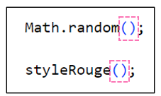
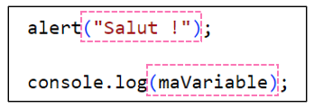

# Cours 10 - Paramètres

Certaines fonctions **n'ont pas de paramètres** :

<center></center>

Certaines fonctions **ont un ou plusieurs paramètres** :

<center></center>

💡 Lorsqu'une **fonction** contient une ou plusieurs **données** dans ses **parenthèses** lorsqu'on l'**appelle**, on dit que c'est une **fonction avec paramètre(s)**.

Quand on appelle `alert(...)` et `console.log(...)`, il **faut** mettre du texte (ou une variable qui contient du texte) dans les **parenthèses**. Quand on fait ça on « **envoie un paramètre** » à la fonction. Cette fonction va ensuite **utiliser** le **paramètre** pour faire quelque chose avec.

## 🥚 Créer une fonction avec un paramètre

Ci-dessous, j'ai une fonction simple, sans paramètre :

```js showLineNumbers
function alerteEtConsole(){

    alert("Allo");
    console.log("Allo");

}
```

Toutefois, au lieu d'afficher `"Allo"` dans une **alerte** et dans la **console**, j'aimerais pouvoir **choisir le texte affiché** quand j'appelle la fonction...

Je vais **ajouter un paramètre à la fonction** :

<center></center>

💡 J'ai ajouté un **paramètre** et je l'ai nommé `message`. J'ai **utilisé** ce paramètre à deux endroits dans la fonction.

Disons que j'appelle la fonction comme ceci :

<center></center>

Alors le texte `"Cliquez pour gagner 1000$ 🤑"` sera 🔌 *plugué* (propagé) à tous les endroits dans la fonction où nous avons utilisé le paramètre `message`. (C'est-à-dire dans `alert(message)` et dans `console.log(message)`)

Que se passera-t-il ? Le message `"Cliquez pour gagner 1000$ 🤑"` sera affiché dans la **console** et dans une **alerte** :

<center></center>

<hr/>

<center></center>

:::warning

Gardez à l'esprit qu'un **paramètre**, c'est un **contrat** : nous **devons** fournir un **paramètre** à la fonction pour pouvoir l'utiliser, car elle en a besoin pour que son code fonctionne bien.

:::

## 🧩 Exemple avec deux paramètres

```js showLineNumbers
function salutations(nom, heure){

    alert(`Bonjour ${nom}, il est actuellement ${heure} !`);

}
```

On peut voir que la fonction `salutations()` possède **deux paramètres** : `nom` et `heure`.

⛔ N'oubliez pas : chaque **paramètre** est un **contrat** ! C'est comme si la fonction nous disait : « tu **dois** me fournir un `nom` et une `heure` pour que je puisse bien fonctionner ! »

<center></center>

## ⚡ La puissance des paramètres

Quel est l'avantage d'utiliser les paramètres ? Commençons par regarder trois fonctions **sans paramètre** :

```js showLineNumbers
function texteEtBordureRouge(){

    document.querySelector(".texte").style.color = "red";
    document.querySelector(".texte").style.borderColor = "red";

}

function texteEtBordureBleu(){

    document.querySelector(".texte").style.color = "blue";
    document.querySelector(".texte").style.borderColor = "blue";

}

function texteEtBordureVert(){

    document.querySelector(".texte").style.color = "green";
    document.querySelector(".texte").style.borderColor = "green";

}
```

⛔ Ces trois fonctions font **presque la même chose** et sont **très répétitives** ! 😬

<hr/>

À l'aide d'un **paramètre**, nous pourrions **remplacer ces trois fonctions par une seule** ! 🧠

```js showLineNumbers
function texteEtBordure(couleurChoisie){

    document.querySelector(".texte").style.color = couleurChoisie;
    document.querySelector(".texte").style.borderColor = couleurChoisie;

}
```

Et voilà ! On a une fonction qui fera le travail, **peu importe la couleur** :

* `textureEtBordure("pink");` permettrait de rendre le texte et la bordure roses.
* `textureEtBordure("crimson");` permettrait de rendre le texte et la bordure cramoisis.
* etc.

:::tip

On pourrait même en profiter pour ajouter un **deuxième paramètre**, qui permettrait de **choisir l'élément HTML**. (Plutôt que de toujours modifier l'élément avec la classe `.texte`)

```js showLineNumbers
function texteEtBordure(classe, couleurChoisie){

    document.querySelector(classe).style.color = couleurChoisie;
    document.querySelector(classe).style.borderColor = couleurChoisie;

}
```

Et voilà, il ne reste plus qu'à **appeler la fonction en lui fournissant deux paramètres** :

* `texteEtBordure(".description", "crimson")` : rendra l'élément `.description` cramoisi.
* `texteEtBordure(".texte", "pink")` : rendra l'élément `.texte` rose.
* etc.

:::

## 🎫 Valeurs et variables

Lorsqu'on passe des **paramètres** à une fonction, on peut le faire en utilisant directement des **valeurs** (`6`, `"salut"`, `true`, etc.) ou en utilisant des **variables**.

Disons qu'on a la fonction suivante :

```js showLineNumbers
function colorierTexte(couleur){

    document.querySelector(".paragraphe2").style.color = couleur;

}
```

Les deux manières de **paser un paramètre** qui suivent sont toutes deux valides.

* Écrire directement la valeur :

```js
colorierTexte("blue");
```

* Utiliser une variable :

```js
let teinte = "red";
colorierTexte(teinte); // On a passé "red" via une variable
```