# Cours 11 - Retours

## 📬 Retourner une valeur

Voici un exemple de fonction **avec une valeur de retour** :

```js showLineNumbers
function valeurPi(){

    let pi = 3.14159265359;
    return pi;

}
```

Grâce au **mot clé `return`**, on peut dire que « la fonction `valeurPi()` retournera la valeur `3.14159265359` ».

## 📞 Appeler une fonction avec retour

Voici ce qui se passe lorsqu'on appelle une **fonction avec valeur de retour** comme `valeurPi()` :

<center>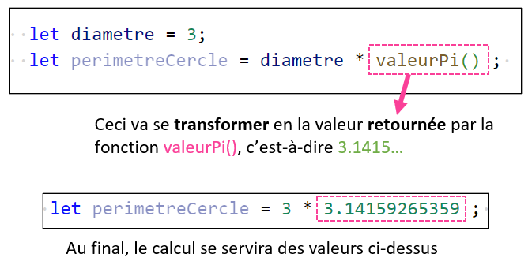</center>

<hr/>

<center>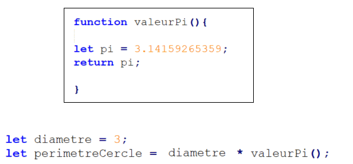</center>

### 💡 Exemple un peu plus utile

La fonction `Math.random()` existe par défaut. (Pas besoin de la créer, comme `alert()` et `console.log()` !)

`Math.random()` retourne **un nombre aléatoire entre `0` et `0.99999...`**. Très utile pour simuler le **hasard** ! 🎲

<center>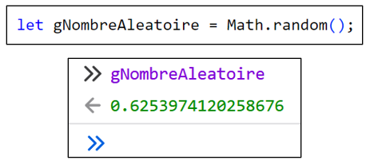</center>

Exemple : on a **25% de chances de gagner 100$** et **75% de chances de perdre 50$** :

```js showLineNumbers
function jouer(){

    let nombreAleatoire = Math.random();

    if(nombreAleatoire < 0.25){

        gArgent += 100;

    }
    else{

        gArgent -= 50;

    }

}
```

* Dans la variable `nombreAleatoire`, il y aura une valeur entre `0` et `0.9999...`. On ne sait pas d'avance quelle sera la valeur ! La valeur changera à chaque fois que nous appellerons la fonction `jouer()`.
* Avec ce `if` ... `else`, on a 25% de chances d'exécuter le `if` et 75% de chances d'exécuter le `else`.

<center>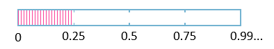</center>

## 🛑 Point de non-retour

:::warning

⛔ Notez que dès que l'instruction `return` est exécutée, **on met fin** à la fonction !

<center>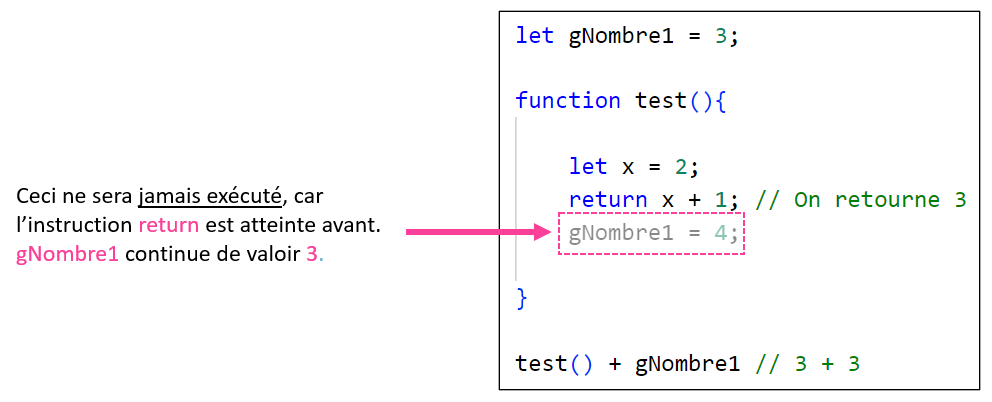</center>

:::

## 📜 Exemples variés

Voici une fonction qui retourne `true` si trois variables globales sont **identiques**, et `false` sinon :

```js showLineNumbers
function tousEgaux(){

    if(gNombre1 == gNombre2 && gNombre1 == gNombre3){
        return true;
    }
    return false;

}
```

:::tip

Pas besoin de mettre `return false` dans un bloc `else` ! Ce bout de code sera seulement atteint si le bloc `if` n'a pas été exécuté de toute façon !

:::

Voici une fonction qui reçoit deux **paramètres** (deux nombres nommés `x` et `y`) et qui **retourne le plus grand des deux** :

```js showLineNumbers
function maximum(x, y){

    if(x > y){
        return x;
    }
    return y;

}
```

```js
let nombre = maximum(2, 4); // nombre contient 4
```

<hr/>

<center>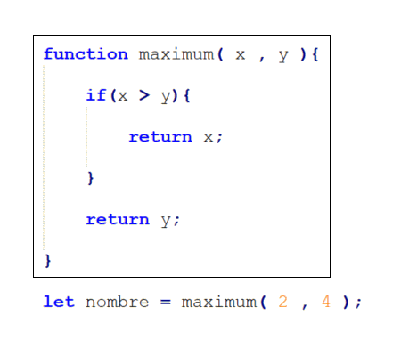</center>

<hr/>

Voici une fonction qui reçoit un **paramètre** (une chaîne de caractères nommée `nom`) et qui **retourne une chaîne de caractères qui correspond à un message de salutations** :

```js showLineNumbers
function saluer(nom){

    return `Salut ${nom}, comment tu vas ?`;

}
```

```js
alert(saluer("Simone"));
```

<center>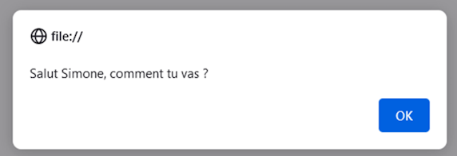</center>


## 🪳 Débogueur (Optionnel)

<details>
    <summary>🥷 Jutsu secret 🤫</summary>

    ‼️ 📢Cette section est complètement optionnelle au cours. ‼️

    Parfois, il est difficile de voir ou comprendre ce qui se passe avec notre code. Un outil très intéressant est le débogueur. Il permet d'ouvrir une vue sur l'exécution de notre code et faciliter la découverte d'éventuel problème. 🔎🪳


    On le retrouve juste à côté de l'onglet de la console de 🔥🦊FireFox. 

    On y retrouve notre script.js! 🎉
    <center>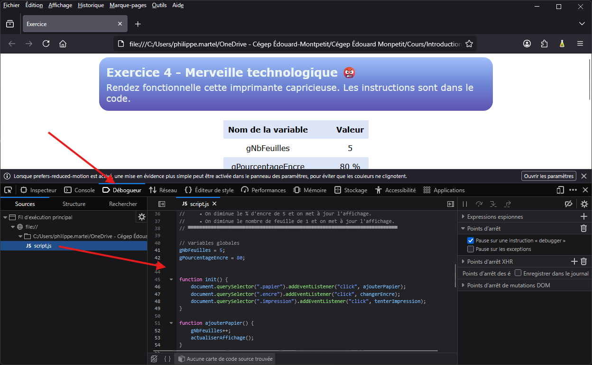</center>
    
    <hr/>
    

    Pour l'utiliser, il suffit d'insérer un point d'arrêt (breakpoint) à la ligne que l'on veut explorer. Lors de l'exécution, notre outil de débogage va s'arrêter à ce point.

    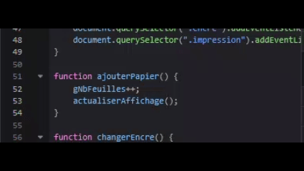

    
<hr/>

Nous pouvons ensuite utiliser les quatres boutons suivant pour avancer l'exécution des lignes de code.
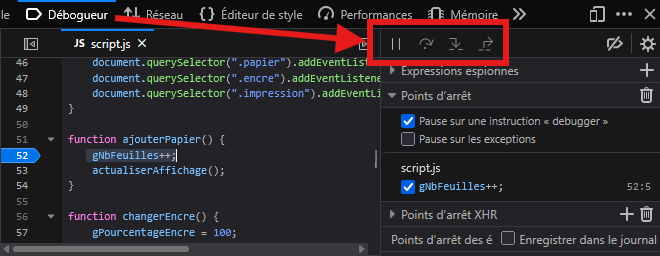

<br/>
Explorons en détail ces boutons! 🔬
<table>
    <tr>
        <th><br/>Reprendre (F8)</th>
        <td>Ce bouton permet de reprendre l'exécution du script après un arrêt sur un point d'arrêt (breakpoint).</td>
    </tr>
    <tr>
        <th><br/>Passer la fonction (F10)</th>
        <td>Passer la fonction permet d'exécuter le code jusqu'à la prochaine ligne. Soit, avancer d'un pas l'exécution.</td>
    </tr>
    <tr>
        <th>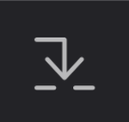<br/>Entrer la fonction (F11)</th>
        <td>Entrer la fonction nous permet d'aller voir l'exécution interne de la fonction pour en examiner le contenu. Ceci est pratique lorsque nous avons une chaîne d'appel de fonction.</td>
    </tr>
    <tr>
        <th>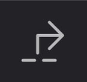<br/>Sortir de la fonction (Shift + F11)</th>
        <td>Sortir de la fonction nous permet de revenir là où la fonction a été appelée. Ceci est pratique lorsque la fonction est très longue et que l'on veut continuer notre observation.</td>
    </tr>
</table>

<center>Voilà un léger survol du débogueur!</center>

<center></center>

</details>
