# Cours 11 - Boucles

Remarquez ce code plutôt répétitif :

<center>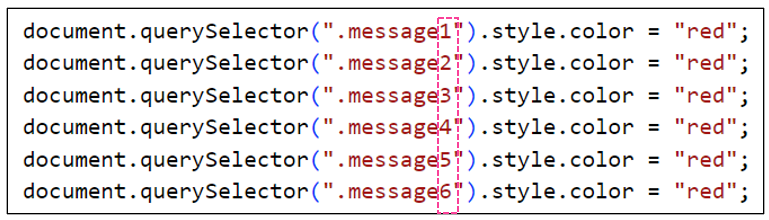</center>

La seule chose qui varie entre ces lignes de code est la **classe** des éléments HTML.

On pourrait rendre le code moins répétitif avec une **fonction avec paramètre**, mais il faudrait quand même
appeler la fonction **6 fois** !

## ➰ Boucles while

Les boucles permettent de **répéter** du code !

Syntaxe :

```js showLineNumbers
while( ... condition ... ){

    // Code à répéter

}
```

C'est un peu comme un `if`, sauf que le code à l'intérieur de la boucle va **s'exécuter à répétition tant que la condition reste `true`**.

<center>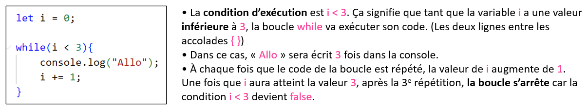</center>

<hr/>

#### Exemple pas-à-pas

<center>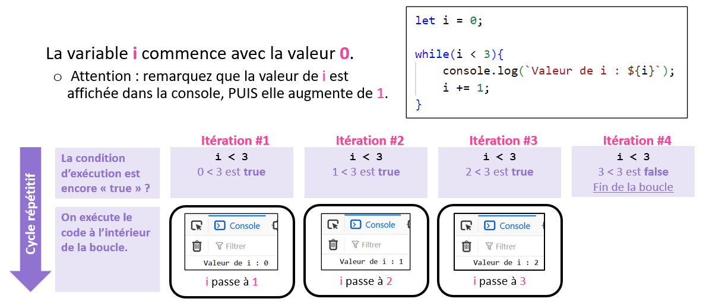</center>

### 💡 Quelques exemples

#### Exemple 1

Cette boucle fera **9 itérations**. (9 répétitions) On se sert de la variable `i` pour ajouter du **contenu textuel** :

<center>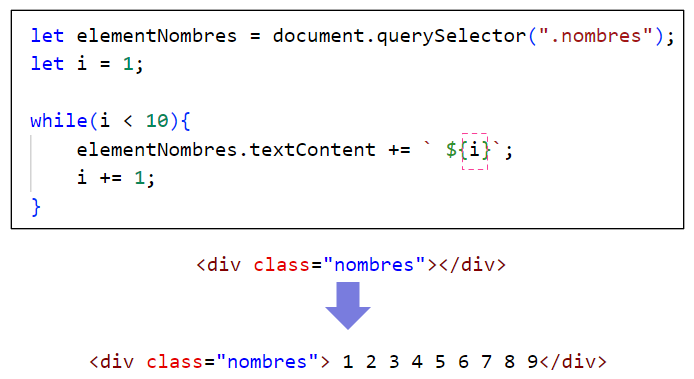</center>

#### Exemple 2

Cette boucle fera **4 itérations**. À chaque itération, on incrémente la variable `valeur` avec la valeur de `i`.

<center>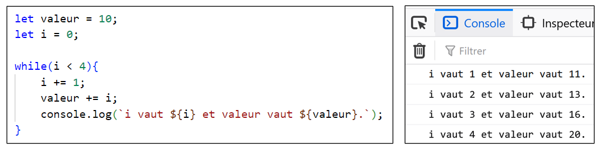</center>

La valeur finale est : `10 + 1 + 2 + 3 + 4`, donc `20`.

#### Exemple 3

Cette boucle fera **3 itérations**. À chaque itération, la classe `image` est ajoutée à un élément HTML.

<center>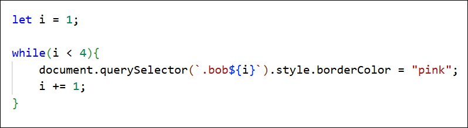</center>
<center>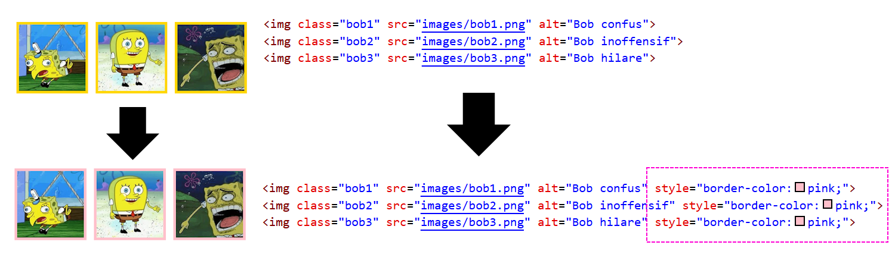</center>

### 🔨 Construire une boucle

Commencez par analyser du **code répétitif** pour **trouver les différences**.

<center>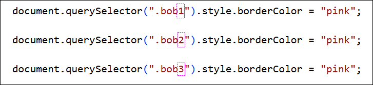</center>

La seule chose qui varie dans ces 3 lignes de code, c'est le **numéro** à la fin de la **classe**.

On a besoin d'une boucle où la variable `i` vaudra `1`, puis `2`, puis `3`.

Squelette de la boucle :

<center>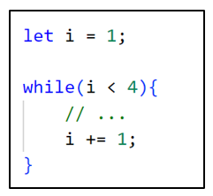</center>

* `i` commencera à `1`. (Grâce à `let i = 1;`)
* `i` va augmenter de `1` à chaque itération. (Grâce à `i += 1;`)
* `i` va s'arrêter à `3`. (Grâce à `i < 4`)

Il reste à intégrer le code et se servir de la variable `i` :

<center></center>

<hr/>

En résumé :

<center>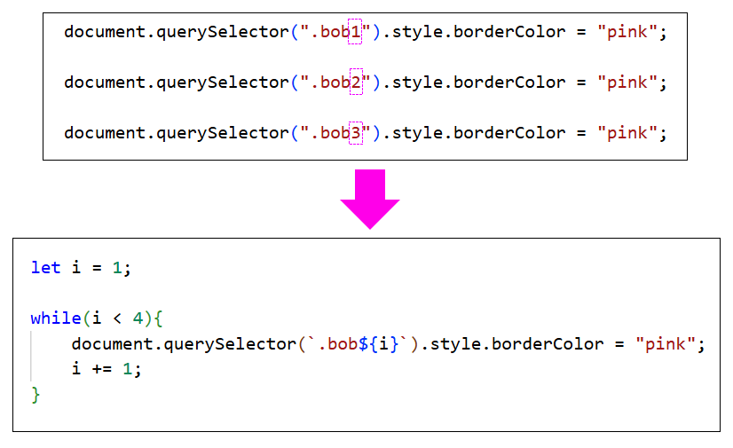</center>

:::tip

S'il y avait eu 3 images supplémentaires avec les classes `bob4`, `bob5` et `bob6`, il suffirait de remplacer la condition de la boucle par `i < 7`, tout simplement !

:::

### 🌌 Boucles infinies

:::danger

⛔ Attention ! Les boucles peuvent **figer la page Web** si elles s'exécutent à l'infini.

```js showLineNumbers
let i = 1;

while(i < 4){
    console.log("Oups ! Boucle infinie.");
}
```

Ici, on a oublié **d'incrémenter la valeur de `i`** dans la boucle, donc `i` vaudra toujours `1` et la condition `i < 4` sera **toujours `true`** !

:::

### 🧩 Exemples avancés

#### Exemple 1

On peut très bien intégrer des blocs `if` (et d'autres types de blocs) dans des boucles `while` :

<center>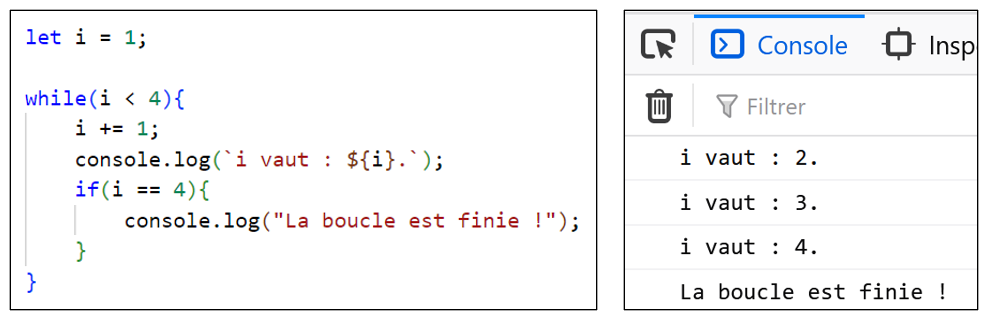</center>

#### Exemple 2

Les **conditions** de nos boucles peuvent être aussi sophistiquées que nécessaire :

<center>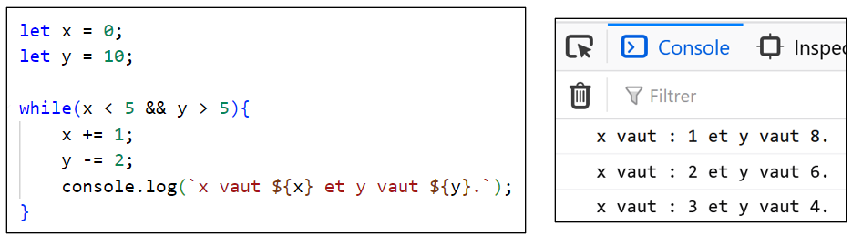</center>

* À chaque itération, `x` augmente de `1` et `y` diminue de `2`.
* À cause de la **condition**, dès que `x` atteindra `5` ou plus OU dès que `y` atteindra `5` ou moins, la boucle s’**arrêtera**.
* Comme `y` diminue plus rapidement que `x` augmente, la boucle s’arrête alors que `x` respecte encore la condition, mais `y` vaut `4` et ne respecte plus la condition.

## 🏁 Boucles do while

Syntaxe :

```js showLineNumbers
do{

    // Code à répéter

}while( ... condition ...);
```

* Très similaire à une boucle `while`, mais la **condition** est vérifiée **APRÈS chaque itération**. (Plutôt qu’avant) Cela signifie qu’il y aura forcément **au moins une itération**.
* Avec une boucle `while`, si la condition était `false` initialement, elle n’effectuerait tout simplement **aucune itération**.

<center>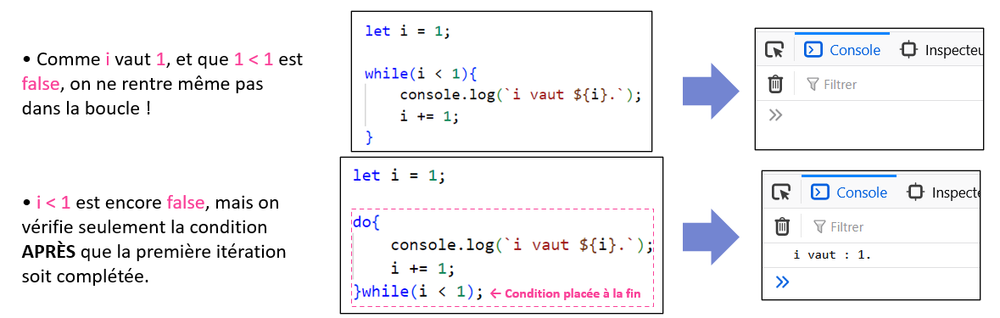</center>

## 🪳 Débogueur (Optionnel)

<details>
    <summary>🥷 Jutsu secret 🤫</summary>

    ‼️ 📢Cette section est complètement optionnelle au cours. ‼️

    Parfois, il est difficile de voir ou comprendre ce qui se passe avec notre code. Un outil très intéressant est le débogueur. Il permet d'ouvrir une vue sur l'exécution de notre code et faciliter la découverte d'éventuel problème. 🔎🪳


    On le retrouve juste à côté de l'onglet de la console de 🔥🦊FireFox. 

    On y retrouve notre script.js! 🎉
    <center>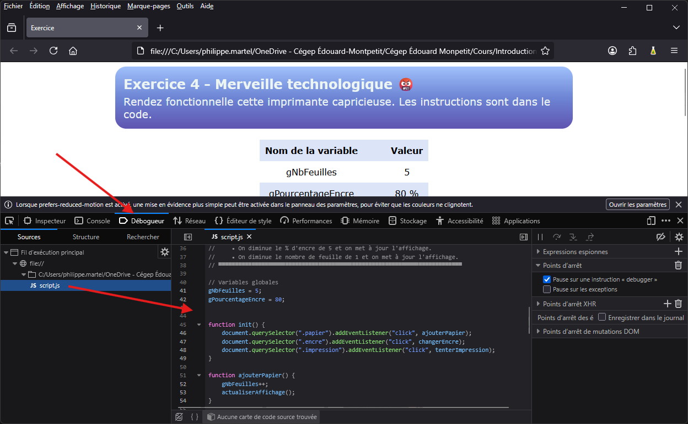</center>
    
    <hr/>
    

    Pour l'utiliser, il suffit d'insérer un point d'arrêt (breakpoint) à la ligne que l'on veut explorer. Lors de l'exécution, notre outil de débogage va s'arrêter à ce point.

    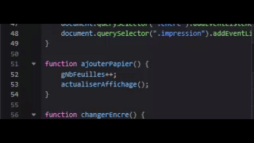

    
<hr/>

Nous pouvons ensuite utiliser les quatres boutons suivant pour avancer l'exécution des lignes de code.
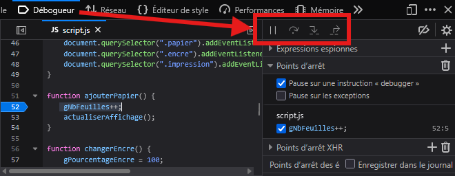

<br/>
Explorons en détail ces boutons! 🔬
<table>
    <tr>
        <th><br/>Reprendre (F8)</th>
        <td>Ce bouton permet de reprendre l'exécution du script après un arrêt sur un point d'arrêt (breakpoint).</td>
    </tr>
    <tr>
        <th><br/>Passer la fonction (F10)</th>
        <td>Passer la fonction permet d'exécuter le code jusqu'à la prochaine ligne. Soit, avancer d'un pas l'exécution.</td>
    </tr>
    <tr>
        <th>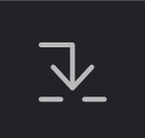<br/>Entrer la fonction (F11)</th>
        <td>Entrer la fonction nous permet d'aller voir l'exécution interne de la fonction pour en examiner le contenu. Ceci est pratique lorsque nous avons une chaîne d'appel de fonction.</td>
    </tr>
    <tr>
        <th>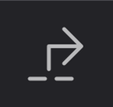<br/>Sortir de la fonction (Shift + F11)</th>
        <td>Sortir de la fonction nous permet de revenir là où la fonction a été appelée. Ceci est pratique lorsque la fonction est très longue et que l'on veut continuer notre observation.</td>
    </tr>
</table>

<center>Voilà un léger survol du débogueur!</center>

<center></center>

</details>
