# Cours 24 - Texte et maths

Depuis le début de la session, nous avons vu quelques fonctions préexistantes en JavaScript : `Math.random()`, `alert(...)`, `console.log(...)`, etc

Aujourd'hui nous allons aborder plusieurs fonctions préexistantes qui permettent de **manipuler des chaînes de caractères** et de **faire des opérations mathématiques simples**.

Les fonctions abordées sont très **standardisées** à travers les différents langages de programmation. (En gros, des fonctions identiques ou similaires existent dans la plupart des langages de programmation !) Ainsi, les apprendre avec **JavaScript** vous sera utile pour d'autres langages aussi.

## 📝 Fonctions textuelles

### 📏 Longueur d'une chaîne

`.length` fonctionne aussi avec les **chaînes de caractères**, pas seulement avec les **tableaux** !

<center>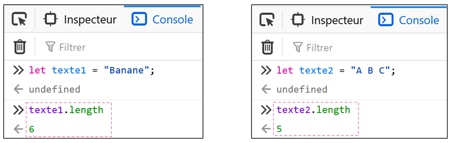</center>

### 🤏 Sous-chaîne

`.substring()` retourne une « sous-chaîne » de caractères. On doit fournir **deux paramètres** à cette fonction 

* Le premier paramètre est l'**index** du premier caractère à **conserver**.
* Le deuxième paramètre est l'**index** du caractère où la sous-chaîne s'arrête. (Exclus !)

<center>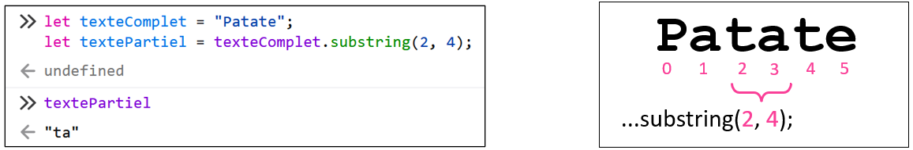</center>

<hr/>

<center>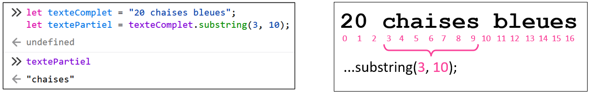</center>

### ☝ Remplacer un segment

`.replace()` permet de remplacer **un** groupe de caractères. Cette fonction **retourne** la chaîne de caractère modifiée.

Il faut fournir **deux paramètres** :

* Le premier paramètre est le groupe de **1+ caractère(s) à remplacer**.
* Le deuxième paramètre est le groupe de remplacement.

<center>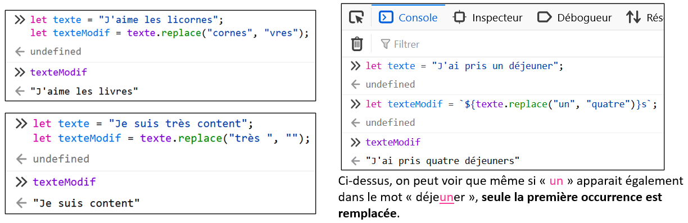</center>

### ✋ Remplacer plusieurs segments

`.replaceAll()` est similaire à `.replace()`, mais elle remplace **toutes les occurences** du texte à remplacer. Cette fonction retourne la chaîne de caractères modifiée également.

Il faut fournir **deux paramètres** :

* Le premier paramètre est le groupe de **1+ caractère(s) à remplacer**.
* Le deuxième paramètre est le groupe de remplacement.

<center>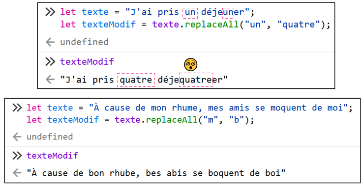</center>

### 📢 Majuscules / 🤫 Minuscules

`.toLowerCase()` et `.toUpperCase()` retournent la chaîne de caractères, mais complètement en **minuscules / majuscules**. (Aucun impact sur les caractères qui ne sont pas des lettres)

<center>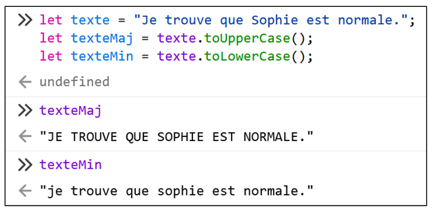</center>

### 🔍 Obtenir un caractère

`.charAt()` retourne le caractère situé à l’**index** de notre choix dans une chaîne de caractères.

Il faut fournir **un paramètre** : l'**index** du caractère souhaité.

<center>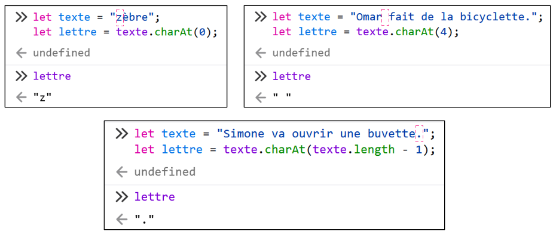</center>

## 🧮 Fonctions mathématiques

### ⚪ Arrondir

`Math.round()` retourne un nombre arrondi au **nombre entier le plus près**. 

<center>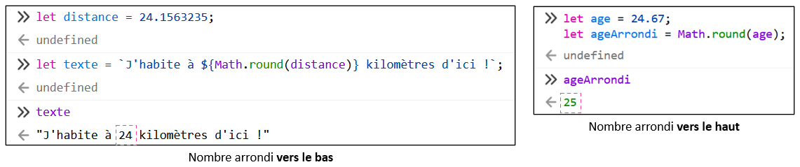</center>

### 🔽🔼 Arrondir vers le bas / le haut

`Math.floor()` retourne un nombre toujours arrondi **vers le bas**.
`Math.ceil()` retourne un nombre toujours arrondi **vers le haut**.

<center>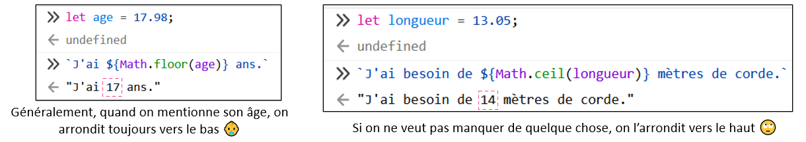</center>

### ⏬⏫ Minimum et maximum

`Math.max()` retourne la valeur **maximale** entre plusieurs nombres.
`Math.min()` retourne la valeur **minimale** entre plusieurs nombres.

<center>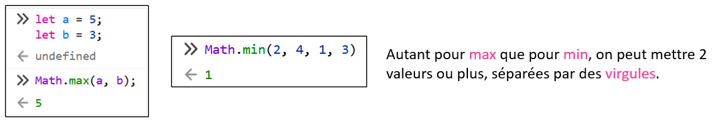</center>

<hr/>

<center>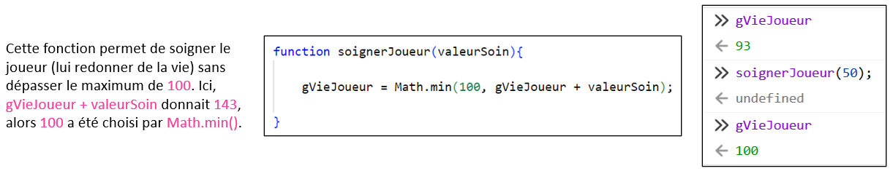</center>

### 🎲 Nombre aléatoire

Nous avons déjà abordé `Math.random()`, mais abordons des exemples un peu plus sophistiqués.

<center>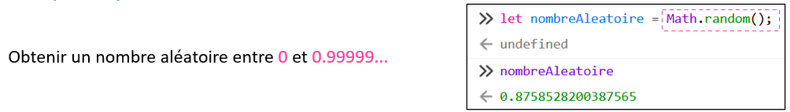</center>

<hr/>

<center>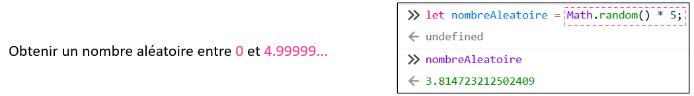</center>

<hr/>

<center>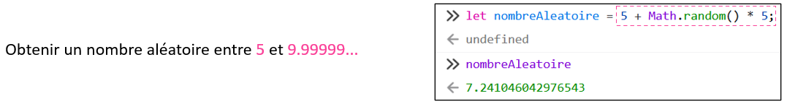</center>

<hr/>

<center>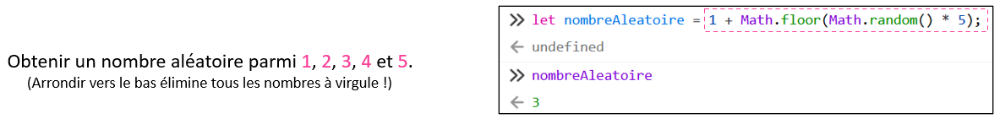</center>

<hr/>

<center>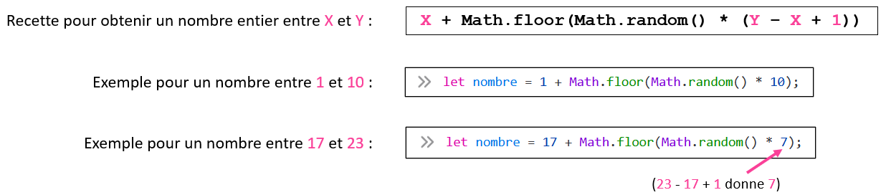</center>

## 📢 Écouteurs d'événements avec paramètres

Pour le moment, nous n'étions pas capables de **passer des paramètres** à une fonction appelée par un écouteur d'événements.

:::warning

⛔ Ceci **ne fonctionne pas** :

```js showLineNumbers
function init(){

    document.querySelector(".bouton1").addEventListener("click", changerCouleur("crimson"));

}
```

✅ Nous sommes obligés d'écrire le nom de la fonction **sans paramètre ni parenthèses** dans un écouteur d'événements :

```js showLineNumbers
function init(){

    document.querySelector(".bouton1").addEventListener("click", changerCouleur);

}
```

:::

Il existe toutefois un *stratagème* pour contourner cette contrainte :

```js
document.querySelector(".bouton1").addEventListener("click", function(){ changerCouleur("crimson") });
```

Remarquez qu'on a glissé l'appel de `changerCouleur("crimson")` dans un bloc `function(){ ... }`.

Il n'est pas nécessaire de comprendre à 100% ce stratagème (tant que vous êtes capables de l'utiliser !), mais en gros, `function() { ... }` est une **fonction anonyme** (une fonction qui n'a pas de nom et donc qui ne peut pas être réutilisée) et on peut mettre le bloc de code de notre choix à l'intérieur. (Dans ce cas-ci, un appel de fonction avec **paramètre(s)**)

Bref, dans ce cas-ci, **cliquer** sur l'élément `.bouton1` appelle une **fonction anonyme** qui appelle `changerCouleur("crimson")` 😵

### ✨ Exemple de simplification du code

Voici un exemple où ce *stratagème* est utilisé pour simplifier du code.

Avant :

```js showLineNumbers
function init(){

    document.querySelector(".bouton1").addEventListener("click", changerCouleurBleu);
    document.querySelector(".bouton2").addEventListener("click", changerCouleurRouge);

}

function changerCouleurBleu(){
    changerCouleur("blue");
}

function changerCouleurRouge(){
    changerCouleur("red");
}

function changerCouleur(couleur){
    document.querySelector(".texte").style.color = couleur;
}
```

Remarquez que les fonctions `changerCouleurBleu()` et `changerCouleurRouge()` servent juste à faire le **pont** entre un écouteur d'événement et la fonction `changerCouleur()` pour passer un **paramètre**. Remédions-y.

Après :

```js showLineNumbers
function init(){

    document.querySelector(".bouton1").addEventListener("click", function(){ changerCouleur("blue") });
    document.querySelector(".bouton2").addEventListener("click", function(){ changerCouleur("red") });

}

function changerCouleur(couleur){
    document.querySelector(".texte").style.color = couleur;
}
```