# Cours 24 - Texte et maths

Depuis le début de la session, nous avons vu quelques fonctions préexistantes en JavaScript : `Math.random()`, `alert(...)`, `console.log(...)`, etc

Aujourd'hui nous allons aborder plusieurs fonctions préexistantes qui permettent de **manipuler des chaînes de caractères** et de **faire des opérations mathématiques simples**.

Les fonctions abordées sont très **standardisées** à travers les différents langages de programmation. (En gros, des fonctions identiques ou similaires existent dans la plupart des langages de programmation !) Ainsi, les apprendre avec **JavaScript** vous sera utile pour d'autres langages aussi.

## 📝 Fonctions textuelles

### 📏 Longueur d'une chaîne

`.length` fonctionne aussi avec les **chaînes de caractères**, pas seulement avec les **tableaux** !

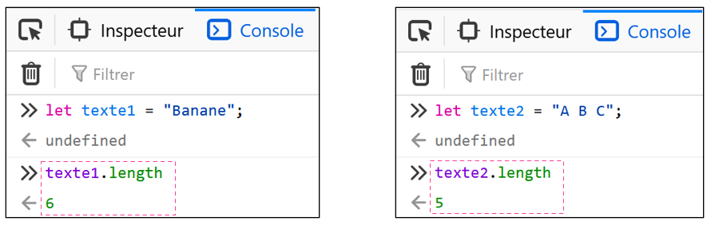

### 🤏 Sous-chaîne

`.substring()` retourne une « sous-chaîne » de caractères. On doit fournir **deux paramètres** à cette fonction 

* Le premier paramètre est l'**index** du premier caractère à **conserver**.
* Le deuxième paramètre est l'**index** du caractère où la sous-chaîne s'arrête. (Exclus !)

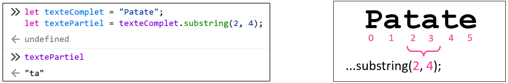

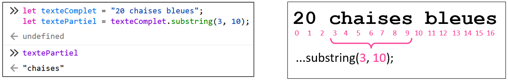

### ☝ Remplacer un segment

`.replace()` permet de remplacer **un** groupe de caractères. Cette fonction **retourne** la chaîne de caractère modifiée.

Il faut fournir **deux paramètres** :

* Le premier paramètre est le groupe de **1+ caractère(s) à remplacer**.
* Le deuxième paramètre est le groupe de remplacement.

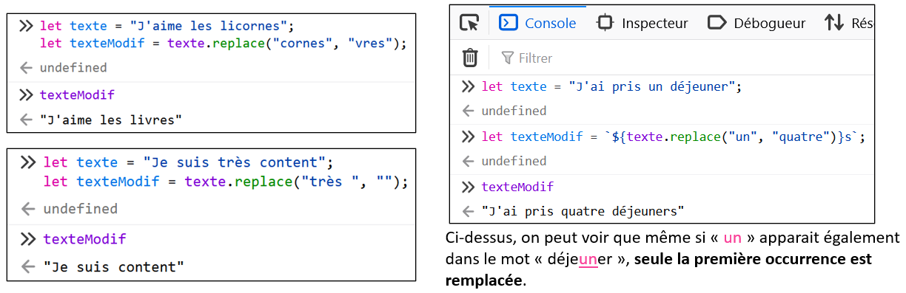

### ✋ Remplacer plusieurs segments

`.replaceAll()` est similaire à `.replace()`, mais elle remplace **toutes les occurences** du texte à remplacer. Cette fonction retourne la chaîne de caractères modifiée également.

Il faut fournir **deux paramètres** :

* Le premier paramètre est le groupe de **1+ caractère(s) à remplacer**.
* Le deuxième paramètre est le groupe de remplacement.

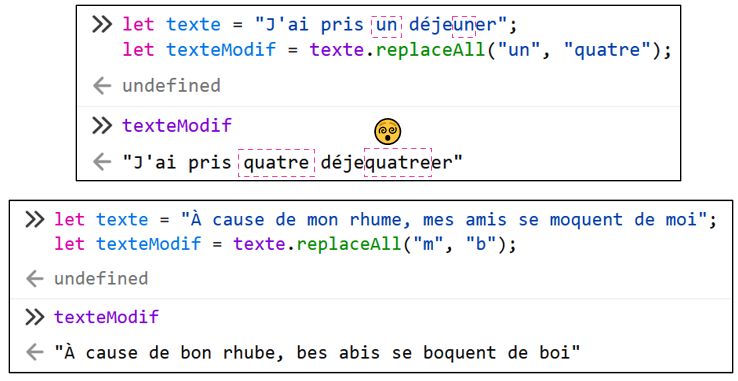

### 📢 Majuscules / 🤫 Minuscules

`.toLowerCase()` et `.toUpperCase()` retournent la chaîne de caractères, mais complètement en **minuscules / majuscules**. (Aucun impact sur les caractères qui ne sont pas des lettres)

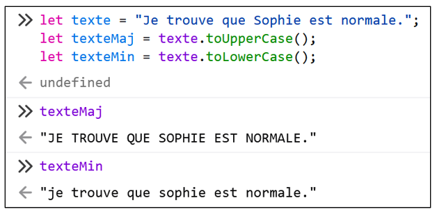

### 🔍 Obtenir un caractère

`.charAt()` retourne le caractère situé à l’**index** de notre choix dans une chaîne de caractères.

Il faut fournir **un paramètre** : l'**index** du caractère souhaité.

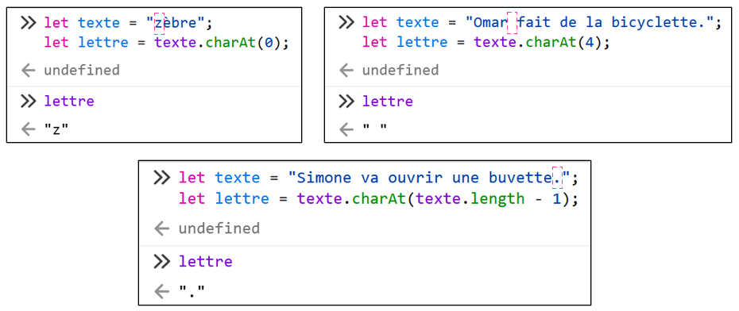

## 🧮 Fonctions mathématiques

### ⚪ Arrondir

`Math.round()` retourne un nombre arrondi au **nombre entier le plus près**. 

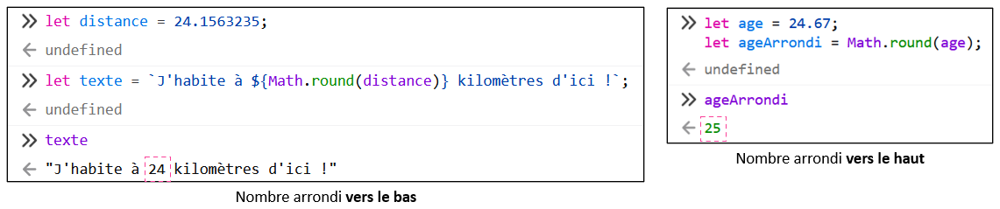

### 🔽🔼 Arrondir vers le bas / le haut

`Math.floor()` retourne un nombre toujours arrondi **vers le bas**.
`Math.ceil()` retourne un nombre toujours arrondi **vers le haut**.

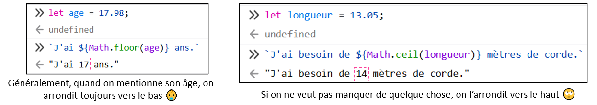

### ⏬⏫ Minimum et maximum

`Math.max()` retourne la valeur **maximale** entre plusieurs nombres.
`Math.min()` retourne la valeur **minimale** entre plusieurs nombres.

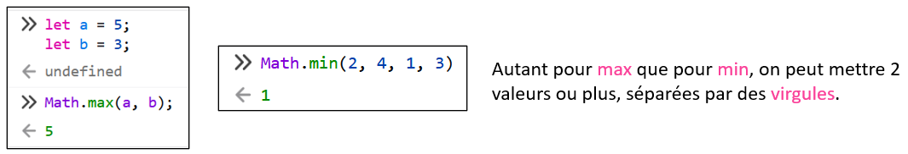

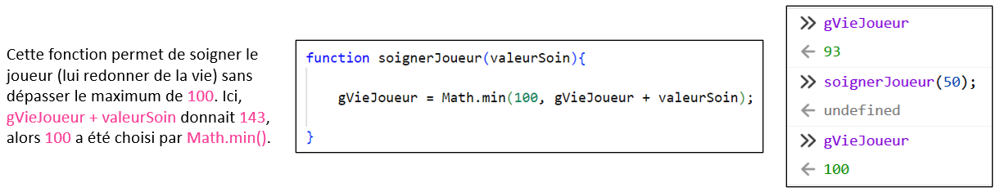

### 🎲 Nombre aléatoire

Nous avons déjà abordé `Math.random()`, mais abordons des exemples un peu plus sophistiqués.

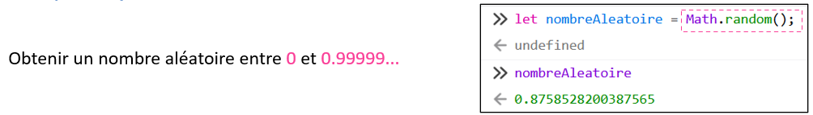

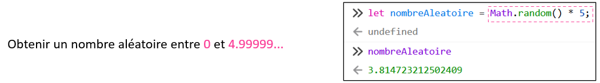

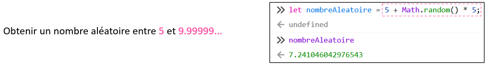

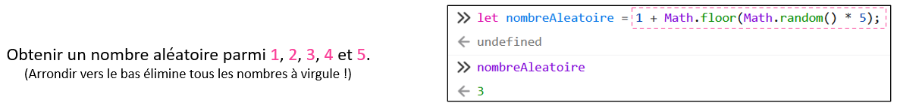

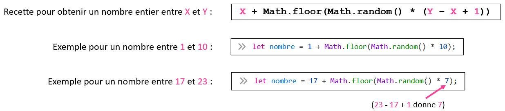
