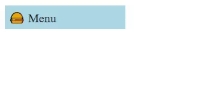
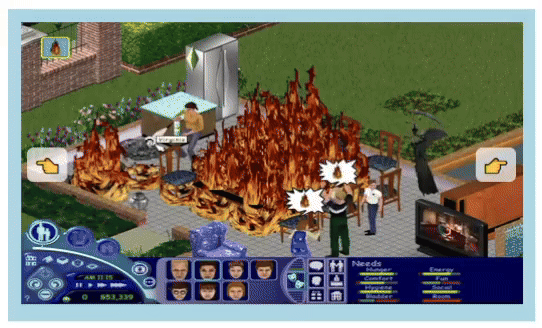
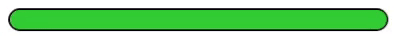
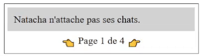

import Tabs from '@theme/Tabs';
import TabItem from '@theme/TabItem';

# Cours 25 - Widgets Web

Au cours de votre technique, vous utiliserez des librairies Web (Ex : **Bootstrap**, **jQuery**, **Tailwind**, etc.) qui permettent de simplifier l'**interaction avec le DOM**. Dans ce cours, nous n'avons utilisé aucune librairie et avons fait toutes nos manipulations « à la main », en prenant tout le contrôle de JavaScript. 

Certaines librairies, comme **Bootstrap**, proposent des gabarits de **composants / widgets** préfabriqués faciles à intégrer dans nos pages Web. Dans ce cours, nous bricolerons quelques **widgets** « à la main » pour avoir un aperçu de leur fonctionnement. Ce sera surtout une opportunité de réviser les notions que nous avons apprises tout au long de la session.

:::note

Bien entendu, les widgets proposés par les librairies les plus populaires sont généralement plus élégants et sophistiqués que ceux que nous créerons !

:::

:::warning

Il est probable que plusieurs styles CSS vous soient inconnus. De toute façon, vous devrez surtout vous concentrer sur le JavaScript, comme d'habitude.

:::

## 🧻 Menu déroulant

<center></center>

<Tabs>
    <TabItem value="html" label="HTML" default>
        ```html showLineNumbers
        <div class="boutonMenu">
            
            <!-- Bouton -->
            🍔 Menu

            <!-- Menu déroulant -->
            <div class="menuDeroulant" style="display:none;">
                <div>👋 Accueil</div>
                <div>🛒 Boutique</div>
                <div>🔍 À propos</div>
            </div>

        </div>
        ```
    </TabItem>
    <TabItem value="css" label="CSS">
        ```css showLineNumbers
        .boutonMenu, .menuDeroulant>div{
            background-color:lightblue;
            padding:5px 5px;
            width:150px;
            display:inline-block;
            cursor:pointer;
        }

        .boutonMenu{
            position:relative;
            user-select:none;
        }

        .menuDeroulant{
            position:absolute;
            top:0px;
            left:0px;
            z-index:2;
        }

        .menuDeroulant>div{
            display:block;
        }

        .menuDeroulant>div:hover{
            background-color:aliceblue;
            color:lightskyblue;
        }
        ```
    </TabItem>
</Tabs>


JavaScript :

```js showLineNumbers
// Écouteurs d'événements
function init(){

    document.querySelector(".boutonMenu").addEventListener("click", function(){ ouvrirFermerMenuDeroulant(true) });
    document.querySelector(".menuDeroulant").addEventListener("mouseleave", function(){ ouvrirFermerMenuDeroulant(false) });

}

function ouvrirFermerMenuDeroulant(ouvrir){

    document.querySelector(".menuDeroulant").style.display = ouvrir ? "block" : "none";    

}
```

:::tip

L'événement `"mouseleave"` est similaire à `"mouseout"`, sauf qu'il se déclenche seulement lorsqu'on arrête de survoler un élément spécifique. (Alors qu'avec `"mouseout"`, le déclenchement se fait dès qu'on arrêter de survoler l'élément **ou un de ses éléments enfants** !)

:::

## 🎠 Carrousel

<center></center>

<Tabs>
    <TabItem value="html" label="HTML" default>
        ```html showLineNumbers
        <div class="carrousel">

            
            <div class="precedent">👈</div>
            <div class="suivant">👉</div>

        </div>
        ```
    </TabItem>
    <TabItem value="css" label="CSS">
        ```css showLineNumbers
        .carrousel{
            background-color:lightblue;
            padding:10px;
            width:400px;
            position:relative;
        }

        .imageCarrousel{
            width:100%;
            margin-bottom:0px;
            transition:1s;
        }

        .precedent, .suivant{
            position:absolute;
            cursor:pointer;
            user-select: none;
            background-color:rgba(255,255,255,0.7);
            padding:0px 5px 5px 5px;
            border-radius:5px;
            top:124px;
            transform:translateY(-50%);
        }

        .precedent{
            left:15px;
        }

        .suivant{
            right:15px;
        }
        ```
    </TabItem>
</Tabs>

JavaScript :

```js showLineNumbers
// Écouteurs d'événements
function init(){

    // Carrousel
    document.querySelector(".precedent").addEventListener("click", function(){ changerImage(true); });
    document.querySelector(".suivant").addEventListener("click", function(){ changerImage(false); });

}

// Tableau avec toutes les images
let gImages = ["sims1.png", "sims2.png", "sims3.png", "sims4.png"];

// Index de l'image actuellement affichée
let gIndexImage = 0;

function changerImage(precedent){

    // On augmente ou réduit l'index
    let variation = precedent ? -1 : 1;
    gIndexImage = gIndexImage + variation;

    if(gIndexImage < 0){
        gIndexImage = gImages.length - 1; // « Wrap » vers la fin du tableau
    }
    if(gIndexImage >= gImages.length){
        gIndexImage = 0;  // « Wrap » vers le début du tableau
    }

    // On change l'image affichée
    document.querySelector(".imageCarrousel").src = "images/" + gImages[gIndexImage];

}
```

## 📊 Barre de progression

<center></center>

<Tabs>
    <TabItem value="html" label="HTML" default>
        ```html showLineNumbers
        <div class="barre">
            <div class="progression" style="background-color:crimson;"></div>
        </div>
        ```
    </TabItem>
    <TabItem value="css" label="CSS">
        ```css showLineNumbers
        .barre{
            position:relative;
            width:300px;
            height:15px;
            border-radius:15px;
            border:solid black 2px;
            background-color:rgb(30,30,30);
        }

        .progression{
            position:absolute;
            height:15px;
            top:0px;
            border-radius:15px;
        }
        ```
    </TabItem>
</Tabs>

JavaScript :

```js showLineNumbers
// Écouteurs d'événements
function init(){

    gPlanificateur = setInterval(modifierProgression, 10);

}

let gProgression = 0; // Largeur de la progression (de 0 à 300) en pixels
let gPlanificateur = null;

function modifierProgression(){

    // On augmente la progression et la largeur de la barre colorée
    gProgression = Math.min(300, gProgression + 1);

    let barre  = document.querySelector(".progression");
    
    barre.style.width = gProgression + "px";

    // On change sa couleur à certains moments
    switch(gProgression){
        case 100 : barre.style.backgroundColor = "orange"; break;
        case 200 : barre.style.backgroundColor = "gold"; break;
        case 300 : barre.style.backgroundColor = "limegreen"; break;
    }

    // On arrête la progression une fois à 300 pixels
    if(gProgression >= 300){
        clearInterval(gPlanificateur);
        gPlanificateur = null;
    }

}
```

## 📃 Pagination

<center></center>

<Tabs>
    <TabItem value="html" label="HTML" default>
        ```html showLineNumbers
        <div class="pages">
            <div class="page">Natacha n'attache pas ses chats.</div>
            <div class="page" style="display:none;">Ces seize chaises sont sèches.</div>
            <div class="page" style="display:none;">Cinq chiens chassent six chats.</div>
            <div class="page" style="display:none;">Suis-je chez ce cher Serge ?</div>
            <div class="menuPage">
                <div class="pagePrecedente">👈</div>
                <div class="indexPage">Page 1 de 4</div>
                <div class="pageSuivante">👉</div>
            </div>
        </div>
        ```
    </TabItem>
    <TabItem value="css" label="CSS">
        ```css showLineNumbers
        .pages{
            width:300px;
            padding:5px;
            border:black solid 1px;
        }

        .menuPage{
            margin:5px 0px;
            display:flex;
            justify-content:center;
            gap:0px 5px;
            align-items: center;
        }

        .pagePrecedente, .pageSuivante{
            cursor:pointer;
            user-select: none;
        }

        .page{
            background-color:lightgray;
            padding:10px;
        }
        ```
    </TabItem>
</Tabs>

JavaScript :

```js showLineNumbers
// Écouteurs d'événements
function init(){

    document.querySelector(".pagePrecedente").addEventListener("click", function(){ changerPage(true); });
    document.querySelector(".pageSuivante").addEventListener("click", function(){ changerPage(false); });

}

let gNbPages = 4;
let gIndexPage = 0; // Page actuellement affichée (0 est la première, 3 est la dernière)

function changerPage(precedent){

    // Création d'un tableau pour avoir accès à toutes les pages du HTML
    let pages = document.querySelectorAll(".page");

    // Cacher l'ancienne page
    pages[gIndexPage].style.display = "none";

    // Changer l'index
    let variation = precedent ? -1 : 1;
    gIndexPage = Math.min(gNbPages - 1, Math.max(0, gIndexPage + variation));

    // Afficher la nouvelle page
    pages[gIndexPage].style.display = "block";

    // Mettre à jour la numérotation du bas
    document.querySelector(".indexPage").textContent = `Page ${gIndexPage + 1} de ${gNbPages}`;

}
```
