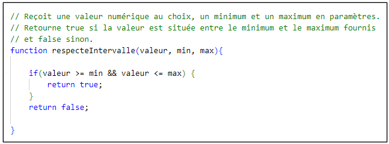
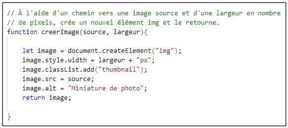
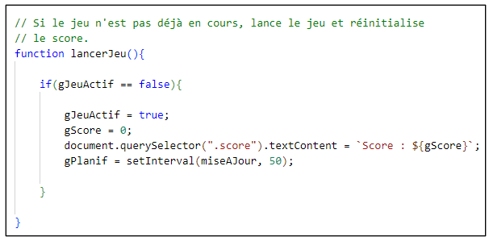
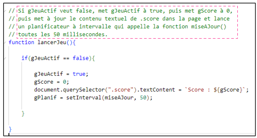
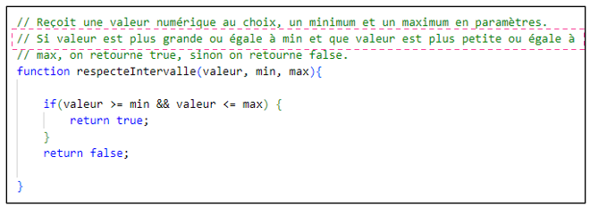
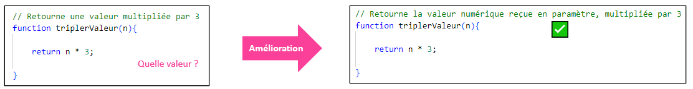
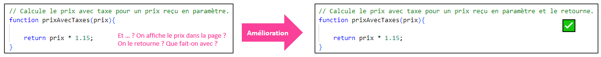

# Cours 26 - Commentaires

## 📜 Commenter ses fonctions

Nous connaissons les **commentaires** (`// ... `) depuis la séance 4, mais nous ne les avons jamais rédigés nous-mêmes.

Pendant le TP3, vous devrez créer vos propres fonctions et vous devrez les ... **commenter** !

:::warning

Lorsqu’on crée du code, c’est important de le commenter (le décrire) pour que nos collègues puissent comprendre et naviguer facilement notre travail.

:::

**Lignes directrices :**

* Décrire brièvement l’**utilité** de la fonction. (⛔ Sans entrer dans des détails trop techniques)
* Si la fonction reçoit des **paramètres**, que représentent-ils ?
* Si la fonction **retourne** une **valeur**, que représente-t-elle ?

### ✅ Bons exemples

### ❌ Mauvais exemples

Ci-dessous, les commentaires **décrivent TROP en détails les lignes de code** plutôt que de **résumer rapidement et clairement en français** les fonctions :

Ci-dessous, on oublie de parler des **paramètres** :

Ci-dessous, on oublie de parler de la **valeur retournée** :

