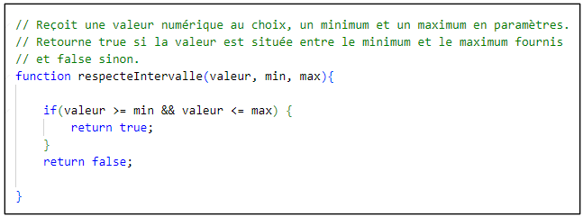
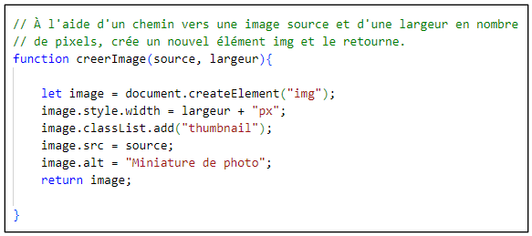
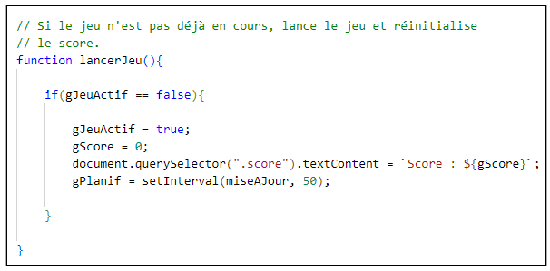
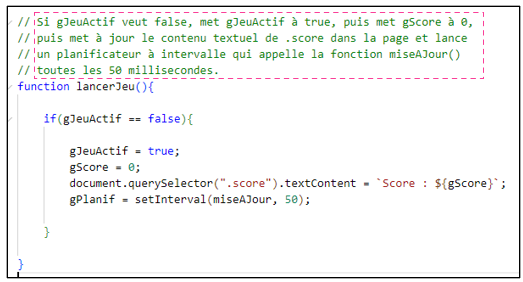
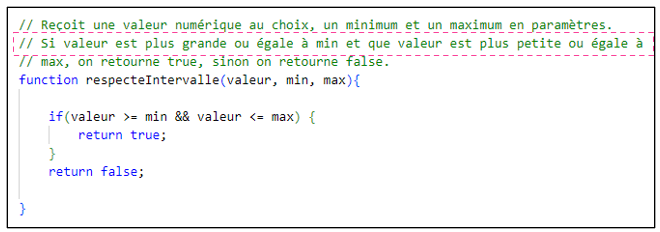
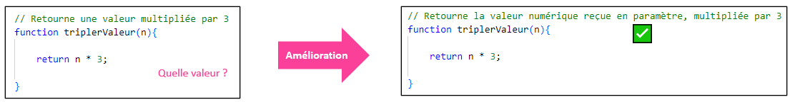
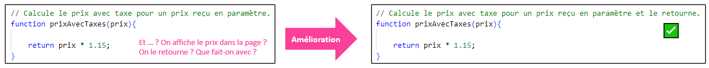
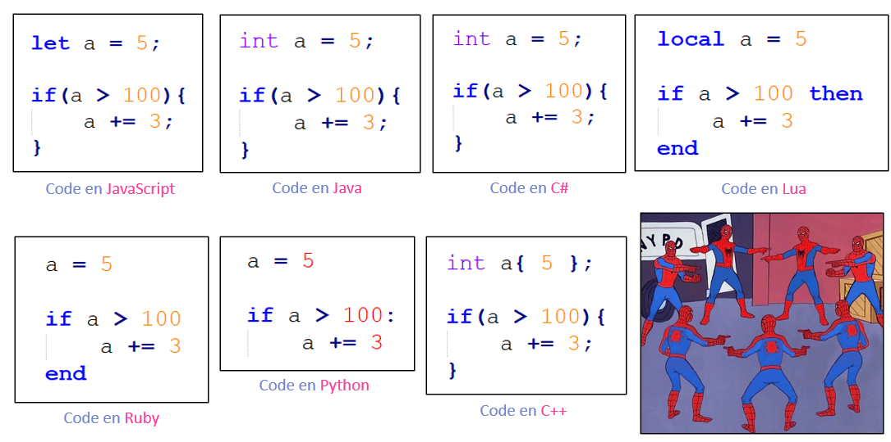

# Cours 26 - Commentaires

## 📜 Commenter ses fonctions

Nous connaissons les **commentaires** (`// ... `) depuis la séance 4, mais nous ne les avons jamais rédigés nous-mêmes.

Pendant le TP3, vous devrez créer vos propres fonctions et vous devrez les ... **commenter** !

:::warning

Lorsqu’on crée du code, c’est important de le commenter (le décrire) pour que nos collègues puissent comprendre et naviguer facilement notre travail.

:::

**Lignes directrices :**

* Décrire brièvement l’**utilité** de la fonction. (⛔ Sans entrer dans des détails trop techniques)
* Si la fonction reçoit des **paramètres**, que représentent-ils ?
* Si la fonction **retourne** une **valeur**, que représente-t-elle ?

### ✅ Bons exemples

### ❌ Mauvais exemples

Ci-dessous, les commentaires **décrivent TROP en détails les lignes de code** plutôt que de **résumer rapidement et clairement en français** les fonctions :

De plus, éviter les formulations génériques en début de commentaire :

* ❌ « La fonction lancerJeu() permet de déterminer si [...] » -> ✅ « détermine si [...] »
* ❌ « Cette fonction modifie la valeur de [...] » -> ✅ « modifie la valeur de [...] »

Ci-dessous, on oublie de parler des **paramètres** :

Ci-dessous, on oublie de parler de la **valeur retournée** :

## 📚 Apprendre d'autres langages

Bien que nous ayons appris beaucoup de notions en **JavaScript**, nous n’avons vu **que les bases** ! 👶 Si vous explorez d’autres langages, vous rencontrerez plusieurs nouvelles notions qui ne vous seront pas familières.

Malgré tout, n’ayez pas peur d’apprendre d’autres langages dès maintenant !
* Il faut apprendre le langage **C++** pour exploiter **Unreal Engine** en profondeur.
* Il faut apprendre **Kotlin**, **Java** ou autre pour faire des applications Android.
* Il faut apprendre **C#**, **Java**, **Python**, **PHP** ou autre pour faire un serveur Web à partir de zéro.
* Il faut apprendre **SQL** pour exploiter les bases de données relationnelles soi-même.
* etc !

Selon les types de projets qui vous intéressent, il y a beaucoup à apprendre. Dans l'univers TIM, vous n'aurez cela dit pas besoin d'apprendre beaucoup de langages de programmation 🥳
