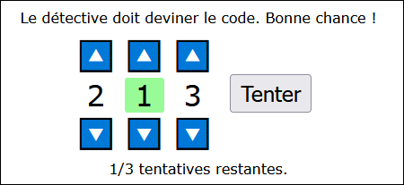
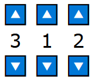
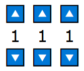
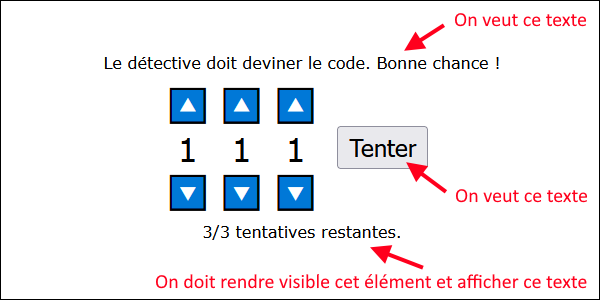
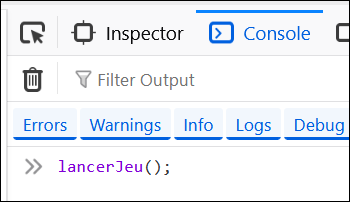
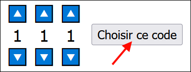
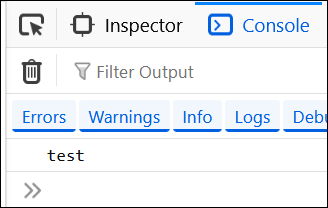
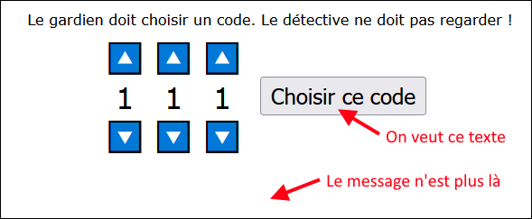

# TP1 - Code pas tant secret 🕵️‍♂️

⏰ Date de remise : **21 septembre à 23h59**. (Remise sur Teams)

📦 Projet de départ : [Téléchargement](../../static/files/tp1.zip)

## 📜 Modalités du TP

* 👤 Le TP doit être fait de manière individuelle.
* ✅ Le projet de départ fourni devra être complété et remis en entier, sur Teams. (Compressé)
* ⛔ Attention au **plagiat**. Pour rappel, il est interdit de :
  * Copier en partie ou complètement le code d'une autre personne.
  * Copier du code généré par IA.
* 📅 La pénalité de retard est de **-10%** par **tranche de 24h entamée**.
  * Si le retard dépasse **120h** (5 jours), la note sera de **0**.
* 🚫 Il est interdit de modifier le code **HTML** ou **CSS** du projet de départ.
* 🚫 Il est interdit d'utiliser des notions qui n'ont pas été abordées en classe, à moins de demander à votre enseignant(e) **pendant un cours**.
  * Sinon, 0% pour chaque TODO concerné.

:::danger

Si votre travail est suspecté de plagiat (code copié d'un(e) autre étudiant(e), code généré par IA, notions non abordées en classe, etc.), deux choses peuvent se produire :

* Le plagiat est prouvé par nos outils : **Note de 0**, automatiquement.
* Le plagiat est plutôt évident, mais une validation est requise : vous serez convoqué(e) au bureau de votre enseignant(e). Vous devrez répondre à certaines questions pour prouver que vous comprenez et maîtrisez le code qui a été utilisé dans votre TP. Si vous ne réussissez pas à répondre à certaines questions, vous aurez la **note de 0**. (Si vous ne comprenez pas votre propre code, c'est que vous avez plagié, d'une manière ou d'une autre)

:::

## ✨ Description du jeu

Ce TP est un « jeu » qui oppose deux personnes : un *gardien* et un *détective*.

* Le **gardien** choisit d'abord un code de **trois chiffres** sans que le **détective** ne regarde.
* Le **détective** aura ensuite trois tentatives pour deviner le code.

Si le **détective** découvre le code, il gagne, sinon, il perd. 🥱

:::note

Pour que les chances de gagner du **détective** soient *raisonnables*, les chiffres du code peuvent seulement être des nombres de `1` à `3`. (Ex : `123`, `111`, `322`, etc.) De plus, à chaque tentative, si un nombre est valide, son fond devient vert.

:::

Une fois la partie terminée, on peut rejouer à nouveau : le **gardien** doit choisir un nouveau code et ça recommence.

## 🕵️‍♂️🧩 TODOs

### TODO 1

Il faudra déclarer **huit** variables globales. Vous devrez choisir leur **nom** vous-mêmes.

<table>
<tr>
    <th>Utilité</th>
    <th>Valeur de départ</th>
    <th>Évolution de la valeur</th>
</tr>
<tr>
    <td>
        Trois variables pour noter la valeur de chaque chiffre affiché dans la page.
        

    </td>
    <td>Ces trois variables commenceront avec la valeur `1`.</td>
    <td>Au fil de la partie, ces variables vont varier de `1` à `3`.</td>
</tr>
<tr>
    <td>Trois variables pour noter le code secret choisi par le **gardien**.</td>
    <td>Ces trois variables commenceront avec la valeur `1`.</td>
    <td>Lorsque le **gardien** valide son choix de code secret, ces variables vont changer de valeur et contiendront chacune le nombre de `1` à `3` choisi.</td>
</tr>
<tr>
    <td>Une variable pour noter si c'est au tour du **gardien** ou du **détective** de jouer.</td>
    <td>Quand on ouvre la page, c'est d'abord au tour du **gardien** de jouer. Choisissez une valeur qui représentera le gardien pour vous.</td>
    <td>Il y a plusieurs manières de noter c'est à qui de jouer : `true` / `false`, `"gardien"` / `"détective"` ou encore `1` / `2`, etc. Choisissez ce que vous préférez.</td>
</tr>
<tr>
    <td>Une variable pour noter le nombre de tentatives restantes du détective.</td>
    <td>Probablement `3` puisque c'est le nombre de chances quand on commence une partie.</td>
    <td>À chaque tentative échouée, la valeur risque de descendre de `1`.</td>
</tr>
</table>

### TODO 2

Il y a **sept** écouteurs d'événements à ajouter. Tous les événements seront déclenchés via un **clic**.

À mesure que vous compléterez les **TODOS 3** et **5**, vous pourrez créer ces écouteurs d'événements.

### TODO 3

Rendez les six boutons 🔼🔽 fonctionnels : ils doivent permettre d'augmenter et de diminuer la valeur des trois chiffres affichés en tout temps.

:::info

Attention ! N'oubliez pas que les trois chiffres doivent être coincés entre `1` et `3`. (Inclus) 

* Lorsque vous augmentez un chiffre, assurez-vous de l'empêcher d'aller plus haut que 3. 
* Lorsque vous diminuez un chiffre, assurez-vous de l'empêcher d'aller plus bas que 1.

:::

### TODO 4

La fonction `lancerJeu()` doit servir à sauvegarder le **code secret** choisi par le **gardien** et inviter le **détective** à commencer ses tentatives.

Voici quelques pistes pour vous aider à compléter la fonction :

1. Il faut copier / prendre en note la valeur des trois chiffres choisis dans les bonnes variables globales.
2. Il faut remettre les trois chiffres affichés dans la page et leur variable associée à `1`. (Sinon on verrait le code choisi...)
3. Il faut modifier une variable globale pour indiquer que c'est maintenant au tour du **détective** de jouer.
4. Il faut « remettre » le nombre de tentatives restantes à `3`. (Comme ça on peut jouer plusieurs fois d'affilé sans réactualiser la page)
5. Enfin, il y a quelques changements **visuels** à effectuer :

Pour le moment aucun bouton ne permet d'appeler cette fonction. (C'est voulu) Pour tester cette fonction, choisissez un code secret comme le ferait le **gardien**, puis appelez la fonction dans la **console du navigateur** en vous assurant que tout fonctionne bien.

Pour tout ce qui est **visuel**, ce sera facile de vérifier. Cela dit, il faudrait aussi que vous vérifiez les **variables globales** que vous avez modifiées dans `lancerJeu()` à l'aide de la console. Contiennent-elles les bonnes valeurs ?

* Est-ce que les trois variables qui servent à noter le code secret contiennent les bons chiffres ?
* Est-ce que les trois variables qui représentent les chiffres dans la page sont de retour à `1` ?
* Est-ce que la variable qui sert à noter le tour indique bien que c'est au **détective** de jouer ?
* Est-ce que la variable qui contient le nombre de tentatives est bien à `3` ?

:::tip

Lorsque vous aurez terminé tous les TODOs, si vous remarquez que vous avez du mal à **rejouer** une deuxième fois en testant, il est possible que le ou les *bogues* soient situés dans ce TODO.

:::

### TODO 5

Vous devrez créer une fonction nommée `valider()`. Elle doit être appelée lorsqu'on appuie sur le bouton à droite du code.

Cette fonction sera appelée dans deux situations :

* Lorsque le **gardien** a terminé de choisir le code secret.
* Lorsque le **détective** réalise une tentative.

Si c'est le **gardien** qui clique, il suffira d'appeler la fonction `lancerJeu()` : elle s'occupe déjà de tout préparer pour faire deviner le **détective**.

Si c'est le **détective** qui clique, pour le moment, faites juste afficher le messge `"test"` dans la console du navigateur. Vous pourrez remplacer ce bout de code pendant le TODO 6.

:::tip

> Comment faire pour savoir si c'est le **gardien** ou le **détective** qui a cliqué ? 

Vous avez une **variable globale** qui sert à vérifier à qui c'est le tour de jouer !

:::

Pour **tester** le TODO 5, faites comme si vous étiez un **gardien** et choisissez un code secret. Vous pourrez cliquer sur le bouton « Choisir ce code » et la page est censée changer comme au TODO 4 car `lancerJeu()` est appelée par le code. Ensuite, tous les clics suivants sur le bouton (qui est maintenant nommé « Valider ») vont simplement afficher `"test"` dans la console.

### TODO 6

Pour compléter le code, vous aurez à gérer les **tentatives du détective** et la **fin d'une partie**. Vous devrez créer de nouvelles fonctions pour y arriver.

#### 🕵️‍♂️ Tentatives du détective

C'est la partie la plus complexe du TP. Quand le **détective** appuie sur « Valider », il y a plusieurs choses à gérer (l'ordre ci-dessous ne doit pas forcément être respecté dans le code) :

* Diminuer le nombre de tentatives restantes et modifier le message dans le bas de la page en conséquence.
* Mettre le fond d'un chiffre couleur `"palegreen"` s'il est valide. (À faire pour les trois chiffres du code, individuellement)
* Si le code est bon, mettre fin au jeu et afficher le message `"Bravo, c'est le bon code ! Le gardien peut choisir un nouveau code."`
* Si la dernière tentative vient d'être épuisée sans succès, mettre fin au jeu et afficher le message `"Perdu ! Le code était XXX. Le gardien peut choisir un nouveau code."`. (Remplacez `XXX` dans la phrase par le code secret)

:::tip

> Comment vérifier si les chiffres (ou le code complet) sont valides ?

Vous avez un **trio de variables** qui contiennent les chiffres actuellement affichés dans la page et un **trio de variables** qui contiennent les chiffres du code secret. Il faudra comparer les bonnes variables entre elles.

:::

#### 🛑 Fin d'une partie

Lorsqu'une partie se termine, il y a quelques opérations à réaliser pour réinitialiser le jeu :

* Remettre les trois fonds des chiffres en blanc.
* Indiquer, dans la bonne variable globale, que c'est le tour du **gardien** à nouveau.
* Cacher l'élément HTML qui sert à afficher le nombre de tentatives. (Il redeviendra visible grâce à `lancerJeu()`)
* Remettre le texte du bouton à droite à « Choisir ce code ».

:::warning

Puisque la fin d'une partie peut être déclenchée dans deux situations (victoire ou défaite du **détective**), si vous remarquez qu'il y a du code répétitif en faisant le TODO 6, veillez à isoler **le code répétitif** dans une fonction et appelez cette fonction à plusieurs endroits.

:::

## ✅ Grille de correction

<table>
    <tr>
        <th>Critère</th>
        <th>Points</th>
    </tr>
    <tr>
        <td>TODO 1 :  - Les variables sont créées et ont des noms appropriés. - Les valeurs de départ sont appropriées.</td>
        <td> 4 pts 2 pts</td>
    </tr>
    <tr>
        <td>TODO 2 :  - Les écouteurs d'événements sont créés et valides.</td>
        <td> 3 pts</td>
    </tr>
    <tr>
        <td>TODO 3 :  - On peut augmenter et diminuer la valeur des trois chiffres affichés tel que demandé. - Impossible d'aller sous 1 ou au-dessus de 3.</td>
        <td> 2 pts 2 pts</td>
    </tr>
    <tr>
        <td>TODO 4 :  - Les variables globales sont modifiées correctement. - Les trois chiffres affichés redeviennent 1. - Les différents changements visuels demandés sont réalisés.</td>
        <td> 3 pts 1 pt 2 pts</td>
    </tr>
    <tr>
        <td>TODO 5 :  - Le bon code est exécuté selon le stade du jeu.</td>
        <td> 2 pts</td>
    </tr>
    <tr>
        <td>TODO 6 :  - Le fond d'un chiffre devient vert s'il est valide. - La victoire est bien détectée et gérée. - Le nombre de tentatives restantes est bien mis à jour. - La défaite est bien détectée et gérée. - La fin du jeu réinitialise bien certaines variables et éléments visuels sans code répétitif.</td>
        <td> 2 pts 3 pts 2 pts 3 pts 3 pts</td>
    </tr>
    <tr>
        <td>Pénalités possibles :  - Plagiat et / ou incapable d'expliquer son code. - Usage de notions non abordées en classe. (0 pour le TODO) - Remise en retard (-10% par jour, maximum 5 jours)</td>
        <td> -100% -2 pts à -38 pts -10% à -100%</td>
    </tr>
    <tr>
        <td>Total</td>
        <td>34 pts</td>
    </tr>
</table>
