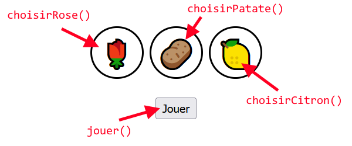
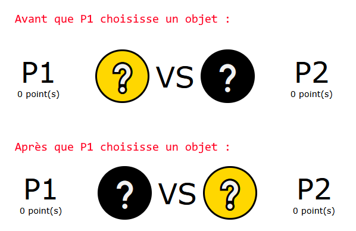
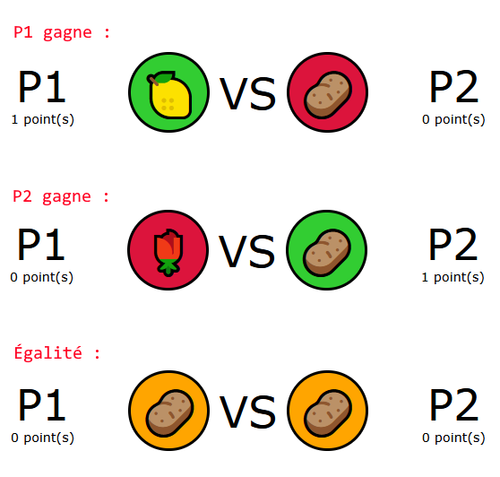

# TP1 - Rose, patate, citron 🥔

⏰ Date de remise : **27 septembre à 23h59**. (Remise sur Teams)

📦 Projet de départ : Téléchargement

## 📜 Modalités du TP

* 👤 Le TP doit être fait de manière individuelle.
* ✅ Le projet de départ fourni devra être complété et remis en entier. (Compressé)
* ⛔ Attention au **plagiat**. Pour rappel, il est interdit de :
  * Copier en partie ou complètement le code d'une autre personne.
  * Copier du code généré par IA.
* 📅 La pénalité de retard est de **-10%** par **tranche de 24h entamée**.
  * Si le retard dépasse **120h** (5 jours), la note sera de **0**.
* 🚫 Il est interdit de modifier le code **HTML** ou **CSS** du projet de départ.
* 🚫 Il est interdit d'utiliser des notions qui n'ont pas été abordées en classe, à moins de demander à votre enseignant(e) **pendant un cours**.
  * Sinon, 0% pour chaque TODO concerné, à la discrétion de l'enseignant(e).

:::danger

Si votre travail est suspecté de plagiat (code copié d'un(e) autre étudiant(e), code généré par IA, notions non abordées en classe, etc.), deux choses peuvent se produire :

* Le plagiat est prouvé par nos outils : **Note de 0**, automatiquement.
* Le plagiat est plutôt évident, mais une validation est requise : vous serez convoqué(e) au bureau de votre enseignant(e). Vous devrez répondre à certaines questions pour prouver que vous comprenez et maîtrisez le code qui a été utilisé dans votre TP. Si vous ne réussissez pas à répondre à certaines questions, vous aurez la **note de 0**. (Si vous ne comprenez pas votre propre code, c'est que vous avez plagié, d'une manière ou d'une autre)

:::

## ✨ Description du jeu

Ce TP est un jeu similaire à « Roche, papier, ciseaux™ », sauf que des objets différents ont été utilisés pour des raisons évidentes de droits d'auteur. Le déroulement d'une partie ressemble à ceci :

1. On doit appuyer sur « Jouer » pour débuter la partie.
2. Le joueur **P1** choisit un des trois objets en cliquant dessus. (Son choix ne sera pas affiché tout de suite, comme ça **P2** n'a pas d'avantage !)
3. Le joueur **P2** choisit un des trois objets en cliquant dessus.
4. Les objets choisis sont affichés en bas (chaque côté du « VS ») et le gagnant obtient 1 point.

On peut ensuite rejouer à volonté en cliquant sur « Jouer » à nouveau.

## 🌹🥔🍋 TODOs

### TODO 1

Il faudra déclarer **six** variables globales. Vous devrez choisir leur nom vous-mêmes.

<table>
<tr>
    <th>Utilité</th>
    <th>Valeur de départ</th>
    <th>Évolution de la valeur</th>
</tr>
<tr>
    <td>Deux variables pour noter le score de chacun des joueurs.</td>
    <td>Les deux variables commenceront avec la valeur `0`, forcément.</td>
    <td>Au fil de la partie, ces variables seront incrémentées de 1 lorsque le joueur associé gagnera.</td>
</tr>
<tr>
    <td>Deux variables pour noter sur quel objet chaque joueur a cliqué</td>
    <td>Peu importe, ça peut être une chaîne vide par exemple `""`.</td>
    <td>Au fil de la partie, ces variables contiendront toujours `"🌹"`, `"🥔"`, ou `"🍋"`.</td>
</tr>
<tr>
    <td>Une variable pour noter si c'est au tour de **P1** de jouer ou au tour de **P2**.</td>
    <td>Peu importe.</td>
    <td>Il y a plusieurs manières de noter c'est à qui de jouer : `true` / `false`, `"P1"` / `"P2"` ou encore `1` / `2`. Choisissez ce que vous préférez !</td>
</tr>
<tr>
    <td>Une variable pour noter si une partie est **en cours**.</td>
    <td>Initialement, la partie n'est pas en cours... Trouvez une valeur cohérente.</td>
    <td>`true` ou `false` seront des valeurs suffisantes pour cette variable.</td>
</tr>
</table>

### TODO 2

Il y a **quatre** écouteurs d'événements à ajouter. Tous les événements seront déclenchés via un **clic**.

Voici un schéma qui indique quelles fonctions sont appelées lorsqu'on clique sur les éléments dans la page :

:::info

Il faudra fouiller dans le HTML pour trouver les bonnes **classes** à utiliser et ensuite aller remplir la fonction `init()`.

:::

### TODO 3

La fonction `jouer()` permettra de débuter la partie.

**Si la partie n'est pas en cours**, on fait les quatre choses suivantes :

* On indique que la partie est maintenant en cours dans la bonne variable globale.
* On indique que c'est au tour de **P1** de jouer dans la bonne variable globale.
* On met le contenu textuel `"❔"` pour les deux joueurs dans la page. (Voir image ci-dessous)
* On met un fond `"gold"` pour **P1** et un fond `"black"` pour **P2**. (Voir image ci-dessous)

:::warning

La fonction `jouer()` ne fait **rien du tout** lorsque la partie est en cours !

:::

### TODO 4

Ce TODO décrit ce qu'il faut faire pour les fonctions `choisirRose()`, `choisirPatate()` et `choisirCitron()`, qui permettront aux joueurs de sélectionner un des trois objets pendant une partie.

Ci-dessous, seule la fonction `choisirRose()` sera décrite, mais les deux autres fonctions seront **identiques**, à part pour l'objet (🌹🥔🍋) utilisé.

**Si la partie est en cours** :

* Si c'est à **P1** de jouer : 
  * On note son choix d'objet (🌹) dans la bonne variable globale.
  * On rend la couleur de fond de **P1** `"black"` et celle de **P2** `"gold"`. (Voir image ci-dessous)
  * On indique que c'est à **P2** de jouer dans la bonne variable globale.
* Si c'est à **P2** de jouer :
  * On note son choix d'objet (🌹) dans la bonne variable globale.
  * On appelle la fonction `resultat()`. (Qui n'existe pas pour le moment !)

:::warning

Les fonctions `choisirRose()`, `choisirPatate()` et `choisirCitron()` ne font **rien du tout** lorsque la partie n'est pas en cours ! Bref, tant qu'on n'a pas cliqué sur le bouton « Jouer », cliquer sur les trois objets ne fera rien.

:::

### TODO 5

La fonction `resultat()` est la plus complexe de ce TP ! Elle permettra d'afficher les objets choisis par les joueurs, de mettre à jour le pointage et de mettre fin à la partie.

Commencez par **créer** le squelette de la fonction `resultat()`, bien entendu. Ensuite, suivez ces instructions :

* D'abord, on modifie deux contenus textuels pour afficher les objets choisis par les joueurs :

* On indique que la partie **n'est plus en cours** dans la bonne variable globale. (Ça permettra de rendre le bouton « Jouer » fonctionnel à nouveau !)

* Finalement, il faudra déterminer le vainqueur pour effectuer certains changements ...

  * **P1** gagne : son fond devient `limegreen`, le fond de **P2** devient `crimson`, le score de **P1** augmente de `1`.
  * **P2** gagne : son fond devient `limegreen`, le fond de **P1** devient `crimson`, le score de **P2** augmente de `1`.
  * Égalité : les deux fonds deviennent `orange`... et c'est tout !

:::tip

Comment déterminer le vainqueur ? Il faudra utiliser les deux variables globales qui contiennent les objets choisis par les joueurs et les comparer correctement. 

Gardez à l'esprit qu'il y a trois manières de gagner : `"🍋"` bat `"🥔"`, `"🌹"` bat `"🍋"` et `"🥔"` bat `"🌹"`.

:::

:::warning

Assurez-vous que les scores **évoluent correctement** si on gagne plusieurs fois. Bien entendu, c'est normal que les scores retournent à 0 si on **réactualise** la page.

:::

## ✅ Grille de correction

<table>
    <tr>
        <th>Critère</th>
        <th>Points</th>
    </tr>
    <tr>
        <td>TODO 1 :  - Les variables sont créées et ont des noms appropriés. - Les valeurs de départ sont appropriées.</td>
        <td> 3 pts 3 pts</td>
    </tr>
    <tr>
        <td>TODO 2 :  - Les écouteurs d'événements sont créés et valides.</td>
        <td> 4 pts</td>
    </tr>
    <tr>
        <td>TODO 3 :  - La fonction ne fait rien si la partie est en cours. - L'état du jeu est bien modifié. - L'apparence du jeu est bien modifiée. - Les objets choisis par les joueurs sont bien réinitialisés dans la page.</td>
        <td> 2 pts 2 pts 2 pts 2 pts</td>
    </tr>
    <tr>
        <td>TODO 4 :  - Les fonctions ne font rien si la partie n'est pas en cours. - Le choix du joueur est bien noté. - L'apparence du jeu est bien modifiée. - L'état du jeu est bien modifié au besoin. - La fin de la partie est bien déclenché au besoin.</td>
        <td> 2 pts 2 pts 2 pts 1 pt 1 pt</td>
    </tr>
    <tr>
        <td>TODO 5 :  - Les choix des joueurs sont bien affichés. - Le vainqueur (ou l'égalité) est bien déterminé. - L'apparence du jeu est bien modifiée. - Le score est bien mis à jour. - L'état du jeu est bien modifié.</td>
        <td> 2 pts 5 pts 2 pts 2 pts 1 pt</td>
    </tr>
    <tr>
        <td>Pénalités possibles :  - Retard (5 jours maximum, -10% par jour) - Plagiat et / ou incapable d'expliquer son code. - Usage de notions non abordées en classe. (0 pour le TODO)</td>
        <td> -50% -100% -1 à -5 pts</td>
    </tr>
    <tr>
        <td>Total</td>
        <td>40 pts</td>
    </tr>
</table>
