# TP2 - Sussy Bakart 🏁

⏰ Date de remise : **15 novembre à 23h59**. (Remise sur Teams)

📦 Projet de départ : [Téléchargement](../../static/files/tp2.zip)

## 📜 Modalités du TP

* 👤 Le TP doit être fait de manière individuelle.
* ✅ Le projet de départ fourni devra être complété et remis en entier. (Compressé)
* ⛔ Attention au **plagiat**. Pour rappel, il est interdit de :
  * Copier en partie ou complètement le code d'une autre personne.
  * Copier du code généré par IA.
* 📅 La pénalité de retard est de **-10%** par **tranche de 24h entamée**.
  * Si le retard dépasse **120h** (5 jours), la note sera de **0**.
* 🚫 Il est interdit de modifier le code **HTML** ou **CSS** du projet de départ.
* 🚫 Il est interdit d'utiliser des notions qui n'ont pas été abordées en classe, à moins de demander à votre enseignant(e) **pendant un cours**.
  * Sinon, 0% pour chaque TODO concerné, à la discrétion de l'enseignant(e).

:::danger

Si votre travail est suspecté de plagiat (code copié d'un(e) autre étudiant(e), code généré par IA, notions non abordées en classe, etc.), deux choses peuvent se produire :

* Le plagiat est prouvé par nos outils : **Note de 0**, automatiquement.
* Le plagiat est plutôt évident, mais une validation est requise : vous serez convoqué(e) au bureau de votre enseignant(e). Vous devrez répondre à certaines questions pour prouver que vous comprenez et maîtrisez le code qui a été utilisé dans votre TP. Si vous ne réussissez pas à répondre à certaines questions, vous aurez la **note de 0**. (Si vous ne comprenez pas votre propre code, c'est que vous avez plagié, d'une manière ou d'une autre)

:::

## ✨ Description du jeu

Mario Kart coûtait trop cher ... alors voici *Sussy Bakart* ! 

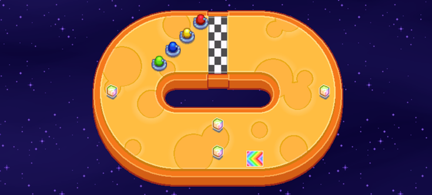

L'objectif du jeu est de compléter un certain nombre de tours de circuit. Avant une partie, on peut choisir un circuit, une difficulté et combien de joueurs participeront :

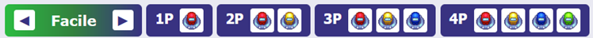

Après avoir choisi le nombre de joueurs, on peut voir les contrôles pour chaque joueur, lancer la partie ou annuler la partie. (On peut aussi encore changer de circuit)

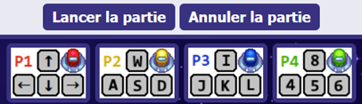

## 🏁 TODOs

📝 Vous devrez surtout travailler sur le fichier `script.js`, mais aussi un peu sur `script2.js` ensuite.

* Il faut **tout compléter** dans `script.js`.
* Il faut seulement compléter **6 points** dans `script2.js`, au choix.

:::info

Pour chaque TODO, il y aura parfois des **indices / instructions supplémentaires** ici. De plus il y aura toujours des **indications pour tester** vos TODOs si vous désirez vous assurez que tout fonctionne bien. **Si un test échoue**, ça veut dire que votre code n'est pas bon.

:::

### TODO 0

#### 🧪 Tester ce TODO

Au départ, aucun bouton dans la page ne fonctionne : c’est normal. De plus, il y a une erreur dans la console. C’est normal aussi.

Assurez-vous de jeter un coup d’œil 👁 intense à toutes les variables globales ! Cela vous aidera à vous situer plus tard.

### TODO 1

#### 🧪 Tester ce TODO

(Deux lignes de code ajoutées dans `init()`... ce test n’inclut pas les écouteurs d’événements à faire pendant le TODO 7 !)

D’abord, il n’y a plus d’erreurs dans la console. (On peut d’ailleurs changer de course parmi les quatre disponibles)
Ensuite, essayez les deux instructions suivantes dans la console. C’est censé faire apparaître le joueur vert et son ombre.

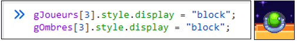

L'ombre est plutôt discrète : c'est le cercle gris qu'on peut voir derrière le personnage.

### TODO 2

#### 🧪 Tester ce TODO

Premier test : Si vous exécutez l’appel de fonction ci-dessous dans la console, vous devriez voir les quatre joueurs apparaître. C’est normal qu’ils ne soient pas bien placés.

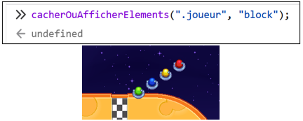

Deuxième test : Testez l’appel de fonction ci-dessous, qui est censé faire **disparaître** les quatre boutons « 1P », « 2P », « 3P » et « 4P » :

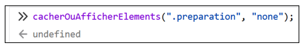

### TODO 3

#### 🧪 Tester ce TODO

Les quatre boutons « 1P », « 2P », « 3P » et « 4P » sont censés fonctionner :
* Les cinq boutons disparaissent. (Difficulté et nombre de joueurs)
* Les joueurs et leur ombre apparaissent.
* Les joueurs sont bien placés, derrière la ligne d’arrivée. 
* Le bon nombre de contrôles est affiché. (C’est la seule chose différente selon le nombre de joueurs choisi. Vérifiez bien les 4 possibilités)

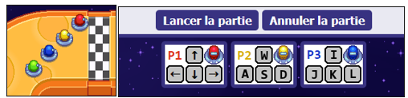

Par exemple, quand je choisis « 3P », je vois trois contrôles.

### TODO 4

#### 🧪 Tester ce TODO

Préparez et lancez une partie. Il devrait se passer plusieurs choses :
* D’abord, au milieu de l’écran, en grand, on voit le décompte. (« 3 », « 2 », « 1 » puis « Go ! »)

Puis, après le « Go ! » :
* Attendez 2 ou 3 secondes puis vérifiez que `gDecompte` contient encore -1 :

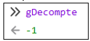

* Le « Go ! » disparait bel et bien après 1 seconde. (Et aucun décompte n’est affiché car la course commence)
* Le chronomètre en haut à gauche de l’écran progresse : 

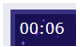

* Si on « Annule la partie », le chrono s’immobilise. (Reste coincé aux mêmes chiffres)
* Les joueurs contrôlés par l’ordinateur ont commencé à jouer.

### TODO 5

#### 🧪 Tester ce TODO

Préparez et lancez une partie. Remarquez deux choses :
* Lorsqu’un joueur termine la course, il y a ce message dans la console :

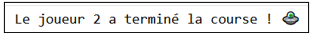

* Lorsque le **dernier** joueur termine la course, il y a plutôt ce message : 

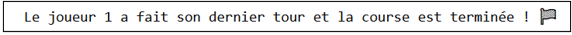

* Des scores sont affichés quand tout le monde a terminé.

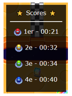

### TODO 6

#### 🧪 Tester ce TODO

Lancez une partie avec 4 joueurs. (Pour avoir le contrôle de tous les personnages) Obtenez un item au moins une fois avec chaque joueur et tenter de l’activer. Notez que le type d’item n’a pas d’importance. Pas besoin de terminer la course.
* Avec le joueur rouge (P1), la flèche du bas devrait activer l’item.
* Avec le joueur jaune (P2), la touche S devrait activer l’item.
* Avec le joueur bleu (P3), la touche K devrait activer l’item.
* Avec le joueur vert (P4), la touche 5 devrait activer l’item. 

### TODO 7

#### 💡 Instructions

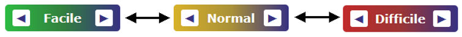

Comme les deux boutons `◄ ►` appellent la même fonction, il faudra trouver un moyen de savoir quel bouton a été cliqué lorsque la fonction changerDifficulte() est appelée.

:::tip

Les deux flèches `◄ ►` sont des caractères textuels accessibles via le `.textContent`.

:::

Quand on clique sur `◄`, il faut diminuer la difficulté de 1. Si on était déjà en difficulté 1 (Facile), il ne se passe rien.

Quand on clique sur `►`, il faut augmenter la difficulté de 1. Si on était déjà en difficulté 3 (Difficile), il ne se passe rien.

En tout temps, la variable `gDifficulte` doit contenir 1, 2 ou 3 pour représenter la difficulté actuelle. 

Utilisez les classes `.facile`, `.normal` et `.difficile` pour obtenir la bonne couleur de fond sur le bouton.

#### 🧪 Tester ce TODO

Jouez un peu avec les flèches gauches et droites pour changer la difficulté du jeu :

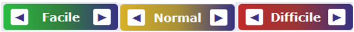

Si on clique sur la flèche gauche alors qu’on est déjà à « Facile », il ne se passe rien et la difficulté reste coincée à 1.

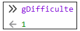

On peut se rendre de « Facile », à « Normal », à « Difficile » avec la flèche droite. (Et revenir à « Normal », puis à « Facile » avec la flèche gauche ensuite)

La flèche droite ne fait rien lorsqu’on est à « Difficile » et la difficulté reste coincée à 3.

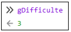

Et, bien entendu, les ennemis contrôlés par l’ordinateur sont plus coriaces en mode « Normal » et « Difficile ». (Contrairement à vous, qui êtes autant maladroit(e) qu’avant 😇)

Bravo ! Le jeu de base est fonctionnel et la partie 1 est terminée ! 🥳

 
:::warning

Pour rappel, vous n'avez pas à faire tous les TODOs **ci-dessous** ! Vous n'avez que 6 points à compléter parmi les DLCs, au choix. Notez que compléter plus de 6 points ne permettra pas d'améliorer votre note : le maximum de points à obtenir est 6.

:::

### TODO A-2

#### 💡 Instructions

Quelques clarifications :

* Cliquer sur le 🏆 permet d'afficher / cacher les positions moyennes.

* La **position moyenne** d'un joueur est obtenue en faisant la moyenne de toutes les positions qu'il a eues au fil des courses. Par exemple, si j'ai complété trois courses et que j'ai eu les positions `1er`, puis `2e`, puis `1er`, ma position moyenne sera `1.33` environ. (1 + 2 + 1, divisé par 3)

* La variable `gSommePositions` contiendra la somme des positions pour les quatre personnages. Ex : `[4, 5, 10, 11]` après trois courses. Ici, le premier nombre du tableau est `4` car le premier joueur a terminé `1er`, puis `2e`, puis `1er`. (Ce qui fait une somme de `4`) Si on divise `4` par le nombre de courses (c'est-à-dire `3`) on obtient le nombre à afficher dans le premier élément HTML avec la classe `.positionMoyenne`.

#### 🧪 Tester ce TODO

Il suffit de vérifier les positions moyennes en cliquant sur le 🏆 après une, puis deux courses. Assurez-vous que les valeurs fassent du sens !

Après une course

 

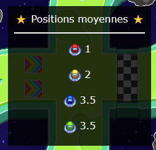

Après deux courses

### TODO B-2

#### 🧪 Tester ce TODO

Faites le nécessaire pour obtenir une étoile. (Scénario le plus simple : lancer une partie 4P, parcourez la course à l’envers avec n’importe quel personnage pour prendre la première boîte que vous croisez, vous finirez par obtenir une étoile. Évitez de faire un tour complet, même à l’envers, car cela va augmenter votre pointage un peu et cela vous empêchera d’obtenir une étoile)

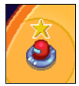

Une fois votre étoile en main, activez-la et vérifiez que … :
* La nouvelle animation apparait immédiatement et est bien placée autour du joueur.
* La nouvelle animation dure environ 4 secondes puis disparait.
* La nouvelle animation suit le joueur même s’il se déplace.

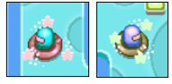

### TODO C-1

#### 🧪 Tester ce TODO

À l’aide de la console, retirez la classe "invisible" à l’élément .wow : 

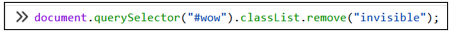

Un petit « Wow! » animé devrait apparaître quelque part : 

Si le « Wow! » animé a disparu, c’est bon !

### TODO C-2

#### 💡 Instructions

:::note

Sachez que si le « Wow ! » animé est déjà affiché pour un autre joueur, faire un 360° ne permet pas d’afficher l’animation. (Il faut attendre que l’animation soit terminée pour l’autre joueur d’abord) C’est pour cela qu’on a besoin d’un if qui vérifie que l’élément .wow possède la classe "invisible" : on s’assure que l’animation n’est pas actuellement visible et utilisée.

:::

🔍 Vérifiez dans l’[annexe](/tp/tp2#-placer-un-élément-par-rapport-à-un-autre) (vers la fin de ce document), il y a un exemple très complet pour placer un élément dans la page par rapport à un autre élément, tel que demandé dans ce TODO.

#### 🧪 Tester ce TODO

Désormais, si vous maintenez la touche pour tourner à gauche ou la touche pour tourner à droite, une fois que vous avez fait un 360°, le « Wow! » devrait apparaître pour une durée de 800 millisecondes au-dessus de votre personnage. Notez que vous n’avez pas besoin d’avancer pour faire un 360° : vous pouvez le faire sur place.

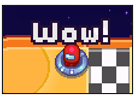

Notez que si deux joueurs font un 360° simultanément, c’est seulement le premier qui complète son 360° qui obtient l’animation. (Tant que l’animation n’est pas terminée, faire un autre 360° ne déclenche rien)

Si on maintient le bouton pour avancer ET un des boutons pour tourner, cela déclenche également l’animation. (Tant qu’on maintient la touche pour tourner assez longtemps pour faire un cercle complet) Cependant, si vous avez mis une vitesse maximale élevée dans `gVitesseMaximale`, cette manœuvre pourrait être impossible.

### TODO D-2

#### 🧪 Tester ce TODO

Appelez la fonction `choisirEmoji()` à répétition dans la console. La majorité du temps vous aurez des 😃, quelques fois des 🤬 et rarement des 💩.

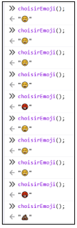

### TODO D-3

#### 💡 Instructions

Le premier défi risque d’être de trouver comment faire pour accéder à l’élément HTML de l’émoji à placer. Il faut commencer par créer un tableau qui contient tous les éléments possédant la classe `.emoji`. Une fois que c’est fait, disons qu’on a nommé ce tableau `tableauEmojis`, on peut facilement accéder à l’élément HTML de l’émoji à placer à l’aide du paramètre `indexSmiley`, comme ceci :

`tableauEmojis[indexSmiley]`

À partir de là, comme pour n’importe quel élément HTML, on peut effectuer des modifications comme `.textContent`, `.style.propriété`, etc. 

Le deuxième défi sera de savoir comment on peut faire pour placer l’émoji par rapport au joueur. Consultez l’[annexe](/tp/tp2#-placer-un-élément-par-rapport-à-un-autre) pour cela. (Vers la fin de ce document)

#### 🧪 Tester ce TODO

Lancez une course. (Avec 4P pour avoir la vie tranquille) Faites demi-tour et allez récupérer un objet en circulant à contre-sens de la course. (C’est très important d’aller à l’envers, mais sans aller trop loin) Vous êtes censés obtenir un item parmi : étoile (50% de chances), champignon (20% de chances) ou émoji (30% de chances). Débarrassez-vous des étoiles et des champignons jusqu’à ce que vous obteniez un émoji. NE L’ACTIVEZ PAS TOUT DE SUITE ! Avec les 3 autres joueurs, complétez un tour complet.

Enfin, activez l’émoji. Les trois autres joueurs devraient être cachés par un émoji géant. Il y a de faibles chances qu’au moins un des émojis soit 🤬 ou 💩, mais ce n’est pas important : tant que les trois joueurs sont bel et bien cachés par un émoji géant, tout est bon. Dans le screenshot ci-dessous, on peut dire que « j’ai eu de la chance » d’avoir trois smileys différents. Bien entendu, si un des trois joueurs se déplace, le smiley le suivra pour continuer à le cacher.

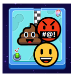

### TODO E-1

#### 🧪 Tester ce TODO

Réactualisez la page Web, appuyez sur les touches « a », « b » et finalement sur la flèche du haut. Vérifiez ensuite, dans la console, que la variable `gCode` a noté les touches appuyées :

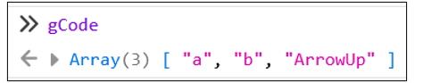

### TODO E-2

#### 💡 Instructions

En ce qui concerne « vérifier que les deux tableaux ont la même taille », ça ne devrait pas être trop compliqué : il existe un petit mot-clé simple (voir aide-mémoire !) qui permet de savoir combien il y a d’éléments dans un tableau. Il restera à comparer cette valeur pour les deux tableaux.

Le plus ardu sera de vérifier si les deux tableaux contiennent exactement les mêmes valeurs. Il faudra le faire avec une boucle qui compare `tableau1[0]` avec `tableau2[0]`, puis `tableau1[1]` avec `tableau2[1]`, etc. Si jamais on trouve deux valeurs différentes à la même position, c’est que le code est erroné !

N’oubliez pas de vider le tableau `gCode` avant de conclure la fonction, dans tous les cas. (Rappel : lorsqu’on retourne une valeur avec `return`, la fonction s’arrête immédiatement)

#### 🧪 Tester ce TODO

Avant chaque test, réactualisez la page Web ! (Ou bien assurez-vous que `gCode` soit vide à l’aide de la console)

**Test 1** : Tapez un code trop court. (Comme A B C) Appuyez sur espace pour valider le code.
* Vérifiez que `gCode` est redevenu vide et que la course secrète ne soit pas apparue.

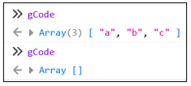

**Test 2** : Tapez un code trop long. (Au moins 11 touches) Appuyez sur espace pour valider le code.
* Vérifiez que `gCode` est redevenu vide et que la course secrète ne soit pas apparue.

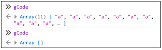

**Test 3** : Tapez un code erroné de la bonne longueur. (10 touches) Appuyez sur espace pour valider le code.
* Vérifiez que `gCode` est redevenu vide et que la course secrète ne soit pas apparue.

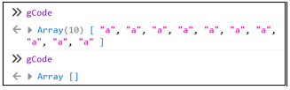

**Test 4** : Finalement, tapez le bon code (`↑ ↑ ↓ ↓ ← → ← → b a`), validez avec espace et assurez-vous que la course secrète apparaisse. `gCode` doit également être redevenu vide.

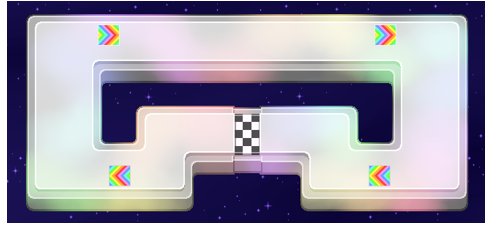

### TODO F-2

#### 💡 Instructions

C’est le DLC le plus dur ! C’est réservé aux courageux et courageuses. Pour le côté mathématique, vérifiez, dans l’[annexe](/tp/tp2#-distance-entre-deux-éléments) de ce document, comment faire pour calculer la distance entre deux points.

#### 🧪 Tester ce TODO

Faites-le test suivant dans la console. (Attention il y a bien 4 paramètres, deux nombres puis deux tableaux !)

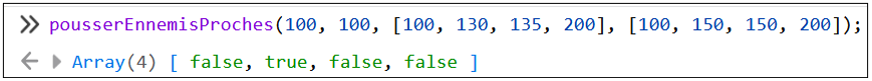

Enfin, essayez d’obtenir l’item « Onde de choc ». (30% de chances de l’obtenir lorsqu’on est 2e, 40% de chances de l’obtenir lorsqu’on est 3e) Le plus simple est de faire un tour complet avec un personnage, puis de prendre un 2e personnage pour aller à la pêche aux items.

Une fois l’item en main, allez proche d'au moins un autre joueur et assurez-vous que seuls les joueurs près de vous sont repoussés.

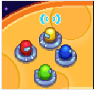

Avant

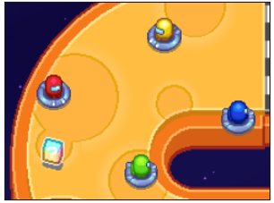

Après

## ✅ Grille de correction

<table>
  <tr>
    <th>Critère</th>
    <th>Points</th>
  </tr>
  <tr>
    <td colspan="2">
Partie 1 (34 points)
</td>
  </tr>
  <tr>
    <td>TODO 1 :  - Tableaux bien remplis.</td>
    <td> 2 pts</td>
  </tr>
  <tr>
    <td>TODO 2 :  - Bonne structure pour la fonction. - Bien modifié les éléments avec des classes en commun. - Paramètres bien exploités.</td>
    <td> 1 pt 2 pts 1 pt</td>
  </tr>
  <tr>
    <td>TODO 3 :  - Éléments bien cachés ou affichés à l'aide d'une fonction. - Le bon nombre de contrôles est affiché avec une boucle. - La bonne fonction est appelée avec le paramètre approprié.</td>
    <td> 2 pts 2 pts 1 pt</td>
  </tr>
  <tr>
    <td>TODO 4 :  - La valeur de décompte évolue et la partie est indiquée comme active. - La structure permet de choisir parmi 3 blocs d'opérations. - Bons planificateurs interrompus ou lancés. - Bon texte affiché ou caché dans la page.</td>
    <td> 2 pts 1 pt 2 pts 2 pts</td>
  </tr>
  <tr>
    <td>TODO 5 :  - Valeur de retour valide. - Une boucle a été utilisée de manière appropriée. </td>
    <td> 3 pts 2 pts</td>
  </tr>
  <tr>
    <td>TODO 6 :  - Selon la touche appuyée, l'item du bon joueur est activé.</td>
    <td> 3 pts</td>
  </tr>
  <tr>
    <td>TODO 7 :  - Écouteurs d'événements nécessaires ajoutés. - Une structure permet de bien choisir les opérations à exécuter. - La difficulté est affichée et bien mise à jour. - *document.querySelector()* est utilisé au plus trois fois. - La difficulté est bien inchangée dans certaines situations.</td>
    <td> 1 pt 3 pts 2 pts 1 pt 1 pt</td>
  </tr>
  <tr>
    <td colspan="2">
Partie 2 (6 points)
</td>
  </tr>
  <tr>
    <td>DLC A 🏆 :  - Les positions moyennes sont bien calculées et affichées avec une boucle.</td>
    <td> 2 pts</td>
  </tr>
  <tr>
    <td>DLC B 🌈 :  - L'animation est bien placée dans la page. - La visibilité de l'animation est bien mise à jour.</td>
    <td> 1 pt 1 pt</td>
  </tr>
  <tr>
    <td>DLC C 🔫 :  - La visibilité de l'animation est bien mise à jour. - L'animation est bien placée dans la page.</td>
    <td> 2 pts 2 pts</td>
  </tr>
  <tr>
    <td>DLC D 😃 :  - Un émoji aléatoire est retourné avec les bonnes probabilités. - L'émoji est bien placé dans la page.</td>
    <td> 2 pts 2 pts</td>
  </tr>
  <tr>
    <td>DLC E 🔍 :  - L'événement clavier est bien exploité. - La validité du code est bien évaluée pour retourner une valeur. - Le tableau du code est toujours réinitialisé.</td>
    <td> 1 pts 4 pts 1 pt</td>
  </tr>
  <tr>
    <td>DLC F 🥊 :  - Le calcul de la distance est valide. - Une boucle appropriée a été utilisée. - Un tableau valide est retourné.</td>
    <td> 3 pts 2 pts 1 pt</td>
  </tr>
    <tr>
    <td colspan="2">
Pénalités possibles
</td>
  </tr>
  <tr>
        <td>- Plagiat et / ou incapable d'expliquer son code. - Usage de notions non abordées en classe. (0 pour le TODO) - Points-virgules manquants - Indentations malpropres</td>
        <td>-100% -2 à -40 pts -2 pts -2 pts</td>
    </tr>
  <tr>
      <td>Total</td>
      <td>40 pts</td>
  </tr>
</table>

:::warning

Si vous complétez trop de DLCs, l'enseignant(e) corrigera simplement 6 points au hasard parmi les DLCs réalisés.

:::

## 📚 Annexe

### 🔨 Placer un élément par rapport à un autre

Disons qu’on souhaite placer le cœur **100 pixels** à gauche de l’étoile et **50 pixels** en haut de l’étoile. (Tel que dans l’image ci-dessous)

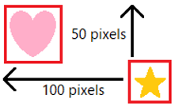

Ultimement, l’objectif est de changer les valeurs `style.left` et `style.top` de l’élément HTML qui représente le cœur. Disons que pour l’étoile on a :

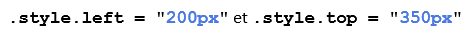

Il faudrait alors que le cœur obtienne les valeurs :

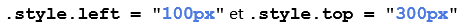

De cette manière, il serait bel et bien **100 pixels** à gauche et **50 pixels** en haut de l’étoile. Nous avons donc, pour `left` et pour `top`, 3 petites étapes à faire :

1. Récupérer les valuers pour l'étoile :

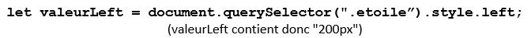

2. Réduire les valeurs du nombre de pixels nécessaire. Attention ! On ne peut pas simplement faire :

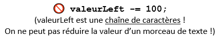

On va donc commencer par convertir la valeur en nombre, PUIS on pourra ensuite réduire sa valeur :

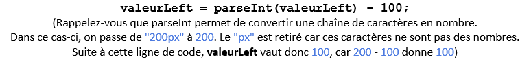

3. Finalement, il reste juste à changer la valeur de `.style.left` / `.style.top` à l’élément qui représente le cœur. N’oubliez pas de remettre le `"px"` dans la valeur ! On a perdu ce morceau à cause de `parseInt()`.

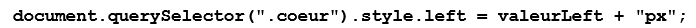

Et voilà ! Il reste à faire la même chose pour `.style.top`, bien entendu.

### 📐 Distance entre deux éléments

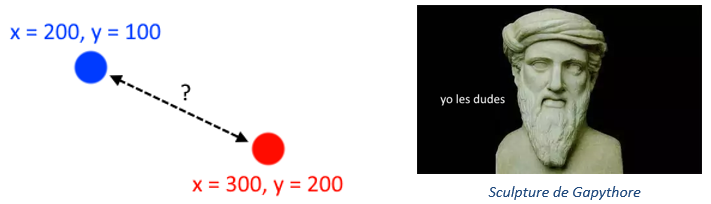

Disons qu’on souhaite vérifier si la distance entre le point bleu 🔵 et le point rouge 🔴 est supérieure à `50`. Voici comment on procédera :

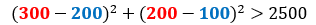

En gros, on a fait `x rouge - x bleu` **exposant 2** additionné à `y rouge - y bleu` **exposant 2**. Pourquoi on a vérifié que le résultat était plus grand que `2500` plutôt que `50` ? Pour éviter de faire la **racine carrée** de notre addition, on a simplement mis `50` en **exposant 2**. On calcule donc la distance au carré et on la compare avec `50` au carré.

On pourrait remplacer l’usage de l'**exposant 2** par cette manière de faire :

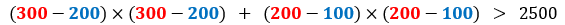

