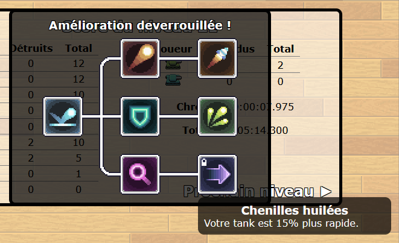
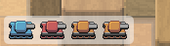

# TP3 - Taigne-que Bateule 🚑

⏰ Date de remise : **9 décembre à 23h59**. (Remise sur Teams)

📦 Projet de départ : Téléchargement

## 📜 Modalités du TP

* 👤 Le TP doit être fait de manière individuelle.
* ✅ Le projet de départ fourni devra être complété et remis en entier. (Compressé)
* ⛔ Attention au **plagiat**. Pour rappel, il est interdit de :
  * Copier en partie ou complètement le code d'une autre personne.
  * Copier du code généré par IA.
* 📅 La pénalité de retard est de **-10%** par **tranche de 24h entamée**.
  * Si le retard dépasse **120h** (5 jours), la note sera de **0**.
* 🚫 Il est interdit de modifier le code **HTML** ou **CSS** du projet de départ.
* 🚫 Il est interdit d'utiliser des notions qui n'ont pas été abordées en classe, à moins de demander à votre enseignant(e) **pendant un cours**.
  * Sinon, 0% pour chaque TODO concerné, à la discrétion de l'enseignant(e).

:::danger

Si votre travail est suspecté de plagiat (code copié d'un(e) autre étudiant(e), code généré par IA, notions non abordées en classe, etc.), deux choses peuvent se produire :

* Le plagiat est prouvé par nos outils : **Note de 0**, automatiquement.
* Le plagiat est plutôt évident, mais une validation est requise : vous serez convoqué(e) au bureau de votre enseignant(e). Vous devrez répondre à certaines questions pour prouver que vous comprenez et maîtrisez le code qui a été utilisé dans votre TP. Si vous ne réussissez pas à répondre à certaines questions, vous aurez la **note de 0**. (Si vous ne comprenez pas votre propre code, c'est que vous avez plagié, d'une manière ou d'une autre)

:::

## ✨ Description du jeu

En solo où avec l'aide d'un(e) ami(e), vous devrez affronter des vagues d'ennemis avec votre petit tank. Il y a un total de 30 niveaux.

À chaque fois que vous complété un niveau qui est un multiple de 3 (3, 6, 9, etc.), vous pourrez débloquer une amélioration :

## 🚜 TODOs

📝 Vous devrez seulement travailler sur `script.js`. Il y a plusieurs autres fichiers JavaScript, mais vous n'aurez pas besoin de les consulter.

:::info

Les instructions pour chaque TODO sont uniquement dans l'énoncé. Il n'y pas d'indications supplémentaires dans le code. N'oubliez pas de **tester vos TODOs** à l'aide des indications dans cet énoncé. 

:::

### TODO 0 - État initial 🏠

Au début du TP, le jeu fonctionne déjà, à quelques détails près :

* Impossible d'utiliser le menu déroulant en haut à gauche. (Qui permettra d'aller consulter les scores) (TODO 2)
* Durant les niveaux, les ennemis restants ne sont pas affichés sous forme d'icônes en bas à gauche. (TODO 3)

* Le bouton pour activer / désactiver la musique (en bas à droite) ne fonctionne pas. (TODO 1)
* Lorsqu'on survole une amélioration à déverrouiller, il n'y a pas de tooltip avec une description. (TODO 4)

### TODO 1 - Et musique fut 🎵

#### 📝 Instructions

#### 🧪 Tester

### TODO 2 - Scores et skill issues 🏆

#### 📝 Instructions

#### 🧪 Tester

### TODO 3 - Appelle une ambulance, mais pas pour moi 🚑

#### 📝 Instructions

#### 🧪 Tester

### TODO 4 - Icônes incompréhensibles 😵‍💫

#### 📝 Instructions

#### 🧪 Tester

## ✅ Grille de correction

