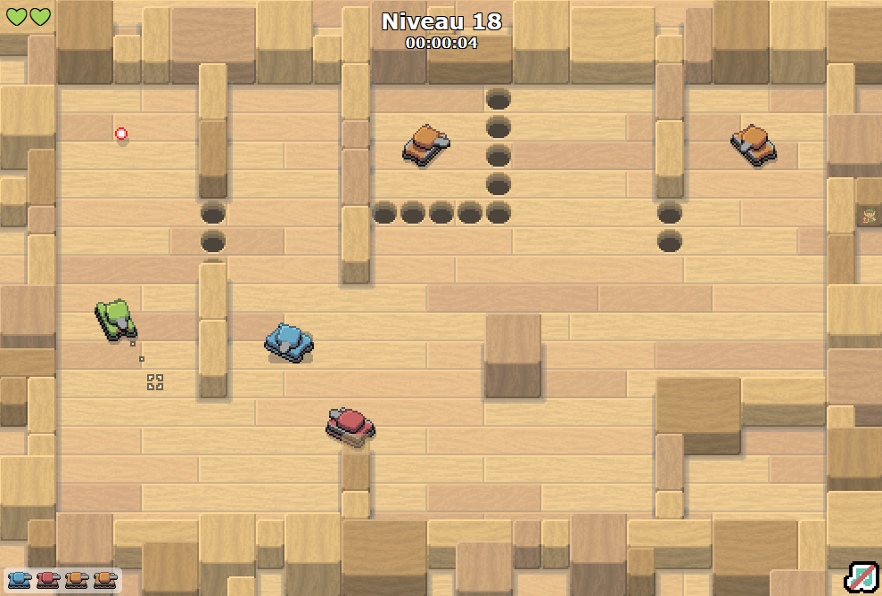

# TP3 - Taigne-que Bateule 🚑

⏰ Date de remise : **9 décembre à 23h59**. (Remise sur Teams)

📦 Projet de départ : Téléchargement

## 📜 Modalités du TP

* 👤 Le TP doit être fait de manière individuelle.
* ✅ Le projet de départ fourni devra être complété et remis en entier. (Compressé)
* ⛔ Attention au **plagiat**. Pour rappel, il est interdit de :
  * Copier en partie ou complètement le code d'une autre personne.
  * Copier du code généré par IA.
* 📅 La pénalité de retard est de **-10%** par **tranche de 24h entamée**.
  * Si le retard dépasse **120h** (5 jours), la note sera de **0**.
* 🚫 Il est interdit de modifier le code **HTML** ou **CSS** du projet de départ.
* 🚫 Il est interdit d'utiliser des notions qui n'ont pas été abordées en classe, à moins de demander à votre enseignant(e) **pendant un cours**.
  * Sinon, 0% pour chaque TODO concerné, à la discrétion de l'enseignant(e).

:::danger

Si votre travail est suspecté de plagiat (code copié d'un(e) autre étudiant(e), code généré par IA, notions non abordées en classe, etc.), deux choses peuvent se produire :

* Le plagiat est prouvé par nos outils : **Note de 0**, automatiquement.
* Le plagiat est plutôt évident, mais une validation est requise : vous serez convoqué(e) au bureau de votre enseignant(e). Vous devrez répondre à certaines questions pour prouver que vous comprenez et maîtrisez le code qui a été utilisé dans votre TP. Si vous ne réussissez pas à répondre à certaines questions, vous aurez la **note de 0**. (Si vous ne comprenez pas votre propre code, c'est que vous avez plagié, d'une manière ou d'une autre)

:::

## ✨ Description du jeu

