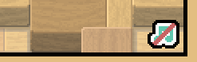
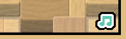
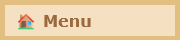
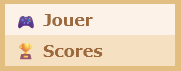
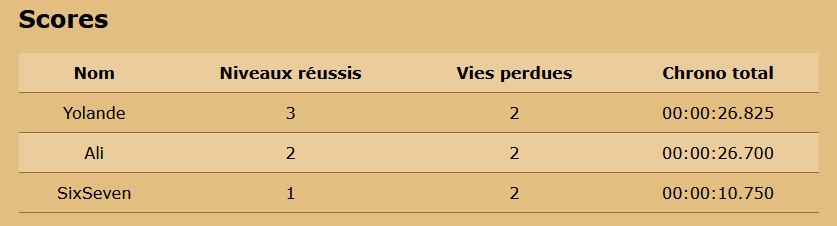

# TP3 - Taigne-que Bateule 🚑

⏰ Date de remise : **9 décembre à 23h59**. (Remise sur Teams)

📦 Projet de départ : Téléchargement

## 📜 Modalités du TP

* 👤 Le TP doit être fait de manière individuelle.
* ✅ Le projet de départ fourni devra être complété et remis en entier. (Compressé)
* ⛔ Attention au **plagiat**. Pour rappel, il est interdit de :
  * Copier en partie ou complètement le code d'une autre personne.
  * Copier du code généré par IA.
* 📅 La pénalité de retard est de **-10%** par **tranche de 24h entamée**.
  * Si le retard dépasse **120h** (5 jours), la note sera de **0**.
* 🚫 Il est interdit de modifier le code **HTML** ou **CSS** du projet de départ.
* 🚫 Il est interdit d'utiliser des notions qui n'ont pas été abordées en classe, à moins de demander à votre enseignant(e) **pendant un cours**.
  * Sinon, 0% pour chaque TODO concerné, à la discrétion de l'enseignant(e).

:::danger

Si votre travail est suspecté de plagiat (code copié d'un(e) autre étudiant(e), code généré par IA, notions non abordées en classe, etc.), deux choses peuvent se produire :

* Le plagiat est prouvé par nos outils : **Note de 0**, automatiquement.
* Le plagiat est plutôt évident, mais une validation est requise : vous serez convoqué(e) au bureau de votre enseignant(e). Vous devrez répondre à certaines questions pour prouver que vous comprenez et maîtrisez le code qui a été utilisé dans votre TP. Si vous ne réussissez pas à répondre à certaines questions, vous aurez la **note de 0**. (Si vous ne comprenez pas votre propre code, c'est que vous avez plagié, d'une manière ou d'une autre)

:::

## ✨ Description du jeu

En solo où avec l'aide d'un(e) ami(e), vous devrez affronter des vagues d'ennemis avec votre petit tank. Il y a un total de 30 niveaux.

<center></center>

À chaque fois que vous complété un niveau qui est un multiple de 3 (3, 6, 9, etc.), vous pourrez débloquer une amélioration :

<center></center>

## 🚜 TODOs

📝 Vous devrez seulement travailler sur `script.js`. Il y a plusieurs autres fichiers JavaScript, mais vous n'aurez pas besoin de les consulter.

:::info

Les instructions pour chaque TODO sont uniquement dans l'énoncé. Il n'y pas d'indications supplémentaires dans le code. N'oubliez pas de **tester vos TODOs** à l'aide des indications dans cet énoncé. 

:::

### TODO 0 - État initial 🏠

Au début du TP, le jeu fonctionne déjà, à quelques détails près :

* Le bouton pour activer / désactiver la musique (en bas à droite) ne fonctionne pas. (TODO 1)
* Durant les niveaux, les ennemis restants ne sont pas affichés sous forme d'icônes en bas à gauche. (TODO 2)

<center></center>

* Lorsqu'on survole une amélioration à déverrouiller, il n'y a pas de tooltip avec une description. (TODO 3)
* Impossible d'utiliser le menu déroulant en haut à gauche. (Qui permettra d'aller consulter les scores) (TODO 4)

### TODO 1 - Et musique fut 🎵

Cette section permettra d'activer et de désactiver les sons du jeu à l'aide d'un bouton en bas à droite du jeu.

#### 📝 Instructions

<center></center>

Il faut rendre l'icône 🎵 **cliquable**. Cliquer sur l'icône devra ... :

* Mettre `gSonActifs` à `true` ou à `false`. (On alterne entre les deux à chaque clic)
* Changer l'image de l'icône pour indiquer si les sons sont actifs. (Utilisez `"images/music_on.png"` et `"images/music_off.png"`)

#### 🧪 Tester

Assurez-vous que l'apparence de l'icône soit cohérente avec la présence ou l'absence des sons. (Quand l'icône est biffée en rouge, les sons doivent être inactifs)
Bien entendu pour entendre 👂 les sons vous aurez besoins d'écouteurs filaires au Cégep. (Ou bien il faudra tester chez soi !)

<center>


</center>

### TODO 2 - Appelle une ambulance, mais pas pour moi 🚑

<center></center>

Ce TODO permettra d'afficher, en bas à gauche du jeu, une icône pour chaque ennemi encore vivant durant un niveau. À mesure que les ennemis seront éliminés, des icônes seront retirés de l'affichage. (Ça peut sembler peu utile, mais il y a des ennemis invisibles à partir du niveau 20 et cela devient pertinent à ce moment)

Il y aura trois fonctions à compléter pour ce TODO.

#### 📝 Instructions

**`retirerListeEnnemis()`** : **Retire** l'élément avec la classe `.listeEnnemis` de la page, s'il existe.

<hr/>

**`afficherEnnemis()`** : Cette fonction permettra de créer et d'afficher la **liste d'icônes**.

🔍 Notez que la variable `gListeEnnemis` contient, en tout temps, un **tableau de couleurs** qui représentent les ennemis **qui sont encore vivants**. Ex : `["Bleu", "Rouge", "Orange", "Orange"]`

1. Commencez par appeler la fonction `retirerListeEnnemis()` pour retirer la liste. (Nous allons recréer la liste à partir de zéro)
2. Puis, s'il reste au moins un ennemi en jeu, créer puis intégrez le HTML suivant dans l'élément avec la classe `.jeu` :

```html showLineNumbers
<div class="listeEnnemis">
  
  
  
  
</div>
```

(Ceci est un exemple si le tableau `gListeEnnemis` contenait actuellement `["Jaune", "Jaune", "Orange", "Rouge"]`. Il faudra créer une à plusieurs `` cohérentes avec les couleurs du tableau !)

<hr/>

**`retirerEnnemiDeLaListe()`** : Cette fonction recevra une couleur en paramètre. (Ex : `"Bleu"`, ou `"Rouge"`, ou etc.) Le but sera de retirer cette couleur du tableau `gListeEnnemis`, mais **une seule fois** ! Ensuite, juste après, on appelera la fonction `afficherEnnemis()` pour mettre l'affichage à jour.

Exemple : si le paramètre contient `"Bleu"` et `gListeEnnemis` contenait `["Bleu", "Bleu", "Rouge"]`, alors `gListeEnnemis` va devenir `["Bleu", "Rouge"]`.

#### 🧪 Tester

Atteignez le **niveau 2** (puisqu'il contient plusieurs ennemis), et assurez que les icônes des trois ennemis gris s'affichent bien. Assurez-vous également qu'à chaque fois que vous éliminez un ennemi, une des trois icônes disparait.

### TODO 3 - Icônes incompréhensibles 😵‍💫

#### 📝 Instructions

#### 🧪 Tester

### TODO 4 - Scores et skill issues 🏆

Cette fonction rendra fonctionnel un petit menu déroulant en haut à gauche pour afficher l'historique des scores. De plus, vous construirez un tableau HTML et afficherez l'historique des scores manuellement.

#### 📝 Instructions

**Partie 1 : Menu déroulant**

<center>


</center>

Notez que les boutons « Jouer » et « Scores » du menu **fonctionnent déjà**. Ils permettent d'afficher le jeu OU l'historique des scores. Cela dit, pour moment, cliquer sur « Menu » ne fait rien : c'est sur ça que vous allez travailler !

Vous aurez **trois choses** à faire pour rendre le menu déroulant fonctionnel :
1. Créer une fonction qui permet d'afficher et de cacher le menu déroulant. (`display` passe à `"block"` ou `"none"`.)
2. Créer un écouteur d'événements qui affiche le menu lorsqu'on **clique** sur « Menu ».
3. Créer un écouteur d'événements qui cache le menu lorsqu'on **arrête de survoler** le menu. (Le type de l'événement sera `"mouseleave"`, comme dans les notes de cours.)

:::danger

⛔ Les deux écouteurs d'événements doivent **appeler la même fonction** en lui envoyant `"block"` ou `"none"` en **paramètre**.

:::

<hr/>

**Partie 2 : Historique des scores**

<center>

</center>

Sachant que le bouton « Scores » du menu déroulant permet déjà d'accéder à l'historique des scores, il ne vous restera qu'à compléter la fonction `afficherScores()`, dont le but est de **meubler le tableau avec les scores**. Notez que `afficherScores()` est déjà appelée lorsqu'on appuie sur « Scores » dans le menu.

De base, dans la page, le tableau des scores ressemble à ceci :

```html showLineNumbers
<table class="scores">
    <tr>
        <th>Nom</th>
        <th>Niveaux réussis</th>
        <th>Vies perdues</th>
        <th>Chrono total</th>
    </tr>
</table>
```

Dans la fonction `afficherScores()`, à l'aide, entre autres, de `createElement()`, nous voudrons avoir un résultat similaire à celui-ci : 

```html showLineNumbers
<table class="scores">
  <tr>
      <th>Nom</th>
      <th>Niveaux réussis</th>
      <th>Vies perdues</th>
      <th>Chrono total</th>
  </tr>
  <tr class="rangeeScore">
    <td>Yolande</td>
    <td>3</td>
    <td>2</td>
    <td>00:00:26.825</td>
  </tr>
  <tr class="rangeeScore">
    <td>Ali</td>
    <td>2</td>
    <td>2</td>
    <td>00:00:26.700</td>
  </tr>
</table>
```

On remarque donc qu'un élément `<tr>` a été ajouté pour **chacun des scores**. De plus, chaque `<tr>` contient quatre `<td>` :

* Le premier contient le **pseudo**.
* Le deuxième contient le **nombre de niveaux réussis**.
* Le troisième contient le **nombre total de vies perdues**.
* Le quatrième contient le **chrono**. (Il faudra utiliser la fonction `chaineChronoMS()`, qui existe déjà, pour bien afficher le chrono.)

🔍 Notez qu'il n'y a pas de **style** ou d'**attribut** quelconque à ajouter dans les éléments que vous allez créer. (Seulement la **classe** `rangeeScore`)

:::tip

> Comment récupérer les quatre données à afficher dans les `<td>` ?

Parmi les variables globales, il y a les tableaux `gPseudos`, `gNiveaux`, `gViesPerdues` et `gChronos`. Ces quatre tableaux auront **toujours la même taille** (Ex : ils sont tous de taille 1, ou bien ils sont tous de taille 2, etc.) et contiendront toutes les données à afficher dans le tableau. Par exemple, la première rangée utilise `gPseudos[0]`, `gNiveaux[0]`, `gViesPerdues[0]` et `gChronos[0]`.

:::

**Dernière chose** : au début de la fonction, il faudra **supprimer de la page** tous les éléments avec la classe `rangeeScore`. Cela permettra d'éviter d'afficher les scores en double lorsqu'on alterne entre le jeu et les scores.

#### 🧪 Tester

Commencez par vérifier que le menu déroulant fonctionne comme prévu et permet de naviguer entre le jeu et les scores.

Ensuite, il suffit de jouer au moins deux parties (vous pouvez perdre rapidement) pour vérifier que les scores s'affichent bien.

<center></center>

Assurez-vous qu'en alternant entre le jeu et les scores à l'aide du menu déroulant, les scores affichés ne se dupliquent pas.

## ✅ Grille de correction

