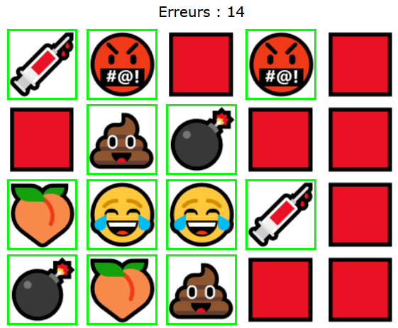
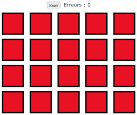
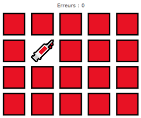
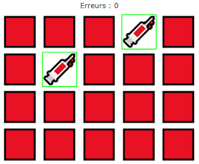
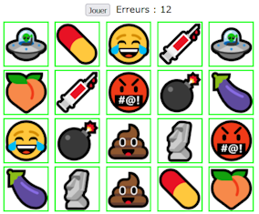

# TP3 - Maimouare 🃏🧠

📦 Projet de départ : [Téléchargement](../../static/files/tp3_jeu1.zip)

📽 Vidéo du résultat attendu : [Lien](https://youtu.be/j5Imjfm7j1o)

<center></center>

## 📝 Instructions

### 🗄 Variables globales

Plusieurs variables globales sont déjà créées. Normalement, vous devriez pouvoir coder le jeu en entier **sans ajouter de nouvelles variables globales**. Toutefois, n’hésitez pas à en créer d’autres si cela vous aide.

### 🏁 Initialisation du jeu

```js
 
```

Suivez simplement les instructions dans le code. Ci-dessus, voyez un exemple complet de l’élément qui doit être créé 20 fois et placé dans l’élément avec la classe `.row` !

À la fin de la fonction `init()`, la variable globale `gCartesHTML` devrait être un tableau qui contient les 20 éléments HTML des cartes. Par exemple, si on faisait `gCartesHTML[5].style.display = "none"`, ça cacherait la première carte sur la 2e rangée. Ou encore, si on faisait `gCartesHTML[19].src = "images/pillule.png"`, ça changerait l’image de la dernière carte en bas à droite.

### ⛳ Section guidée

#### 1️⃣ nombreAleatoireEntre0EtMax(max)

Le commentaire qui décrit cette fonction est déjà suffisamment clair. Par exemple, `nombreAleatoire(4)` retournerait un **nombre entier aléatoire parmi 0, 1, 2, 3 ou 4**. Cette fonction risque d’être seulement utilisée par la fonction suivante dans ce document.

#### 2️⃣ remplirCartesAleatoirement()

⚠ Cette fonction sera la plus complexe du jeu. (Pas forcément très longue cependant) 

1. Choisir une image aléatoire pour chacune des 20 cartes.

Sachant que parmi les variables globales, initialement, `gListeImages` contient les 20 noms d’images (10 noms répétés 2 fois chacun), l’objectif est de transférer les 20 noms présents dans l’attribut `alt` des 20 éléments HTML des cartes. Cela dit, les 20 noms doivent être mélangés aléatoirement !

:::tip

Comment y arriver ? En résumé, on commence par obtenir **un index aléatoire entre 0 et 19**... on prend un mot dans `gListeImages`, on l’enlève et on le met dans l’attribut `alt` de la première carte. Ensuite, on obtient **un index aléatoire entre 0 et 18**... (l’index maximal a baissé de 1) on prend un mot dans `gListeImages` à l’index obtenu, on l’enlève et on le met dans l’attribut `alt` de la deuxième carte. (Et ainsi de suite 20 fois !)

:::

2. Réinitialiser les 20 images de carte du jeu.

Il s’agit de changer, pour chaque image, l’attribut `src` pour remettre plein de carrés rouges et retirer la classe `.carteObtenue`. Notez que l’étape 2 se fait « en même temps » que l’étape 1.

### ✅ Code déjà complété

Fonction nommée `reinitialierListeNoms()` : Puisqu’une des fonctions que vous allez coder va **vider** le tableau `gListeImages`, cette fonction servira simplement à remettre les 20 mots dans le tableau pour lancer une prochaine partie ! Vous pourrez l’appeler lorsque nécessaire.

### 🧠 Section libre

:::warning

Lisez les sections « 🧠 Section libre » et « 💡 Astuces variées » **en entier** avant de vous lancer ! Oui c'est lourd de tout lire d'un coup, mais cela vous donnera une perspective plus complète. Par la suite, n'hésitez pas à relire des bouts à mesure que vous coderez.

:::

Vous devrez coder tout le reste de la logique du jeu sans trop d’encadrement. Gardez à l’esprit que **le flot du jeu ressemble à peu près à ceci** :

1. J’ouvre la page Web. 20 cartes sont déjà présentes. (Grâce au code dans la fonction `init()`)

<center></center>

2. Lorsque la partie commence, le bouton « Jouer » disparait et le nombre d’erreurs retourne à 0. Je peux maintenant cliquer sur les cartes pour révéler des images. Cela dit, révéler les cartes se déroule d’une manière particulière :
   * Je clique sur une première carte et elle s’affiche tant que je n’ai pas cliqué sur une deuxième carte.

<center></center>

   * Une fois une deuxième carte cliquée, si son image est différente de la première, toutes les deux se cacheront après 1 seconde et mon nombre d’erreurs augmente de 1. Si elles sont identiques, elles restent dévoilées pour toujours et leur bordure devient verte grâce à la classe .carteObtenue.

<center></center>

   * Je peux ensuite poursuivre et cliquer à nouveau sur une première carte. Bien entendu, cliquer sur des cartes déjà révélées ne fait rien.
3. Une fois toutes les paires révélées, la partie se termine. Il ne se passe pas grand-chose à part le fait que le bouton « Jouer » réapparait et j’ai la possibilité de lancer une nouvelle partie.

<center></center>

### 💡 Astuces variées

* On peut stocker un élément HTML dans une variable de plusieurs manières :
   * `maVariable = document.querySelector(".classe");`
   * `maVariable = event.currentTarget;`
   * `maVariable = document.querySelectorAll(".classe")[14];`

* L’attribut `alt` de chacune des 20 cartes HTML vous sera TRÈS utile !
   * Pour vérifier l'image qui a été cliquée.
   * Pour comparer avec d'autres cartes.
   * Pour afficher l'image dans l'attribut `src`.

* Quand on veut « vider » une variable on peut la mettre à `null` :
   * `maVariable = null;`
   * Ailleurs, on pourrait vérifier qu'elle est vide avec `maVariable == null`

* La variable `gJeuActif` vous servira beaucoup pour bloquer / autoriser les clics dans le jeu. N’hésitez pas à changer sa valeur dans plusieurs contextes.

### 🐞 Bugs à prévenir

* Impossible de jouer (sélectionner des cartes) tant qu'on n'a pas cliqué sur le bouton « Jouer ».
* Quand on vient de cliquer sur une deuxième carte et que le jeu attend une seconde avant de les cacher (quand elles ne correspondent pas), il est impossible de cliquer immédiatement sur une autre carte.
* Cliquer **deux fois d'affilé sur la même carte** ou **cliquer sur une carte déjà dévoilée** ne doit pas provoquer de problèmes.
* Il se peut que d'autres bugs doivent être prévenus.

## ✅ Grille de correction

<table>
    <tr>
        <td>Critères</td>
        <td>Points</td>
    </tr>
    <tr>
        <td>L'initialisation du jeu est bien réalisée.</td>
        <td>4 pts</td>
    </tr>
    <tr>
        <td>Fonctions guidées :<br/>• Obtenir un nombre aléatoire entre un minimum et un maximum, inclus.<br/>• Attribuer les 20 cartes aléatoirement.</td>
        <td><br/>1 pt<br/>4 pts</td>
    </tr>
    <tr>
        <td>Fonctions libres :<br/>• Lancement du jeu et conclusion du jeu.<br/>• Révélation d’une carte.<br/>• Comparaison de deux cartes.<br/>• Réaction à la suite d’une comparaison de deux cartes.</td>
        <td><br/>2 pts<br/>1 pt<br/>1 pt<br/>3 pts</td>
    </tr>
    <tr>
        <td>Rédaction des commentaires pour la section libre :<br/>• Commentaires appropriés.<br/>• Français soigné.</td>
        <td><br/>2 pts<br/>2 pts</td>
    </tr>
    <tr>
        <td>Qualité du code :<br/>• Usage stratégique des structures enseignées.*<br/>• Pas ou peu de code répétitif.<br/>• Le jeu ne présente pas de bogues (Hors fonctionnalités non réalisées)</td>
        <td><br/>1 pt<br/>2 pts<br/>2 pts</td>
    </tr>
    <tr>
        <td>- Plagiat et / ou incapable d'expliquer son code.<br/>- Usage de notions non abordées en classe. (0 pour le TODO)<br/>- Points-virgules manquants<br/>- Indentations malpropres</td>
        <td>-100%<br/>-1 à -25 pts<br/>-2 pts<br/>-2 pts</td>
    </tr>
    <tr>
        <td>Total</td>
        <td>25 pts</td>
    </tr>
</table>

\* Utilisez les if, else if, else, switch, while, for et conditions ternaires de manière stratégique et élégante.