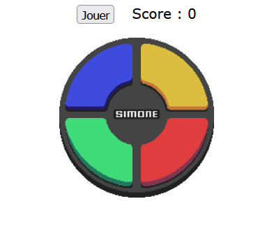

# TP3 - Simone 💁‍♀️💡

📦 Projet de départ : [Téléchargement](../../static/files/tp3_jeu2.zip)

📽 Vidéo du résultat attendu : [Lien](https://youtu.be/42G_XLmggQ0)

<center></center>

## 📝 Instructions

### 🗄 Variables globales

Plusieurs variables globales sont déjà créées. Normalement, vous devriez pouvoir coder le jeu en entier **sans ajouter de nouvelles variables globales**. Toutefois, n’hésitez pas à en créer d’autres si cela vous aide.

### 🏁 Initialisation du jeu

Vous aurez à créer quelques **écouteurs d’événements** très simples lorsque vous allez créer les fonctions libres.

### ⛳ Section guidée

#### 1️⃣ allumerOuEteindreCouleur(couleur, onOuOff)

La `couleur` reçue en paramètre sera une des quatre couleurs du jeu. (`"bleu"`, `"rouge"`, `"jaune"` ou `"vert"`) De plus, le paramètre `onOuOff` contient `true` ou `false`. (`true` veut dire qu’on *allume*, `false` veut dire qu’on **éteint**) 

L’objectif est seulement de changer l’attribut `src` du bon élément HTML pour « allumer » ou « éteindre » la bonne couleur. Profitez du fait que la classe et les images contiennent le même nom que le paramètre reçu pour **coder la fonction en une seule ligne de code**. (Au pire, commencez par coder la fonction en plusieurs lignes de code, et la réponse vous semblera plus évidente ensuite !)

#### 2️⃣ afficherSequence()

Cette fonction risque d’être la plus complexe du TP, mais elle est **plutôt courte**. Avant de continuer, nous devons apprendre une nouvelle notion : utiliser `setTimeout` pour appeler une fonction **avec des paramètres** !

Normalement, quand on utilise `setTimeout`, ça ressemble à ceci :

```js
setTimeout(nomFonction, 250);
```

Disons que `nomFonction(fruit, couleur)` exige deux paramètres… comment les lui envoie-t-on ? Comme ceci :

```js
setTimeout(nomFonction, 250, "pomme", "route");
```

Le ou les paramètres sont simplement placés **après le temps en millisecondes**.

En gardant à l’esprit que la variable globale `gSequenceReponse` contient une suite de couleurs (exemple : `["bleu", "bleu", "rouge", "bleu", "vert"]`), l’objectif de la fonction sera **d’allumer et d’éteindre, successivement, chacune de ces 5 couleurs**. Comme on ne veut pas que tout s’allume et s’éteigne en même temps, on doit bien mettre des **délais** (avec `setTimeout`) entre chaque couleur.

Le but est d’allumer une nouvelle couleur toutes les **500 millisecondes** et d’éteindre chacune après **250 millisecondes**. (Je vais allumer la première à **500 ms** et l’éteindre à **750 ms**. Je vais allumer la deuxième à **1000 ms** et l’éteindre à **1250 ms**. Le calcul ne devrait pas être trop complexe.)

Bien entendu, on utilisera intensivement la fonction `allumerOuEteindreCouleur()`.  

Enfin, avant de quitter la fonction, on veut simplement appeler la fonction `autoriserClic()`, **mais pas immédiatement**. On veut l’appeler dans **500 millisecondes multiplié par le nombre de couleurs dans la séquence + 1**. (Donc si la séquence contient 3 éléments, on appelle dans **500 * 4 = 2000** millisecondes)

#### 3️⃣ nombreAleatoireEntre1Et4()

Le commentaire au-dessus de cette fonction est déjà assez clair.

### ✅ Code déjà complété

Les fonctions `bloquerClic()` et `autoriserClic()` pourront être utilisées stratégiquement à l’aide de `setTimeout()` pour changer la valeur de `gJeuActif`. Gardez à l’esprit que `gJeuActif` devrait être `true` quand c’est le **bon moment pour cliquer dans le jeu** et `gJeuActif` devrait être `false` quand on souhaite que **cliquer ne fasse rien**.

### 🧠 Section libre

:::warning

Lisez les sections « 🧠 Section libre » et « 💡 Astuces variées » **en entier** avant de vous lancer ! Oui c'est lourd de tout lire d'un coup, mais cela vous donnera une perspective plus complète. Par la suite, n'hésitez pas à relire des bouts à mesure que vous coderez.

:::

Vous devrez coder tout le reste de la logique du jeu sans trop d’encadrement. Gardez à l’esprit que **le flot du jeu ressemble à peu près à ceci** :

1. J’ouvre la page Web. Je dois d’abord cliquer sur le bouton « Jouer » pour lancer la partie.
2. Lorsque la partie commence, le bouton « Jouer » disparaît et le score retourne à 0. La partie est composée de manches dont le déroulement est toujours identique :
   * Au début de la manche, le jeu choisit aléatoirement une des quatre couleurs, qu’il ajoute à la fin de la séquence à mémoriser.
   * Le jeu affiche la séquence.
   * Enfin, le joueur peut finalement cliquer sur des couleurs pour tenter de reproduire la séquence. Notez qu’il se passe plusieurs choses à chaque fois que le joueur clique :
      1. On bloque les prochains clics pour **400 millisecondes**. (Sauf si le joueur vient de perdre ou de deviner correctement la dernière couleur, dans ces cas on fait juste bloquer les clics jusqu’à nouvel ordre)
      2. Si la couleur est bonne, on « allume » la couleur cliquée pendant **300 millisecondes**. (Comme ça le joueur voit bien que le clic a été reçu)
      3. On vérifie si la couleur est bonne ! (Il faut noter à quel élément de la séquence le joueur était rendu et comparer la couleur cliquée avec le bon élément de la séquence.) Comment trouver la couleur cliquée ? Indice : `alt`.
      4. Si le joueur vient de deviner correctement la dernière couleur de la séquence, on augmente le score affiché de 1. On lance la prochaine manche dans **2 secondes**. (Pour que le joueur ait le temps de souffler avant que la séquence soit affichée à nouveau) 
3. Éventuellement, le joueur va perdre. À ce moment, le jeu s’arrête, on réaffiche le bouton pour jouer, on vide la séquence et on affiche « Perdu ! » dans une alerte.

### 💡 Astuces variées

N’ayez pas peur d’utiliser `setTimeout()` à profusion ! C’est très utile pour bien permettre au jeu (et au joueur) de respirer entre les animations. En dehors de bien calculer les délais et de bien utiliser les variables globales pour calibrer l’état du jeu, le code ne sera pas très complexe.

### 🐞 Bugs à prévenir

* Cliquer sur les 4 couleurs du jeu ne fait rien quand le jeu n’est pas actif.
* Cliquer sur les 4 couleurs du jeu ne fait rien pendant que la séquence est en train d'être affichée pour la mémorisation.
* Cliquer sur une couleur du jeu ne fait rien pour 400 millisecondes après avoir cliqué sur une couleur. (Éviter les double clics accidentels)
* Il se peut que d'autres bugs doivent être prévenus.

## ✅ Grille de correction

<table>
    <tr>
        <td>Critères</td>
        <td>Points</td>
    </tr>
    <tr>
        <td>L'initialisation du jeu est bien réalisée.</td>
        <td>2 pts</td>
    </tr>
    <tr>
        <td>Fonctions guidées :<br/>• Allumer et éteindre les couleurs de manière élégante.<br/>• Afficher une séquence correctement.<br/>• Retourner un nombre entier aléatoire entre 1 et 4.</td>
        <td><br/>1 pt<br/>3 pts<br/>1 pt</td>
    </tr>
    <tr>
        <td>Fonctions libres :<br/>• Lancement du jeu et conclusion du jeu.<br/>• Gestion d'un clic avec feedback visuel et vérification de la réponse.<br/>• Transition entre les manches. (Mise à jour de l'état du jeu, évolution de la séquence)</td>
        <td><br/>3 pts<br/>3 pts<br/>3 pts</td>
    </tr>
    <tr>
        <td>Rédaction des commentaires pour la section libre :<br/>• Commentaires appropriés.<br/>• Français soigné.</td>
        <td><br/>1.5 pts<br/>2.5 pts</td>
    </tr>
    <tr>
        <td>Qualité du code :<br/>• Usage stratégique des structures enseignées.*<br/>• Pas ou peu de code répétitif.<br/>• Le jeu ne présente pas de bogues (Hors fonctionnalités non réalisées)</td>
        <td><br/>1 pt<br/>2 pts<br/>2 pts</td>
    </tr>
    <tr>
        <td>- Plagiat et / ou incapable d'expliquer son code.<br/>- Usage de notions non abordées en classe. (0 pour le TODO)<br/>- Points-virgules manquants<br/>- Indentations malpropres</td>
        <td>-100%<br/>-1 à -25 pts<br/>-2 pts<br/>-2 pts</td>
    </tr>
    <tr>
        <td>Total</td>
        <td>25 pts</td>
    </tr>
</table>

\* Utilisez les if, else if, else, switch, while, for et conditions ternaires de manière stratégique et élégante.