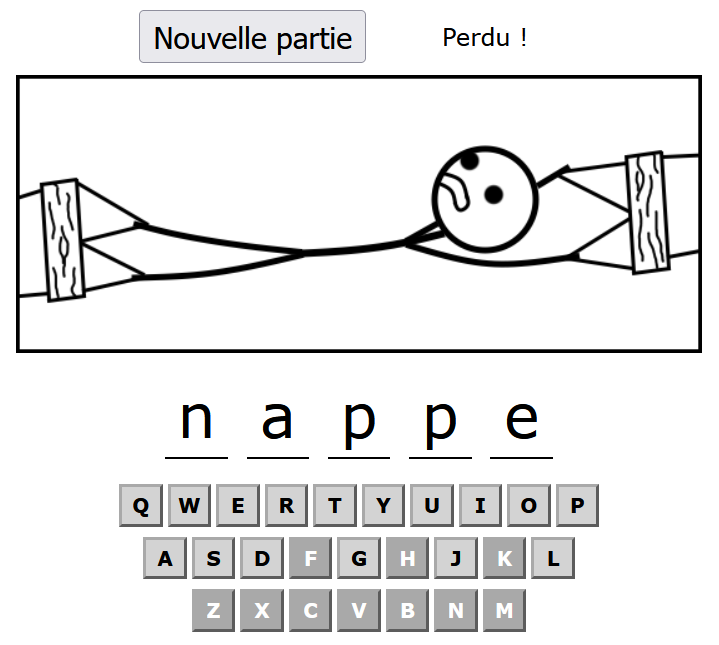
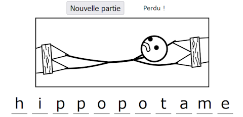
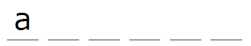
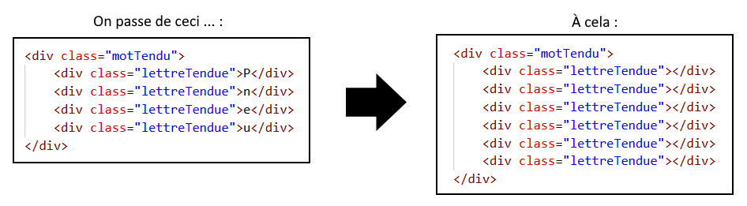
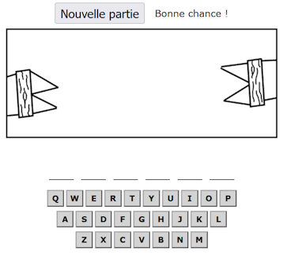

# TP3 - Bonhomme tendu 😬🪢

📦 Projet de départ : [Téléchargement](../../static/files/tp3_jeu3.zip)

📽 Vidéo du résultat attendu : [Lien](https://youtu.be/gr9Y3tf27V0)

<center></center>

## 📝 Instructions

### 🗄 Variables globales

Plusieurs variables globales sont déjà créées. Normalement, vous devriez pouvoir coder le jeu en entier **sans ajouter de nouvelles variables globales**. Toutefois, n’hésitez pas à en créer d’autres si cela vous aide.

### 🏁 Initialisation du jeu

Vous aurez à créer quelques **écouteurs d’événements** très simples lorsque vous allez créer les fonctions libres.

### ⛳ Section guidée

#### 1️⃣ choisirMotTendu()

Le but sera de :

1. Remplir la variable `gMotTendu` avec un mot aléatoire parmi ceux présents dans `gMotsPossibles`.
2. Remplir la variable `gNbLettresRestantes` avec le nombre de lettres dans le nouveau mot sélectionné.

#### 2️⃣ perdu()

Cette fonction pourra être appelée lorsque le joueur aura épuisé son nombre de tentatives. Elle devra :

1. Écrire `Perdu !` à côté du bouton « Nouvelle partie ».
2. Afficher toutes les lettres du mot tendu dans la page. (On affiche la réponse pour satisfaire la curiosité du perdant)

<center></center>

:::tip

Voici quelques pistes pour réussir à **afficher toutes les lettres dans la page**.

* Il faudra parcourir le mot tendu. (Rappel : une chaîne de caractères possède une longueur `length` !)
* `charAt()` sera très utile pour extraire chacune des lettres du mot tendu, une à la fois.
* Le but est de placer une lettre dans chacun des éléments avec la classe `.lettreTendue`. (Les éléments avec cette classe, c'est la série de traits de soulignement \_ qui sont vides au début d'une partie)

Petit exemple dans lequel on place la lettre `"a"` sur le premier trait de soulignement ( \_ ) dans la page :

```js
let elements = document.querySelectorAll(".lettreTendue");
elements[0].textContent = "a";
```

<center></center>

:::

### ✅ Code déjà complété

La fonction `placerLettre()` permet de placer la `lettre` (ex: `"a"`, ou `"b"`, ou etc.) reçue en paramètre **dans la page**, à tous les endroits du mot avec cette lettre. (Bref, du `textContent` est remplacé aux bons endroits) De plus, la fonction retourne `true` si la lettre était **valide** (existait dans le mot) et retourne `false` sinon.

<center></center>

### 🧠 Section libre

:::warning

Lisez les sections « 🧠 Section libre » et « 💡 Astuces variées » **en entier** avant de vous lancer ! Oui c'est lourd de tout lire d'un coup, mais cela vous donnera une perspective plus complète. Par la suite, n'hésitez pas à relire des bouts à mesure que vous coderez.

:::

Vous devrez coder tout le reste de la logique du jeu sans trop d’encadrement. Gardez à l’esprit que **le flot du jeu ressemble à peu près à ceci** :

1. On clique sur le bouton « Nouvelle partie ». Un certain nombre de choses se passeront pour préparer la nouvelle partie :
   * Le message « Bonne chance ! » sera affiché à côté du bouton « Nouvelle partie ». (Ça remplacera les potentiels messages de victoire ou de défaite)
   * Un nouveau mot tendu aléatoire doit être choisi.
   * Les 26 lettres de l'alphabet ré-obtiennent un fond `"lightgray"` et un texte `"black"`.
   * Les 9 morceaux du bonhomme sont cachés.
   * L'ancien mot tendu est retiré de la page et le nouveau est affiché, mais sans dévoiler les lettres du nouveau mot. Voici un exemple ou l'ancien mot était **pneu** et le nouveau serait **patate** :

<center></center>

<center></center>

2. Pendant le jeu, le joueur peut **appuyer sur les lettres du clavier** pour « tenter des lettres ». Dans l'alphabet des 26 lettres, celle appuyée obtient un fond `"darkgray"` et une couleur de texte `"white"`. Ensuite, voici ce qu'il se passe si ...
   * La lettre est **valide** : elle est placée dans la page. Si le mot est complet, le texte « Victoire ! » est affiché à côté du bouton « Nouvelle partie ».
   * La lettre est **invalide** : un morceau du bonhomme est affiché. Si le bonhomme est maintenant complet, le jeu est perdu.

### 💡 Astuces variées

* On ne vous cachera pas que la fonction `tenterLettre(event)`, qui est déjà entamée, devra être appelée par un **écouteur d'événements clavier**...
* N'ayez pas peur de modifier légèrement la fonction `placeLettre(lettre)` au besoin. Par exemple, dans le solutionnaire, une ligne de code a été ajoutée dans cette fonction. (Il se peut que vous trouviez une alternative cela dit !)
* Il se peut aussi que vous souhaitiez faire des modifications dans les **fonctions guidées**, mais il est très possible de compléter le code sans le faire.

### 🐞 Bugs à prévenir

* Appuyer sur une lettre du clavier ne fait rien si la partie n'est pas commencée, la partie est déjà perdue, la lettre a déjà été appuyée ou la partie est déjà gagnée.
* Impossible de lancer une nouvelle partie tant qu'on n'a pas gagné ou perdu. (Bien que le bouton reste affiché en permanence)

## ✅ Grille de correction

<table>
    <tr>
        <td>Critères</td>
        <td>Points</td>
    </tr>
    <tr>
        <td>L'initialisation du jeu est bien réalisée.</td>
        <td>1 pt</td>
    </tr>
    <tr>
        <td>Fonctions guidées :<br/>• Choisir un mot aléatoire.<br/>• Mettre à jour l'affichage lors de la défaite.</td>
        <td><br/>1 pt<br/>3 pts</td>
    </tr>
    <tr>
        <td>Fonctions libres :<br/>• Mise à jour des données du jeu lors d'une nouvelle partie.<br/>• Mise à jour de l'affichage lors d'une nouvelle partie.<br/>• Gestion d'une touche appuyée et feedback dans la page.</td>
        <td><br/>1 pt<br/>5 pts<br/>5 pts</td>
    </tr>
    <tr>
        <td>Rédaction des commentaires pour la section libre :<br/>• Commentaires appropriés.<br/>• Français soigné.</td>
        <td><br/>1.5 pts<br/>2.5 pts</td>
    </tr>
    <tr>
        <td>Qualité du code :<br/>• Usage stratégique des structures enseignées.*<br/>• Pas ou peu de code répétitif.<br/>• Le jeu ne présente pas de bogues (Hors fonctionnalités non réalisées)</td>
        <td><br/>1 pt<br/>2 pts<br/>2 pts</td>
    </tr>
    <tr>
        <td>- Plagiat et / ou incapable d'expliquer son code.<br/>- Usage de notions non abordées en classe. (0 pour le TODO)<br/>- Points-virgules manquants<br/>- Indentations malpropres</td>
        <td>-100%<br/>-1 à -25 pts<br/>-2 pts<br/>-2 pts</td>
    </tr>
    <tr>
        <td>Total</td>
        <td>25 pts</td>
    </tr>
</table>

\* Utilisez les if, else if, else, switch, while, for et conditions ternaires de manière stratégique et élégante.